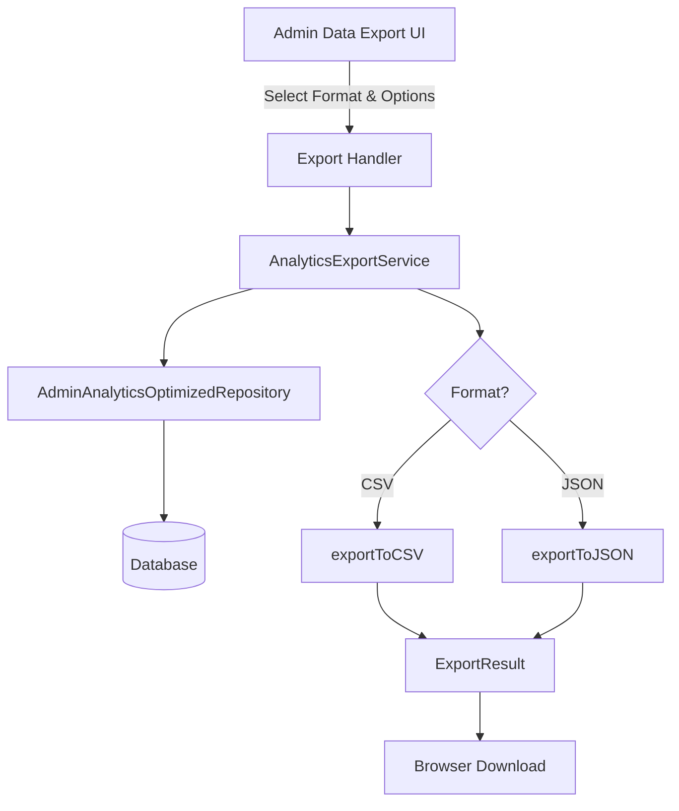
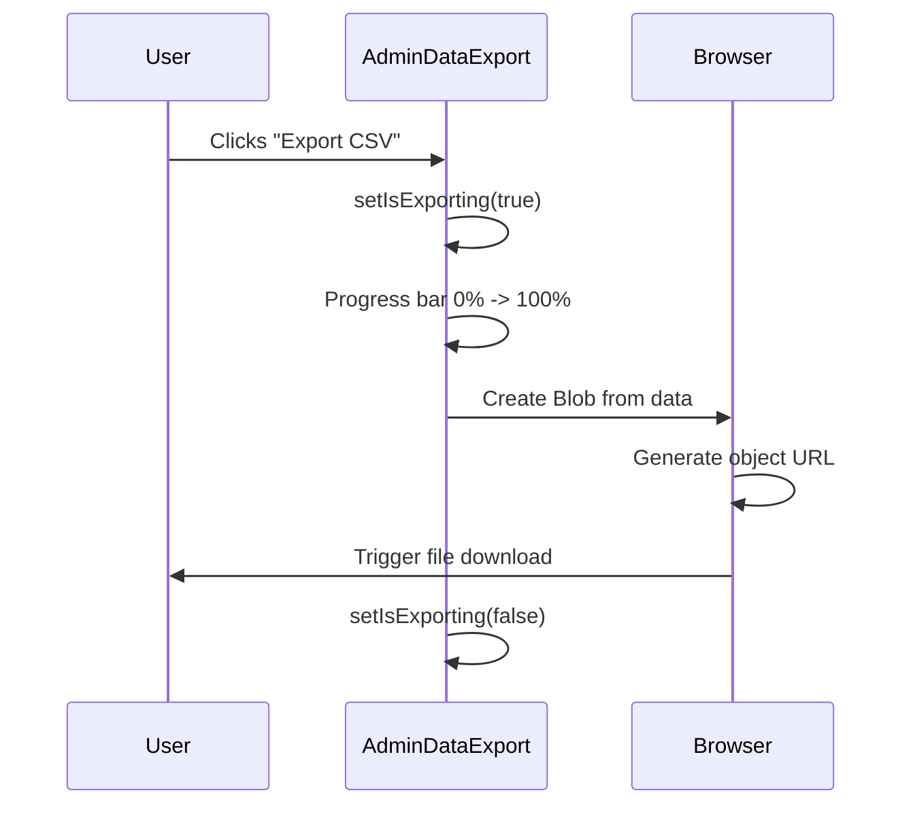

# Export Service

The Ever Works Template provides an analytics export system that supports CSV and JSON output formats, with metadata embedding, date-range filtering, and a comprehensive report mode. The service runs server-side via the `AnalyticsExportService` class and is surfaced to administrators through the `AdminDataExport` component.

## Architecture Overview



### Source Files

| File | Purpose |
|---|---|
| `lib/services/analytics-export.service.ts` | Core export service with CSV/JSON generation |
| `components/admin/admin-data-export.tsx` | Admin UI for triggering exports |

## Export Service Class

The `AnalyticsExportService` is the central export engine. It pulls data from the `AdminAnalyticsOptimizedRepository` and converts it into downloadable formats.

### Interfaces

```typescript
const EXPORT_FORMATS = {
  CSV: 'csv',
  JSON: 'json',
  EXCEL: 'xlsx',
} as const;

type ExportFormat = typeof EXPORT_FORMATS[keyof typeof EXPORT_FORMATS];

interface ExportOptions {
  format: ExportFormat;
  dateRange?: { start: Date; end: Date };
  includeMetadata?: boolean;
  compression?: boolean;
}

interface ExportResult {
  data: string | Buffer;
  filename: string;
  contentType: string;
  size: number;
  timestamp: Date;
}
```

### Available Export Methods

| Method | Data Source | Default Range |
|---|---|---|
| `exportUserGrowthTrends(months, options)` | User signup trends | 12 months |
| `exportActivityTrends(days, options)` | Votes, comments, views | 7 days |
| `exportTopItems(limit, options)` | Highest-engagement items | Top 10 |
| `exportRecentActivity(limit, options)` | Latest user actions | Last 10 |
| `exportComprehensiveReport(options)` | All of the above combined | Mixed |

### Basic Usage

```typescript
import { AnalyticsExportService } from '@/lib/services/analytics-export.service';

const exporter = new AnalyticsExportService();

// Export user growth as CSV
const result = await exporter.exportUserGrowthTrends(12, {
  format: 'csv',
});

// result.data     -> CSV string
// result.filename -> "user-growth-trends-2025-01-15T10-30-00-000Z.csv"
// result.contentType -> "text/csv; charset=utf-8"
// result.size     -> byte length
```

### Comprehensive Report

The `exportComprehensiveReport` method fetches all data sources in parallel and combines them into a single export:

```typescript
const report = await exporter.exportComprehensiveReport({
  format: 'json',
  includeMetadata: true,
});
```

Internally, it runs four queries concurrently via `Promise.all`:

```typescript
const [userGrowth, activityTrends, topItems, recentActivity] = await Promise.all([
  this.repository.getUserGrowthTrends(12),
  this.repository.getActivityTrends(30),
  this.repository.getTopItems(50),
  this.repository.getRecentActivity(100),
]);
```

The output includes a `summary` object with aggregated totals for quick reference.

## CSV Generation

### Array Data

For array-shaped results (most single-metric exports), the CSV generator:

1. Collects the union of all keys across every row to handle sparse data
2. Writes a header row from those keys
3. Escapes values containing commas, quotes, or newlines using RFC 4180 rules

```typescript
// Escaping logic
const esc = (v: any) => {
  if (v === null || v === undefined) return '';
  const s = typeof v === 'string' ? v : String(v);
  return /[",\n\r]/.test(s) ? `"${s.replace(/"/g, '""')}"` : s;
};
```

### Nested Object Data

The comprehensive report produces nested objects. The `objectToCSV` method handles this recursively:

- **Arrays of objects** become labeled CSV sections with their own header rows
- **Simple arrays** are flattened into a single row
- **Nested objects** are prefixed with dot notation (e.g., `summary.totalUsers`)

## JSON Generation

### Without Metadata

```json
[
  { "month": "2025-01", "active": 150 },
  { "month": "2025-02", "active": 175 }
]
```

### With Metadata

When `includeMetadata` is `true`, the output wraps data in an envelope:

```typescript
interface ExportMetadata {
  generatedAt: string;       // ISO timestamp
  dateRange?: string;        // "start to end" when date range is set
  totalRecords: number;      // Array length or 1 for objects
  exportFormat: string;      // "JSON"
  version: string;           // "1.0.0"
}
```

```json
{
  "metadata": {
    "generatedAt": "2025-01-15T10:30:00.000Z",
    "totalRecords": 12,
    "exportFormat": "JSON",
    "version": "1.0.0"
  },
  "data": [ ... ]
}
```

## Validation

The `validateExportOptions` method checks:

1. **Format validity** -- the format must be one of the defined `EXPORT_FORMATS` values
2. **Date range logic** -- `start` must not be after `end`

```typescript
exporter.validateExportOptions({
  format: 'csv',
  dateRange: { start: new Date('2025-01-01'), end: new Date('2024-12-01') },
});
// false -- start is after end
```

Every export method calls `validateExportOptions` before proceeding and throws an `Error` if validation fails.

## Filename Generation

Filenames include a full ISO timestamp with colons and dots replaced by hyphens:

```
user-growth-trends-2025-01-15T10-30-00-000Z.csv
activity-trends-2025-01-15T10-30-00-000Z.csv
```

JSON exports use a simpler date-only format:

```
top-items-2025-01-15.json
```

## Admin Data Export Component

The `AdminDataExport` component provides the admin interface for triggering exports.

### Export Options

The component presents five export options, each with internationalized labels via `next-intl`:

| ID | Data Type |
|---|---|
| `user-growth` | User growth trends |
| `activity-trends` | Activity trends |
| `top-items` | Top performing items |
| `recent-activity` | Recent activity feed |
| `comprehensive` | Full analytics report |

### UI State

```typescript
const [isExporting, setIsExporting] = useState(false);
const [exportProgress, setExportProgress] = useState(0);
const [selectedFormat, setSelectedFormat] = useState<'csv' | 'json'>('csv');
const [includeMetadata, setIncludeMetadata] = useState(true);
```

### Export Flow



The component uses the browser's native download mechanism:

```typescript
const blob = new Blob([content], { type: 'text/plain' });
const url = URL.createObjectURL(blob);
const a = document.createElement('a');
a.href = url;
a.download = filename;
document.body.appendChild(a);
a.click();
document.body.removeChild(a);
URL.revokeObjectURL(url);
```

### Scheduled Reports

The component includes a placeholder section for database-backed scheduled reports. Each report displays:

- Report name and schedule
- Output format (CSV/JSON)
- Status indicator (generated, failed, pending)
- Last generated and next generation timestamps

### Report Management

The admin interface also provides buttons for:
- Creating new report templates
- Managing existing templates
- Viewing export history
- Configuring export settings

## Content Type Mapping

| Format | Content-Type | Extension |
|---|---|---|
| CSV | `text/csv; charset=utf-8` | `.csv` |
| JSON | `application/json` | `.json` |

## Best Practices

1. **Use the comprehensive report** for full analytics snapshots rather than exporting each metric individually.
2. **Enable metadata** for JSON exports so downstream consumers can verify freshness and record counts.
3. **Validate date ranges** before calling export methods to avoid confusing error states.
4. **Clean up object URLs** after triggering downloads to prevent memory leaks in the browser.
5. **Handle export errors gracefully** -- show a toast notification rather than leaving the progress bar stuck.
6. **Use the progress indicator** to give users feedback during longer exports.
