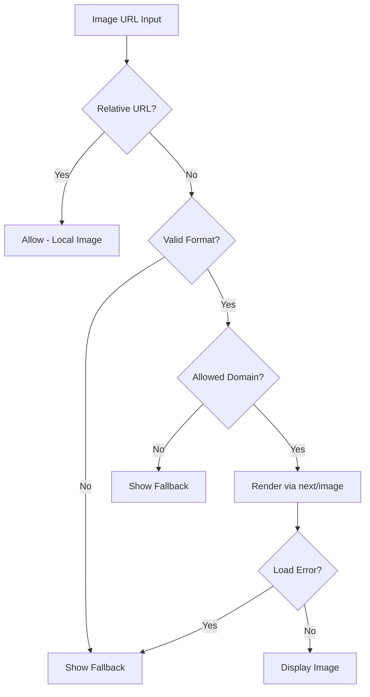
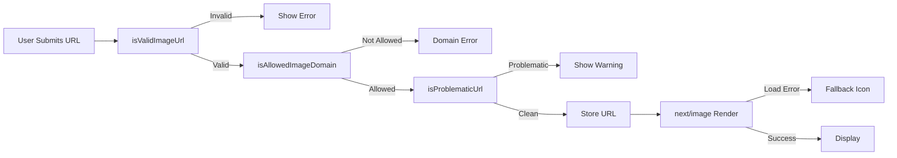

# Image Service

The Ever Works Template provides an image management layer that handles domain validation, URL verification, fallback logic, and dynamic domain configuration. The system integrates with Next.js Image Optimization and manages allowed external image sources.

## Architecture Overview



### Source Files

| File | Purpose |
|---|---|
| `lib/utils/image-domains.ts` | Domain allowlists, validation, and remote patterns |
| `hooks/use-image-domains.ts` | React hook for dynamic domain management |
| `next.config.ts` | Image optimization configuration |

## Domain Configuration

### Common Image Domains

Pre-configured domains for user avatars and content images:

| Domain | Use Case |
|---|---|
| `lh3.googleusercontent.com` | Google profile avatars |
| `avatars.githubusercontent.com` | GitHub profile avatars |
| `platform-lookaside.fbsbx.com` | Facebook profile images |
| `pbs.twimg.com` | Twitter/X profile images |
| `images.unsplash.com` | Unsplash stock images |

### Icon Domains

Pre-configured domains for icon and favicon sources:

| Domain | Service |
|---|---|
| `flaticon.com` | Flaticon icons |
| `iconify.design` | Iconify icons |
| `icons8.com` | Icons8 icons |
| `feathericons.com` | Feather icons |
| `heroicons.com` | Heroicons |
| `tabler-icons.io` | Tabler icons |

## Domain Validation

### Checking Allowed Domains

```typescript
import { isAllowedImageDomain } from '@/lib/utils/image-domains';

// Direct domain match
isAllowedImageDomain('https://lh3.googleusercontent.com/a/photo.jpg');
// true

// Subdomain matching (*.domain.com)
isAllowedImageDomain('https://cdn.flaticon.com/icon.png');
// true

// Relative URLs always allowed
isAllowedImageDomain('/images/logo.png');
// true

// Unknown domain
isAllowedImageDomain('https://unknown-site.com/image.png');
// false
```

### URL Validation

```typescript
import { isValidImageUrl } from '@/lib/utils/image-domains';

isValidImageUrl('https://example.com/image.png');  // true
isValidImageUrl('/images/local.jpg');               // true (relative)
isValidImageUrl('not-a-url');                       // false
isValidImageUrl('');                                // false
```

### Problematic URL Detection

The `isProblematicUrl` function detects URLs that are likely not direct image links:

```typescript
import { isProblematicUrl } from '@/lib/utils/image-domains';

// Page URL instead of image
isProblematicUrl('https://flaticon.com/icone-gratuite/calendar');
// true

// URL with tracking parameters
isProblematicUrl('https://example.com/img.png?related_id=123&origin=search');
// true

// Missing image extension
isProblematicUrl('https://example.com/resource/12345');
// true

// Valid image URL
isProblematicUrl('https://example.com/photo.jpg');
// false
```

### Fallback Decision

```typescript
import { shouldShowFallback } from '@/lib/utils/image-domains';

// No URL provided
shouldShowFallback('');           // true

// Problematic URL
shouldShowFallback('https://flaticon.com/icone-gratuite/clock');
// true

// Valid image URL
shouldShowFallback('https://example.com/icon.png');
// false
```

## Next.js Remote Patterns

The `generateImageRemotePatterns` function produces the `remotePatterns` array for `next.config.ts`:

```typescript
import { generateImageRemotePatterns } from '@/lib/utils/image-domains';

// In next.config.ts
const nextConfig = {
  images: {
    remotePatterns: generateImageRemotePatterns(),
  },
};
```

Each pattern includes:
- **Protocol**: Always `https`
- **Hostname**: Exact match or wildcard subdomain (`*.domain.com`)
- **Pathname**: Specific paths (e.g., `/a/**` for Google) or wildcard (`/**`)

## Dynamic Domain Management

### Runtime Domain Operations

```typescript
import {
  addImageDomain,
  removeImageDomain,
  getAllowedDomains,
} from '@/lib/utils/image-domains';

// Add a new allowed domain
addImageDomain('cdn.mysite.com');

// Add as an icon domain
addImageDomain('custom-icons.com', true);

// Remove a domain
removeImageDomain('old-cdn.com');

// Get all current domains
const { common, icons } = getAllowedDomains();
```

:::caution
Runtime domain additions only persist in the current process. They do not update `next.config.ts` remote patterns, so Next.js Image Optimization will not serve images from dynamically added domains. Use this for validation logic only.
:::

### useImageDomains Hook

The `useImageDomains` hook provides reactive domain management for admin interfaces:

```typescript
import { useImageDomains } from '@/hooks/use-image-domains';

function ImageDomainSettings() {
  const { domains, addDomain, removeDomain, checkDomain } = useImageDomains();

  return (
    <div>
      <h3>Common Domains ({domains.common.length})</h3>
      {domains.common.map(domain => (
        <DomainRow
          key={domain}
          domain={domain}
          onRemove={() => removeDomain(domain)}
        />
      ))}

      <h3>Icon Domains ({domains.icons.length})</h3>
      {domains.icons.map(domain => (
        <DomainRow
          key={domain}
          domain={domain}
          onRemove={() => removeDomain(domain)}
        />
      ))}

      <AddDomainForm onAdd={(domain) => addDomain(domain)} />
    </div>
  );
}
```

### useImageValidation Hook

For inline URL validation in forms:

```typescript
import { useImageValidation } from '@/hooks/use-image-domains';

function IconUrlInput({ value, onChange }) {
  const { checkImageUrl } = useImageValidation();

  const handleChange = (url: string) => {
    const { isValid, error } = checkImageUrl(url);
    if (!isValid) {
      showError(error);
      // e.g., "Domain not allowed. Add cdn.example.com to image domains configuration."
    }
    onChange(url);
  };

  return <Input value={value} onChange={handleChange} />;
}
```

## Image Processing Pipeline



## Component Integration

### Image with Fallback

```tsx
function ItemIcon({ url, name }: { url: string; name: string }) {
  const showFallback = shouldShowFallback(url);

  if (showFallback) {
    return <DefaultIcon name={name} />;
  }

  return (
    <Image
      src={url}
      alt={name}
      width={48}
      height={48}
      onError={(e) => {
        e.currentTarget.style.display = 'none';
        // Show fallback
      }}
    />
  );
}
```

## Adding a New Image Domain

1. **Add to the allowlist** in `lib/utils/image-domains.ts`:

```typescript
export const COMMON_IMAGE_DOMAINS = [
  // ... existing domains
  'cdn.newservice.com',
];
```

2. **Add a remote pattern** (optional, for path-specific matching):

```typescript
// In generateImageRemotePatterns()
patterns.push({
  protocol: 'https' as const,
  hostname: 'cdn.newservice.com',
  pathname: '/images/**',
});
```

3. **Update `next.config.ts`** if the remote patterns function is not already called there.

## Best Practices

1. **Always use `shouldShowFallback`** before rendering external images to handle missing and problematic URLs gracefully.
2. **Validate URLs server-side** during item submission, not just client-side.
3. **Use `next/image`** for all external images to benefit from automatic optimization, lazy loading, and WebP conversion.
4. **Add domains to the allowlist** rather than disabling domain checks -- this prevents SSRF-style attacks through image URLs.
5. **Normalize domains** before adding to the allowlist -- strip wildcards and protocol prefixes.
6. **Test with the `isProblematicUrl` check** to catch URLs that look like image URLs but are actually web pages.
