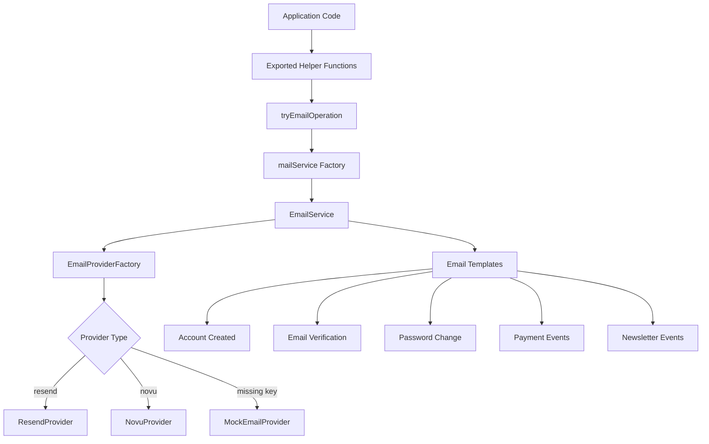

# Mail Providers

The template implements a provider-abstracted email system using the Factory pattern. It supports Resend and Novu as production providers, with a mock provider for development and testing. The system gracefully degrades when no API keys are configured.

## Architecture Overview



## Source Files

| File | Purpose |
|------|---------|
| `lib/mail/index.ts` | `EmailService` class, interfaces, exported helper functions |
| `lib/mail/factory.ts` | `EmailProviderFactory` for provider instantiation |
| `lib/mail/resend.ts` | Resend API provider implementation |
| `lib/mail/novu.ts` | Novu notification provider implementation |
| `lib/mail/mock.ts` | Console-logging mock provider |
| `lib/mail/templates/` | HTML email templates for various events |

## Core Interfaces

### EmailMessage

```typescript
export interface EmailMessage {
  from: string;
  to: string | string[];
  subject: string;
  html: string;
  text?: string;
}
```

### EmailProvider

Every provider implements this interface:

```typescript
export interface EmailProvider {
  sendEmail(message: EmailMessage): Promise<any>;
  getName(): string;
}
```

### EmailServiceConfig

```typescript
export interface EmailServiceConfig {
  provider: string;
  defaultFrom: string;
  apiKeys: Record<string, string>;
  domain: string;
  novu?: EmailNovuConfig;
}

export interface EmailNovuConfig {
  templateId?: string;
  backendUrl?: string;
}
```

## EmailProviderFactory

The factory creates provider instances based on configuration, with automatic fallback to MockEmailProvider when API keys are missing:

```typescript
export class EmailProviderFactory {
  static createProvider(config: EmailServiceConfig): EmailProvider {
    const provider = config.provider.toLowerCase();
    switch (provider) {
      case "resend":
        if (!config.apiKeys.resend || config.apiKeys.resend.trim() === '') {
          return new MockEmailProvider(); // Graceful fallback
        }
        return new ResendProvider(config.apiKeys.resend, config.defaultFrom);
      case "novu":
        if (!config.apiKeys.novu || config.apiKeys.novu.trim() === '') {
          return new MockEmailProvider();
        }
        return new NovuProvider(config.apiKeys.novu, config.defaultFrom, config.novu);
      default:
        return new MockEmailProvider();
    }
  }
}
```

## Provider Implementations

### ResendProvider

Wraps the official Resend SDK:

```typescript
export class ResendProvider implements EmailProvider {
  private resend: Resend;
  private defaultFrom: string;

  constructor(apiKey: string, defaultFrom: string) {
    this.resend = new Resend(apiKey);
    this.defaultFrom = defaultFrom;
  }

  async sendEmail(message: EmailMessage): Promise<CreateEmailResponse> {
    return this.resend.emails.send({
      from: message.from || this.defaultFrom,
      to: message.to,
      subject: message.subject,
      html: message.html,
      text: message.text,
    });
  }

  getName(): string { return "resend"; }
}
```

### NovuProvider

Integrates with the Novu notification infrastructure. Sends emails via Novu workflow triggers:

```typescript
export class NovuProvider implements EmailProvider {
  private novu: Novu;
  private defaultFrom: string;
  private templateId: string;

  constructor(apiKey: string, defaultFrom: string, config?: EmailNovuConfig) {
    this.novu = new Novu({
      secretKey: apiKey,
      serverURL: config?.backendUrl,
    });
    this.templateId = config?.templateId || "email-default";
  }

  async sendEmail(message: EmailMessage) {
    const email = Array.isArray(message.to) ? message.to[0] : message.to;
    return this.novu.trigger({
      to: { subscriberId: email, email },
      workflowId: this.templateId,
      payload: {
        subject: message.subject,
        body: message.html,
        preheader: message.text,
        from: message.from || this.defaultFrom,
      },
    });
  }
}
```

### MockEmailProvider

Logs email messages to the console without sending:

```typescript
export class MockEmailProvider implements EmailProvider {
  async sendEmail(message: EmailMessage) {
    console.log("Sending email:", message);
    return Promise.resolve();
  }
  getName(): string { return "mock"; }
}
```

## EmailService Class

The `EmailService` provides high-level email operations with availability checking:

```typescript
export class EmailService {
  private provider: EmailProvider | null = null;
  private isAvailable: boolean = false;

  constructor(config: EmailServiceConfig) {
    const hasApiKey = Object.values(config.apiKeys).some(key => key && key.trim() !== '');
    if (hasApiKey) {
      this.provider = EmailProviderFactory.createProvider(config);
      this.isAvailable = true;
    }
  }

  public isServiceAvailable(): boolean {
    return this.isAvailable && this.provider !== null;
  }
}
```

### Available Email Methods

| Method | Description |
|--------|-------------|
| `sendVerificationEmail(email, token)` | Email verification with link |
| `sendPasswordResetEmail(email, token)` | Password reset with link |
| `sendTwoFactorTokenEmail(email, token)` | 2FA code delivery |
| `sendPasswordChangeConfirmationEmail(email, userName?, ip?, ua?)` | Password change notification |
| `sendAccountCreatedEmail(userName, email, companyName?)` | Welcome email on registration |
| `sendNewsletterSubscriptionEmail(email)` | Newsletter subscription confirmation |
| `sendNewsletterUnsubscriptionEmail(email)` | Newsletter unsubscribe confirmation |
| `sendCustomEmail(message)` | Send arbitrary email content |

## Graceful Degradation

The `tryEmailOperation` wrapper handles unavailable email services without throwing:

```typescript
async function tryEmailOperation<T>(
  operation: (service: EmailService) => Promise<T>,
  operationName: string
): Promise<T | EmailSkippedResult> {
  const service = await mailService();
  if (!service.isServiceAvailable()) {
    return { skipped: true, reason: 'Email service not configured' };
  }
  return await operation(service);
}
```

This allows the application to function normally even without email configuration. The `EmailSkippedResult` type signals that the operation was not performed:

```typescript
interface EmailSkippedResult {
  skipped: true;
  reason: string;
}
```

## Configuration Resolution

Email configuration merges environment variables with content-based settings:

```typescript
async function mailService() {
  const config = await getCachedConfig();
  return new EmailService({
    provider: config.mail?.provider || emailConfig.provider,
    defaultFrom: config.mail?.default_from || emailConfig.defaultFrom,
    domain: config.app_url || emailConfig.domain,
    novu: config.mail?.provider === "novu" ? {
      templateId: config.mail?.template_id,
      backendUrl: config.mail?.backend_url,
    } : undefined,
  });
}
```

## Email Templates

The `lib/mail/templates/` directory contains HTML templates for all email types:

| Template | File |
|----------|------|
| Account Created | `account-created.ts` |
| Email Verification | `email-verification.ts` |
| Password Change | `password-change-confirmation.ts` |
| Payment Success | `payment-success.ts` |
| Payment Failed | `payment-failed.ts` |
| Subscription Events | `subscription-events.ts` |
| Subscription Expired | `subscription-expired.ts` |
| Subscription Renewal | `subscription-renewal-reminder.ts` |
| Submission Decision | `submission-decision.ts` |
| Newsletter Welcome | `newsletter-welcome.ts` |
| Newsletter Regular | `newsletter-regular.ts` |
| Newsletter Unsubscribe | `newsletter-unsubscribe.ts` |
| Admin Notification | `admin-notification.ts` |

Templates return objects with `subject`, `html`, and `text` properties for full email rendering.
