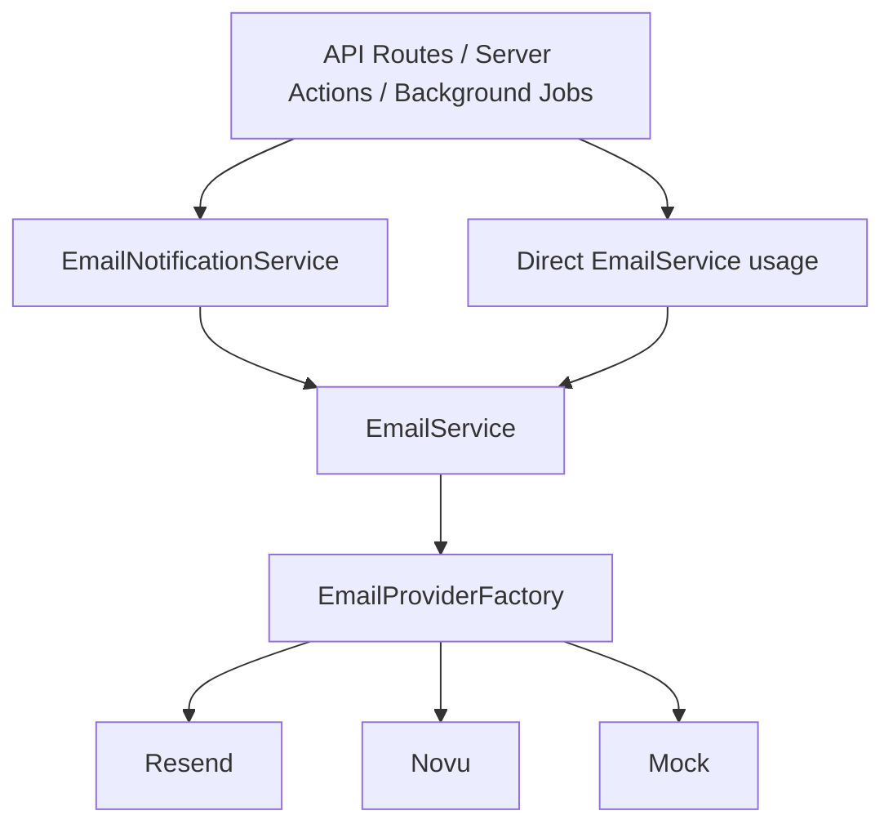

# Mail Service Deep Dive

## Overview

The mail system consists of two layers:

- **`EmailService`** (`lib/mail/index.ts`) -- Core email sending service with multi-provider support (Resend, Novu), template rendering, and graceful degradation when email is not configured.
- **`EmailNotificationService`** (`lib/services/email-notification.service.ts`) -- Higher-level notification service that sends pre-formatted admin and user notification emails for specific platform events.

## Source Files

| File | Path |
|------|------|
| EmailService (core) | `template/lib/mail/index.ts` |
| EmailNotificationService | `template/lib/services/email-notification.service.ts` |
| Provider Factory | `template/lib/mail/factory.ts` |
| Resend Provider | `template/lib/mail/resend.ts` |
| Novu Provider | `template/lib/mail/novu.ts` |
| Mock Provider | `template/lib/mail/mock.ts` |
| Email Templates | `template/lib/mail/templates/` |

## Architecture



## EmailService (Core)

### Constructor

```typescript
new EmailService({
  provider: string;      // 'resend' | 'novu'
  defaultFrom: string;   // Default sender address
  apiKeys: Record<string, string>;  // Provider API keys
  domain: string;        // App URL for link generation
  novu?: {
    templateId?: string;
    backendUrl?: string;
  };
})
```

**Graceful initialization:** If no API keys are configured, the service marks itself as unavailable rather than throwing. This allows the application to start without email configuration.

### `isServiceAvailable(): boolean`

Returns whether the email service has a configured and initialized provider. All sending methods check this internally.

### `sendVerificationEmail(email: string, token: string): Promise<any>`

Sends a verification email using the professional HTML template. Generates a verification link: `{domain}/auth/new-verification?token={token}`.

### `sendPasswordResetEmail(email: string, token: string): Promise<any>`

Sends a password reset email with a link: `{domain}/auth/new-password?token={token}`.

### `sendTwoFactorTokenEmail(email: string, token: string): Promise<any>`

Sends a 2FA code via email.

### `sendPasswordChangeConfirmationEmail(email, userName?, ipAddress?, userAgent?): Promise<any>`

Sends a confirmation after a password change. Includes device/IP info for security awareness.

### `sendNewsletterSubscriptionEmail(email: string): Promise<any>`

Sends a welcome email for newsletter subscriptions.

### `sendNewsletterUnsubscriptionEmail(email: string): Promise<any>`

Sends an unsubscribe confirmation.

### `sendAccountCreatedEmail(userName, userEmail, companyName?): Promise<any>`

Sends a welcome email when a new account is created. Dynamically imports the template.

### `sendVerificationEmailWithTemplate(email, token, userName?): Promise<any>`

Enhanced verification email with the professional template, including user name personalization.

### `sendCustomEmail(message: EmailMessage): Promise<any>`

Sends an arbitrary email. Used by `EmailNotificationService` and other services.

```typescript
interface EmailMessage {
  from: string;
  to: string | string[];
  subject: string;
  html: string;
  text?: string;
}
```

### `getProviderName(): string`

Returns the name of the active provider (e.g., `'resend'`) or `'none (not configured)'`.

## Module-Level Helper Functions

The module exports convenience functions that handle service initialization and graceful failure:

```typescript
sendVerificationEmail(email, token)
sendPasswordResetEmail(email, token)
sendNewsletterSubscriptionEmail(email)
sendNewsletterUnsubscriptionEmail(email)
sendTwoFactorTokenEmail(email, token)
sendPasswordChangeConfirmationEmail(email, userName?, ipAddress?, userAgent?)
sendAccountCreatedEmail(userName, userEmail, companyName?)
sendVerificationEmailWithTemplate(email, token, userName?)
```

Each function:
1. Creates an `EmailService` using config from content and environment
2. Checks if the service is available
3. If unavailable, returns `{ skipped: true, reason: '...' }` instead of throwing
4. If available, calls the corresponding method

## EmailNotificationService

A static service class for sending platform event notifications. All methods are `static async`.

### Admin Notifications

#### `sendAdminNotification(data: EmailNotificationData): Promise<Result>`

Core method that all other notification methods delegate to. Creates an `EmailService` instance, checks availability, renders the `AdminNotificationEmailHtml` template, and sends.

```typescript
interface EmailNotificationData {
  to: string;
  title: string;
  message: string;
  actionUrl?: string;
  actionText?: string;
  notificationType: string;
  timestamp: string;
}
```

**Returns:**
```typescript
{ success: true; messageId: string }
// or
{ success: false; skipped: true; error: string }
// or
{ success: false; error: string }
```

#### `sendItemSubmissionEmail(adminEmail, itemName, submittedBy, actionUrl)`

Notifies admin of a new item submission requiring review.

#### `sendCommentReportedEmail(adminEmail, commentContent, reportedBy, actionUrl)`

Notifies admin of a reported comment. Truncates content to 100 characters.

#### `sendUserRegisteredEmail(adminEmail, userEmail, actionUrl)`

Notifies admin of a new user registration.

#### `sendPaymentFailedEmail(adminEmail, userEmail, amount, reason, actionUrl)`

Notifies admin of a payment failure.

#### `sendSystemAlertEmail(adminEmail, title, message, actionUrl?)`

Sends a general system alert.

#### `sendBulkAdminNotifications(adminEmails[], data)`

Sends the same notification to multiple admin emails using `Promise.allSettled`.

**Returns:**
```typescript
{
  total: number;
  successful: number;
  failed: number;
  results: Array<{ email: string; result: ... }>;
}
```

### User Notifications

#### `sendSubmissionDecisionEmail(userEmail, itemName, status, reviewNotes?)`

Notifies the user that their submission has been approved or rejected. Uses the `submissionDecision` template. Includes detailed error handling for domain verification issues.

### Moderation Notifications

#### `sendUserWarningEmail(userEmail, reason, warningCount)`

Sends a warning notification with the violation reason and total warning count.

#### `sendUserSuspensionEmail(userEmail, reason)`

Notifies the user that their account has been suspended. Lists restricted actions.

#### `sendUserBanEmail(userEmail, reason)`

Notifies the user of a permanent ban.

#### `sendContentRemovedEmail(userEmail, contentType, reason)`

Notifies the user that their content (item or comment) has been removed.

## Error Handling

Both services implement a three-tier error handling strategy:

1. **Service unavailable:** Returns `{ success: false, skipped: true }` -- no error thrown
2. **Provider error:** Returns `{ success: false, error: message }` -- logged but not thrown
3. **Domain verification error (Resend):** Returns specific guidance about verifying the domain or using `onboarding@resend.dev` for testing

## Configuration

Email configuration comes from two sources:

1. **Environment variables** via `emailConfig` from `config-service`:
   - `EMAIL_PROVIDER` -- Provider name
   - `EMAIL_FROM` -- Default sender address
   - Resend API key, Novu API key
2. **Content config** via `getCachedConfig()`:
   - `mail.provider`, `mail.default_from`, `mail.template_id`, `mail.backend_url`

Content config takes precedence over environment variables.

## Usage Examples

```typescript
// Using module-level helpers (recommended)
import { sendVerificationEmail } from '@/lib/mail';
const result = await sendVerificationEmail('user@example.com', 'token123');

// Using EmailNotificationService for admin notifications
import { EmailNotificationService } from '@/lib/services/email-notification.service';

await EmailNotificationService.sendItemSubmissionEmail(
  'admin@example.com',
  'My New Tool',
  'user@example.com',
  'https://app.example.com/admin/items/my-new-tool'
);

// Bulk admin notification
await EmailNotificationService.sendBulkAdminNotifications(
  ['admin1@example.com', 'admin2@example.com'],
  {
    title: 'System Alert',
    message: 'Database backup completed',
    notificationType: 'system_alert',
    timestamp: new Date().toLocaleString(),
  }
);

// Moderation email
await EmailNotificationService.sendUserWarningEmail(
  'user@example.com',
  'Inappropriate comment',
  2
);
```
