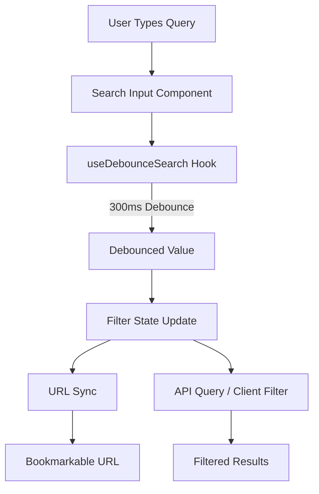
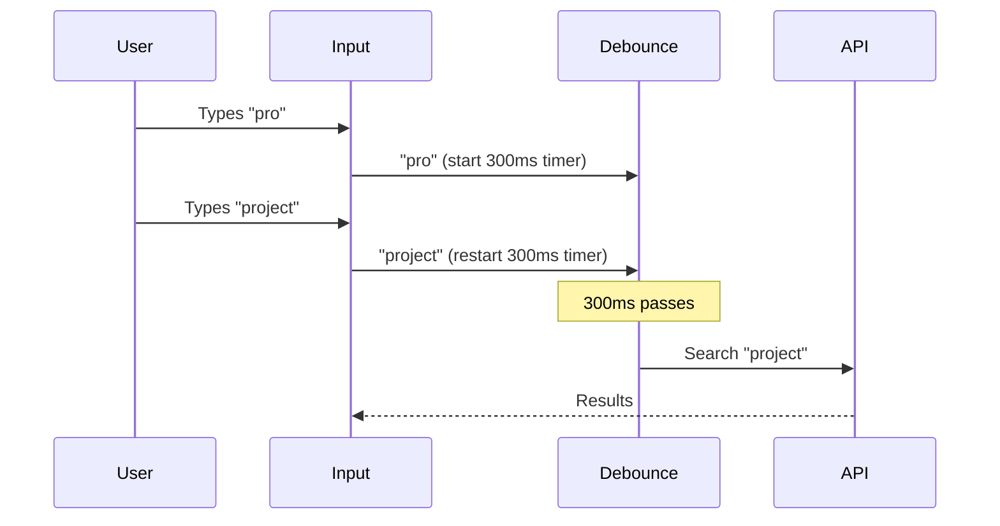

# Search Service

The Ever Works Template implements a client-side search system with debounced input handling, URL synchronization, and multi-filter support. Search operates across items, categories, tags, and location data with real-time filtering.

## Architecture Overview



### Source Files

| File | Purpose |
|---|---|
| `hooks/use-debounced-search.ts` | Core debounced search hook |
| `hooks/use-debounced-value.ts` | Generic value debounce utility |
| `components/filters/hooks/use-filter-state.ts` | Filter state with search integration |
| `components/filters/hooks/use-filter-url-sync.ts` | URL synchronization for filters |
| `components/ui/search-input.tsx` | Search input UI component |
| `components/admin/shared/admin-search-bar.tsx` | Admin search bar component |
| `app/api/admin/clients/advanced-search/route.ts` | Server-side advanced search API |
| `app/api/location/search/route.ts` | Location-based search API |

## Debounced Search Hook

The `useDebounceSearch` hook is the core search primitive, providing debounced value updates with search state tracking.

### Interface

```typescript
interface UseDebounceSearchProps {
  searchValue: string;         // Current raw search input
  delay?: number;              // Debounce delay (default: 300ms)
  onSearch: (value: string) => void | Promise<void>;  // Callback on debounced change
}

interface UseDebounceSearchReturn {
  debouncedValue: string;      // Debounced search value
  isSearching: boolean;        // True while input differs from debounced value
  clearSearch: () => void;     // Reset search state
}
```

### Usage

```typescript
import { useDebounceSearch } from '@/hooks/use-debounced-search';

function SearchableList() {
  const [searchInput, setSearchInput] = useState('');

  const { debouncedValue, isSearching } = useDebounceSearch({
    searchValue: searchInput,
    delay: 300,
    onSearch: (value) => {
      // Triggered only when debounced value actually changes
      console.log('Searching for:', value);
    },
  });

  return (
    <div>
      <input value={searchInput} onChange={(e) => setSearchInput(e.target.value)} />
      {isSearching && <Spinner />}
      <Results query={debouncedValue} />
    </div>
  );
}
```

### Behavior Details

1. **Duplicate prevention**: The hook tracks the previous debounced value via `useRef` and skips the callback if the value has not changed.
2. **Empty handling**: When the search value is cleared (empty string after trimming), `isSearching` is set to `false` and the callback receives an empty string.
3. **Loading state**: `isSearching` is `true` when either the async callback is in progress, or the raw input differs from the debounced value.

## Public Search Flow

### Filter State Integration

The public-facing search is integrated into the filter state system in `components/filters/hooks/use-filter-state.ts`:

```typescript
// Search term is one of many filter dimensions
const {
  searchTerm,
  setSearchTerm,       // Updates state + syncs URL
  selectedTags,
  selectedCategories,
  locationFilter,
  clearAllFilters,     // Clears search + all other filters
} = useFilterState();
```

When the search term changes:
1. The internal state updates immediately (for responsive UI)
2. The URL updates with debouncing (via `useFilterURLSync`)
3. Page scrolls to the filter/results area
4. A 400ms loading indicator shows

### URL Search Parameters

Search queries sync to the URL as the `q` parameter:

```
https://example.com/?q=project+management&tags=collaboration&categories=productivity
```

| Parameter | Purpose |
|---|---|
| `q` | Search query text |
| `tags` | Comma-separated tag filter |
| `categories` | Comma-separated category filter |
| `near_lat` | Near Me latitude |
| `near_lng` | Near Me longitude |
| `radius` | Near Me radius in km |
| `city` | City filter |
| `country` | Country filter |

### URL Sync Behavior

The `useFilterURLSync` hook manages URL updates with these characteristics:

- Uses `window.history.replaceState` to avoid triggering Next.js server navigation
- Debounces updates (default 300ms) to prevent excessive history entries
- Skips URL manipulation on `/categories/[slug]` and `/tags/[slug]` routes (the path already reflects the filter)
- Only updates when the URL actually changes

## Admin Search

### Admin Search Bar

The admin interface uses a separate search system with additional capabilities:

```typescript
import { useAdminFilters } from '@/hooks/use-admin-filters';

const {
  searchTerm,
  setSearchTerm,
  debouncedSearchTerm,
  isSearching,
  hasActiveSearch,
  clearSearch,
  statusFilter,
  setStatusFilter,
  multiFilters,
  setMultiFilter,
  activeFilterCount,
  clearAllFilters,
} = useAdminFilters<ItemStatus>({
  minSearchLength: 2,
  debounceDelay: 300,
  onFiltersChange: () => setCurrentPage(1),
});
```

### Admin Filters Config

| Option | Default | Purpose |
|---|---|---|
| `minSearchLength` | 2 | Minimum characters before search triggers |
| `debounceDelay` | 300 | Debounce delay in milliseconds |
| `initialStatus` | `''` | Default status filter |
| `initialMultiFilters` | `{}` | Default multi-select filter values |
| `onFiltersChange` | - | Callback on any filter change (for page reset) |

### Advanced Search API

The admin advanced search endpoint supports server-side filtering:

```
POST /api/admin/clients/advanced-search
```

This endpoint handles complex queries that combine text search with status filters, date ranges, and category/tag filters.

### Location Search API

For location-based items:

```
GET /api/location/search?query=Berlin
```

Returns geocoded location results for the location filter system.

## Client Item Search

The `useClientItemFilters` hook provides search for the client dashboard:

```typescript
import { useClientItemFilters } from '@/hooks/use-client-item-filters';

const {
  search,
  setSearch,
  debouncedSearch,
  isSearching,
  status,
  setStatus,
  sortBy,
  setSortBy,
  params,          // Combined params for API calls
  hasActiveFilters,
  resetFilters,
} = useClientItemFilters({
  defaultSortBy: 'updated_at',
  defaultSortOrder: 'desc',
  searchDebounceMs: 300,
});
```

### Combined API Parameters

The `params` object is memoized and ready for API calls:

```typescript
const params: ClientItemsListParams = {
  page: 1,
  limit: 10,
  status: 'all',
  search: 'my query',     // Debounced search value
  sortBy: 'updated_at',
  sortOrder: 'desc',
};
```

### Auto-Reset Behavior

Filter changes automatically reset to page 1:
- Status change: Immediate page reset
- Search change: Page reset on debounced value settlement
- Sort change: Immediate page reset
- Limit change: Immediate page reset

## Search Performance

### Debounce Strategy



### Optimization Techniques

1. **Minimum search length**: Admin search requires at least 2 characters before triggering
2. **Debouncing**: 300ms default prevents excessive API calls during rapid typing
3. **Memoized parameters**: `useMemo` prevents unnecessary re-renders when filter values have not changed
4. **Stale-while-revalidate**: React Query caching shows previous results while fetching new ones

## Best Practices

1. **Always debounce search inputs** -- use the provided hooks rather than raw `onChange` handlers.
2. **Set appropriate `minSearchLength`** -- 2 characters is a good minimum to avoid overly broad queries.
3. **Use `params` objects** from filter hooks rather than constructing API parameters manually.
4. **Handle the `isSearching` state** -- show a loading indicator to give users feedback.
5. **Reset pagination on search** -- always go back to page 1 when the search query changes.
6. **Preserve search state in URLs** -- use URL sync so users can bookmark and share filtered views.
