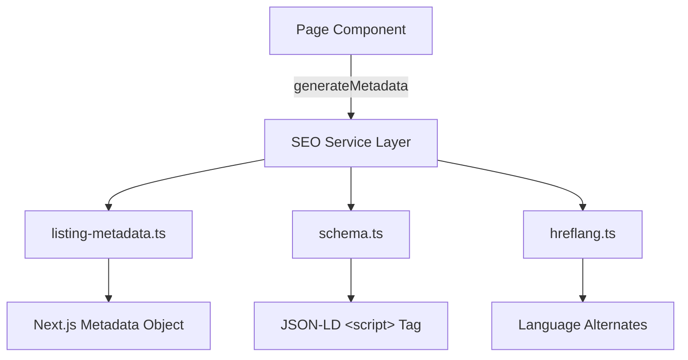

# SEO Service

The SEO service layer generates metadata, structured data, and language alternates for all page types in the Ever Works Template. It bridges the raw SEO utilities in `lib/seo/` with the Next.js Metadata API used in page components.

## Service Architecture



### Source Files

| File | Purpose |
|---|---|
| `lib/seo/listing-metadata.ts` | Metadata generation for listing/category pages |
| `lib/seo/schema.ts` | Structured data (JSON-LD) generators |
| `lib/seo/hreflang.ts` | Hreflang alternate URL generation |
| `app/opengraph-image.tsx` | Site-wide OG image generation |
| `app/[locale]/items/[slug]/opengraph-image.tsx` | Per-item OG image generation |

## Listing Metadata Service

The `generateListingMetadata` function is the primary metadata factory for listing pages such as category views, tag filter views, and the main directory page.

### Interface

```typescript
interface ListingMetadataOptions {
  title: string;           // Page title (without site name)
  description?: string;    // Custom meta description
  path: string;            // URL path without locale prefix
  locale: string;          // Current locale
  itemCount?: number;      // Number of items for auto-description
  keywords?: string[];     // SEO keywords
  imageUrl?: string;       // Custom OG image URL
}
```

### Generated Output

The function returns a complete Next.js `Metadata` object:

```typescript
const metadata = generateListingMetadata({
  title: 'Time Tracking Tools',
  path: '/categories/time-tracking',
  locale: 'en',
  itemCount: 42,
  keywords: ['time tracking', 'productivity'],
});
```

This produces:

| Field | Value |
|---|---|
| `title` | `"Time Tracking Tools \| Ever Works"` |
| `description` | `"Browse 42 time tracking tools. ..."` |
| `keywords` | `"time tracking, productivity"` |
| `openGraph.type` | `"website"` |
| `openGraph.siteName` | Site name from config |
| `openGraph.url` | Full canonical URL |
| `twitter.card` | `"summary_large_image"` |
| `alternates.canonical` | Canonical with locale prefix |
| `alternates.languages` | All locale alternates |

### Auto-Generated Descriptions

When no `description` is provided, the service generates one automatically:

```typescript
// With item count
`Browse 42 time tracking tools. ${siteConfig.description}`

// Without item count
`Browse time tracking tools. ${siteConfig.description}`
```

### Locale-Aware Canonical URLs

The canonical URL respects the "as-needed" locale prefix pattern:

```typescript
// Default locale (en)
`${appUrl}/categories/time-tracking`

// Other locales
`${appUrl}/fr/categories/time-tracking`
```

## Structured Data Generators

The schema generators in `lib/seo/schema.ts` produce JSON-LD objects for different content types.

### Product Schema Service

Used for individual item detail pages:

```typescript
import { generateProductSchema } from '@/lib/seo/schema';

// In a page component
const productLD = generateProductSchema({
  name: item.name,
  description: item.description,
  image: item.iconUrl,
  url: `${siteConfig.url}/items/${item.slug}`,
  category: item.category?.name,
  sourceUrl: item.sourceUrl,
  brandName: item.companyName,
});
```

**Conditional fields**: The generator only includes `image`, `category`, `brand`, and `offers` when the corresponding input values are provided, keeping the output clean.

### Organization Schema Service

Generates once for the entire site, typically in the root layout:

```typescript
const orgLD = generateOrganizationSchema();
```

**Social profiles**: Automatically collects non-empty values from `siteConfig.social` (GitHub, X/Twitter, LinkedIn, Facebook, Blog) into the `sameAs` array.

**Contact point**: Only added when `siteConfig.social.email` is configured.

### WebSite Schema Service

Generates per-locale for search box integration:

```typescript
const siteLD = generateWebSiteSchema(locale);
```

The `SearchAction` template URL includes the locale prefix when not the default locale.

### Breadcrumb Schema Service

Generates navigation breadcrumbs for nested pages:

```typescript
const breadcrumbLD = generateBreadcrumbSchema([
  { name: 'Home', url: siteConfig.url },
  { name: category.name, url: `${siteConfig.url}/categories/${category.slug}` },
  { name: item.name, url: `${siteConfig.url}/items/${item.slug}` },
]);
```

Each item receives a 1-indexed `position` value.

## Hreflang Service

The hreflang service generates language alternate URLs for all 20+ supported locales.

### Core Functions

| Function | Input | Output |
|---|---|---|
| `getLocalizedUrl(path, locale)` | Path + locale | Full URL with locale prefix |
| `generateHreflangAlternates(path)` | Path (no locale) | `Record<string, string>` for all locales |
| `generateItemHreflangAlternates(slug)` | Item slug | Alternates for `/items/{slug}` |
| `generatePageHreflangAlternates(slug)` | Page slug | Alternates for `/pages/{slug}` |

### x-default Handling

The `x-default` hreflang always points to the default locale (English) version:

```typescript
languages['x-default'] = getLocalizedUrl(path, DEFAULT_LOCALE);
```

## Integration Patterns

### Category Page

```typescript
// app/[locale]/categories/[slug]/page.tsx
export async function generateMetadata({ params }) {
  const { locale, slug } = await params;
  const category = await getCategory(slug);

  return generateListingMetadata({
    title: category.name,
    description: category.description,
    path: `/categories/${slug}`,
    locale,
    itemCount: category.itemCount,
    keywords: [category.name, ...category.tags],
  });
}

export default function CategoryPage({ category, items }) {
  const breadcrumbLD = generateBreadcrumbSchema([
    { name: 'Home', url: siteConfig.url },
    { name: category.name, url: `${siteConfig.url}/categories/${category.slug}` },
  ]);

  return (
    <>
      <script type="application/ld+json"
        dangerouslySetInnerHTML={{ __html: JSON.stringify(breadcrumbLD) }} />
      <CategoryView items={items} />
    </>
  );
}
```

### Item Detail Page

```typescript
// app/[locale]/items/[slug]/page.tsx
export async function generateMetadata({ params }) {
  const { locale, slug } = await params;
  const item = await getItem(slug);

  return {
    title: `${item.name} | ${siteConfig.name}`,
    description: item.description?.substring(0, 160),
    openGraph: {
      title: item.name,
      description: item.description,
      type: 'website',
      images: item.iconUrl ? [{ url: item.iconUrl }] : [],
    },
    alternates: {
      canonical: `${siteConfig.url}/${locale}/items/${slug}`,
      languages: generateItemHreflangAlternates(slug),
    },
  };
}
```

### Root Layout

```typescript
// app/[locale]/layout.tsx
export default function RootLayout({ children }) {
  const orgLD = generateOrganizationSchema();
  const siteLD = generateWebSiteSchema(locale);

  return (
    <html>
      <body>
        <script type="application/ld+json"
          dangerouslySetInnerHTML={{ __html: JSON.stringify(orgLD) }} />
        <script type="application/ld+json"
          dangerouslySetInnerHTML={{ __html: JSON.stringify(siteLD) }} />
        {children}
      </body>
    </html>
  );
}
```

## Testing SEO Output

### Validate Structured Data

Use Google's Rich Results Test or Schema.org Validator to check generated JSON-LD:

```bash
# Extract JSON-LD from a page
curl -s https://your-site.com/items/my-app | \
  grep -o '<script type="application/ld+json">.*</script>' | \
  sed 's/<[^>]*>//g' | jq .
```

### Verify Hreflang Tags

Check that all locale alternates resolve to valid pages and use consistent canonical URLs.

## Best Practices

1. **Use `generateListingMetadata`** for all listing pages to ensure consistent metadata structure across the site.
2. **Always include `x-default`** -- this is handled automatically by `generateHreflangAlternates`.
3. **Keep descriptions under 160 characters** -- the listing metadata service auto-generates concise descriptions.
4. **Set OG images** for better social sharing -- use the dynamic OG image routes for item-specific images.
5. **Validate JSON-LD** in development before deploying -- malformed structured data can hurt search rankings.
6. **Include breadcrumbs** on nested pages to improve search result appearance.
