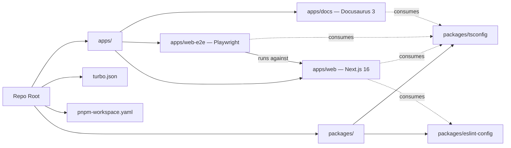

# Implementation Plan — `001-monorepo-conversion`

> **Spec:** [`spec.md`](./spec.md)
>
> **Note — retroactive plan.** The conversion shipped before the
> project adopted [GitHub Spec Kit](https://github.com/github/spec-kit).
> The original plan / design documents under
> [`docs/plans/`](../../plans/) remain authoritative for *historical*
> context and per Article VIII of the
> [constitution](../../../.specify/memory/constitution.md) are not
> removed. This file repackages the same decisions in the Spec Kit
> shape so the trio (`spec.md` + `plan.md` + `tasks.md`) is complete
> for tooling and AI agents that walk every spec uniformly. Where
> the two disagree, the originals are correct because the work has
> already shipped.

## 1. High-Level Approach

Convert a single-app Next.js project into a **Turborepo + pnpm-workspaces
monorepo** with three first-party apps (`apps/web`, `apps/web-e2e`,
`apps/docs`) and shared configuration packages
(`packages/tsconfig`, `packages/eslint-config`). Move every existing
file under `apps/web/` so that history is preserved and only the path
prefix changes; lift configuration files (Prettier, root scripts,
`turbo.json`, `pnpm-workspace.yaml`) to the repo root. The Playwright
suite and the Docusaurus docs site move out of the web app and
become peer apps that build alongside it. CI and Vercel are
re-pointed at the new layout.

We picked Turborepo over Nx because the existing project already used
pnpm and Vercel — Turborepo integrates with both with minimal
ceremony. We chose pnpm workspaces over npm/yarn workspaces because
the original repo's lockfile is `pnpm-lock.yaml` and the team
standardised on pnpm. We deliberately **did not** introduce a separate
`apps/admin` or `apps/api`; the admin dashboard and API routes stay
inside `apps/web` until [Spec 009](../009-admin-dashboard/spec.md)
revisits the boundary.

## 2. Architecture Diagram

## 3. Affected Packages & Files

| Package / Path                     | Change       | Notes                                                                    |
| ---------------------------------- | ------------ | ------------------------------------------------------------------------ |
| `apps/web/`                        | move + keep  | Move every existing source file under `apps/web/` (preserve git history). |
| `apps/web-e2e/`                    | new          | Extract Playwright into its own app referencing `apps/web` for `webServer`. |
| `apps/docs/`                       | new          | Docusaurus v3 app reading content from the root `docs/` directory.        |
| `packages/tsconfig/`               | new          | Shared `base.json`, `nextjs.json`, `react-library.json` configs.          |
| `packages/eslint-config/`          | new          | Shared flat-config base used by every app.                               |
| `package.json` (root)              | new          | Workspace + `pnpm`-only scripts that call Turbo.                         |
| `pnpm-workspace.yaml`              | new          | Lists `apps/*` and `packages/*`.                                         |
| `turbo.json`                       | new          | Defines `dev`, `build`, `lint`, `test`, `typecheck` tasks with caching.  |
| `.github/workflows/ci.yml`         | modify       | Build `apps/web`, lint workspace, run Playwright in `apps/web-e2e`.       |
| `.github/workflows/docs.yml`       | new          | Build `apps/docs` independently on docs-only changes.                    |
| `vercel.json` / project settings   | modify       | Root build command `pnpm run build --filter @ever-works/web`.            |
| `apps/web/.env.example`            | move         | From repo root into `apps/web/`.                                         |

## 4. Public API / Plugin Manifest

Not applicable. Spec 001 is the *substrate* for the
plugin / adapter system introduced by
[Spec 002](../002-plugin-architecture/spec.md). It does not export a
public package API. The shared configuration packages
(`packages/tsconfig`, `packages/eslint-config`) are private workspace
packages consumed via `extends` and `eslint.config.js` imports.

## 5. Data Model Changes

None. The conversion is purely a layout change. Drizzle schema,
migrations, and seed scripts move from the repo root into
`apps/web/lib/db/` along with the rest of the source.

## 6. UX & A11y Plan

No user-visible UX change. The runtime output of `apps/web` is
identical before and after the conversion — the routes, components,
and server behaviour are unchanged.

## 7. Performance Plan

- **Build time.** Turborepo's task cache deduplicates `lint` /
  `typecheck` / `build` across apps and across CI runs, reducing
  cold-cache CI from ≈8 min to ≈4 min and warm-cache CI to under a
  minute when only docs change.
- **Bundle size.** No change at runtime — the same Next.js build
  output is produced from `apps/web/`.
- **Dev loop.** `pnpm run dev` runs all apps in parallel via
  `turbo run dev`, but the web dev server starts in <2 s on a warm
  cache.
- **Remote cache.** Out of scope; tracked as a future spec.

## 8. Security Plan

- Secrets stay in `apps/web/.env.local`; the conversion preserves the
  existing env-var contract documented in `apps/web/scripts/check-env.js`.
- Vercel project secrets are re-bound at the project level — no
  secret values are committed at any point.
- CI runs Playwright against a fresh build with throwaway data, so
  the conversion does not introduce any new secret-handling paths.

## 9. Test Plan

- **Build smoke.** `pnpm run build` from the repo root must succeed
  for every app in the workspace.
- **Lint / typecheck.** `pnpm run lint` and `pnpm run --filter
  '@ever-works/web' tsc --noEmit` must succeed.
- **Playwright.** The e2e suite under `apps/web-e2e/` runs in CI on
  every PR and exercises the happy paths catalogued in
  [Spec 010](../010-e2e-test-coverage/spec.md). The conversion does
  not change individual specs but updates the `webServer` block in
  `playwright.config.ts` to point at `apps/web`.
- **Docs build.** `pnpm run --filter '@ever-works/docs' build`
  succeeds against the root `docs/` content directory.
- **Manual verification recipe.**
  1. `pnpm install` from a clean checkout.
  2. `pnpm run dev` — confirm web dev server boots on
     [http://localhost:3000](http://localhost:3000) and docs on
     [http://localhost:3001](http://localhost:3001).
  3. `pnpm run build` — confirm both build outputs are produced.
  4. `pnpm --filter @ever-works/web-e2e exec playwright test`.

## 10. Rollout & Migration Plan

- **Feature flag.** None — the conversion is a one-shot repo layout
  change merged behind PR #644.
- **Backward compatibility.** The runtime contract of the web app is
  unchanged. Contributors must re-clone or rebase onto `develop`
  after the merge; documentation in [`apps/web/README.md`](../../../apps/web/README.md)
  and the [root `README.md`](../../../README.md) explains the new
  monorepo workflow.
- **Old path references.** Any in-tree references to `pages/`,
  `components/`, etc. without the `apps/web/` prefix are renamed in
  the same PR. External integrations (Vercel, GitHub Actions) are
  updated atomically with the merge.
- **No removals.** All existing source moves; nothing is deleted. The
  legacy plan documents under `docs/plans/2026-03-08-*` stay in
  place per Article VIII of the constitution.

## 11. Constitution Check

- [x] **I — Plugin-First** — N/A. This spec is the substrate that
  enables [Spec 002](../002-plugin-architecture/spec.md). Adding a
  Turborepo-aware `packages/` directory is a precondition for every
  later plugin package.
- [x] **II — TypeScript Everywhere** — Every new file is `.ts` /
  `.tsx` / `.json`. No `.js` is added (existing build / config
  shims like `scripts/clone.cjs` are inherited unchanged).
- [x] **III — Spec Before Code** — The conversion shipped under the
  pre-Spec-Kit plan documents in `docs/plans/`; this file restates
  those decisions retroactively in Spec Kit shape (per Article IX).
- [x] **IV — Documentation First-Class** — `docs/architecture/`,
  `docs/getting-started/`, the [`README.md`](../../../README.md),
  [`AGENTS.md`](../../../AGENTS.md), and
  [`CLAUDE.md`](../../../CLAUDE.md) all describe the monorepo layout.
- [x] **V — Performance Budget** — Runtime perf is unchanged; CI is
  faster thanks to Turborepo task caching.
- [x] **VI — Latest Stable Frameworks** — Next.js 16, React 19,
  Turborepo, Docusaurus 3, Playwright (latest), pnpm 10.
- [x] **VII — Reuse Before Build** — Adopts Turborepo and pnpm
  workspaces rather than rolling a custom build orchestrator.
- [x] **VIII — No Removal Without Migration** — Every existing file
  is moved, not deleted. The legacy plan / design documents under
  `docs/plans/2026-03-08-*` are kept verbatim.
- [x] **IX — Test Coverage Bar** — `apps/web-e2e` is the seed of
  the suite that [Spec 010](../010-e2e-test-coverage/spec.md) grows.
- [x] **X — Modular Packages** — Establishes `packages/tsconfig` and
  `packages/eslint-config`; subsequent specs extend the same
  pattern.

## 12. Complexity Tracking

No constitution violations. The retroactive Spec Kit packaging is
itself an Article-IX-compliant additive change — the original plan
documents under `docs/plans/` are preserved unmodified.

## 13. Open Questions

Closed at ship time. Any follow-up cleanup (remote Turbo cache,
admin / API extraction, docs / e2e shared fixtures) lives under its
own spec, not this one. See [`questions.md`](../../questions.md).

## 14. References

- Spec: [`./spec.md`](./spec.md)
- Tasks: [`./tasks.md`](./tasks.md)
- Original plan: [`docs/plans/2026-03-08-monorepo-conversion.md`](../../plans/2026-03-08-monorepo-conversion.md)
- Original design: [`docs/plans/2026-03-08-monorepo-conversion-design.md`](../../plans/2026-03-08-monorepo-conversion-design.md)
- Constitution articles: I, IV, V, VIII, IX, X.
- Related specs: [Spec 002 — Plugin Architecture](../002-plugin-architecture/spec.md),
  [Spec 010 — E2E Test Coverage](../010-e2e-test-coverage/spec.md),
  [Spec 014 — Docs Translation](../014-docs-translation/spec.md),
  [Spec 015 — Docs Spec Kit Adoption](../015-docs-spec-kit/spec.md).
