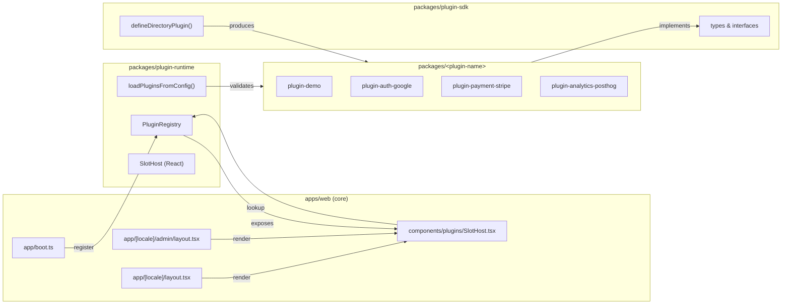

# Implementation Plan — `002-plugin-architecture`

> **Spec:** [`spec.md`](./spec.md)

## 1. High-Level Approach

We introduce two new workspace packages plus a thin runtime in `apps/web/`:

1. **`packages/plugin-sdk/`** — types, interfaces, Zod helpers, and the
   `defineDirectoryPlugin` factory. No runtime side effects.
2. **`packages/plugin-runtime/`** — boot-time registry, capability lookups,
   slot host React components, plugin-config loader. Depends only on
   `plugin-sdk`.
3. **`apps/web/lib/plugins/registry.ts`** — the singleton instance of the
   runtime, plus the canonical list of bundled plugins to register on boot.
4. **`apps/web/components/plugins/SlotHost.tsx`** — a React component that
   renders all components registered for a given slot id.

We choose this split because it lets us version the SDK independently and
publish it externally later without dragging in the runtime. The runtime is
React-aware; the SDK is framework-agnostic.

We migrate one existing integration (analytics) to the new architecture as a
**reference implementation** to prove the design before touching the rest.
Other integrations stay on their current shape and are migrated under their
own specs (see "Sequencing" below).

## 2. Architecture Diagram



## 3. Affected Packages & Files

| Package / Path                                                       | Change       | Notes                                                            |
| -------------------------------------------------------------------- | ------------ | ---------------------------------------------------------------- |
| `packages/plugin-sdk/`                                               | new          | Public SDK; depends only on `zod` and `react` (peer).            |
| `packages/plugin-runtime/`                                           | new          | Registry + slot host; depends on `plugin-sdk` and `react`.       |
| `packages/plugin-demo/`                                              | new          | Reference plugin used in tests and as a teaching example.        |
| `apps/web/lib/plugins/registry.ts`                                   | new          | App-singleton registry + bundled plugin list.                    |
| `apps/web/lib/plugins/loader.ts`                                     | new          | Reads `directory.config.ts` + env, validates configs.            |
| `apps/web/components/plugins/SlotHost.tsx`                           | new          | Thin RSC wrapper around runtime’s slot host.                     |
| `apps/web/app/[locale]/layout.tsx`                                   | modify       | Render `header.right` slot.                                      |
| `apps/web/app/[locale]/admin/(dashboard)/settings/page.tsx`          | modify       | Render `admin.settings.section` slot.                            |
| `apps/web/lib/db/schema/plugin-settings.ts`                          | new          | Drizzle table for per-plugin enabled/config.                     |
| `apps/web/app/api/admin/plugins/**`                                  | new          | REST endpoints for the admin UI.                                 |
| `apps/web/components/admin/plugins/PluginsTable.tsx`                 | new          | Admin UI listing.                                                |
| `apps/web-e2e/tests/plugins/registry.spec.ts`                        | new          | Verifies registry behaviour.                                     |
| `apps/web-e2e/tests/plugins/slots.spec.ts`                           | new          | Verifies slot rendering.                                         |
| `apps/web-e2e/tests/plugins/admin-toggle.spec.ts`                    | new          | Verifies admin toggle.                                           |
| `docs/architecture/plugin-system.md`                                 | new          | Architecture overview.                                           |
| `docs/plugins/authoring-a-plugin.md`                                 | new          | Step-by-step authoring guide.                                    |
| `docs/plugins/lifecycle.md`                                          | new          | Boot, config, enable/disable lifecycle.                          |
| `docs/index.md`                                                      | modify       | Link the new pages from the index.                               |
| `docs/log.md`                                                        | modify       | Append a `YYYY-MM-DD plugin-architecture: …` entry.              |
| `pnpm-workspace.yaml`                                                | unchanged    | Already globs `packages/*`.                                      |

## 4. Public API / Plugin Manifest

```ts
// packages/plugin-sdk/src/index.ts
import { z } from 'zod';

export type Capability =
  | 'auth'
  | 'payment'
  | 'analytics'
  | 'search'
  | 'content-source'
  | 'maps'
  | 'newsletter'
  | 'notifications'
  | 'ai'
  | 'ui-slot';

export interface PluginManifest<C extends z.ZodTypeAny = z.ZodTypeAny> {
  name: string;
  version: string;
  description?: string;
  templateRange: string;
  capabilities: Capability[];
  config: C;
  defaultEnabled?: boolean;
  adminToggleable?: boolean;
}

export interface DirectoryPlugin<C extends z.ZodTypeAny = z.ZodTypeAny> {
  manifest: PluginManifest<C>;
  setup?: (ctx: PluginContext<z.infer<C>>) => void | Promise<void>;
  teardown?: () => void | Promise<void>;
  slots?: Record<string, React.ComponentType<{ ctx: PluginContext }>>;
  providers?: Partial<Record<Capability, unknown>>;
}

export function defineDirectoryPlugin<C extends z.ZodTypeAny>(
  spec: DirectoryPlugin<C>
): DirectoryPlugin<C> {
  return spec;
}
```

```ts
// packages/plugin-runtime/src/index.ts
export class PluginRegistry {
  register(plugin: DirectoryPlugin): void;
  isEnabled(name: string): boolean;
  enable(name: string): Promise<void>;
  disable(name: string): Promise<void>;
  get<T>(capability: Capability): T | undefined;
  list<T>(capability: Capability): T[];
  slotsFor(slotId: string): React.ComponentType<{ ctx: PluginContext }>[];
}
```

## 5. Data Model Changes

```ts
// apps/web/lib/db/schema/plugin-settings.ts
export const pluginSettings = pgTable('plugin_settings', {
  name: text('name').primaryKey(),
  enabled: boolean('enabled').notNull().default(true),
  config: jsonb('config').notNull().$type<Record<string, unknown>>(),
  updatedAt: timestamp('updated_at').notNull().defaultNow(),
});
```

Migration: `pnpm db:generate` + `pnpm db:migrate`. Backfill: every bundled
plugin gets a row with `enabled = manifest.defaultEnabled ?? true`.

## 6. UX & A11y Plan

- Admin Settings → **Plugins** accordion section.
- Toggle uses `<Switch>` with a clear `aria-label` describing the action.
- Disable confirmation modal lists the surfaces affected.
- Empty state when no plugins are installed (cannot really happen, but
  defensive).

## 7. Performance Plan

- Registry is built **once** at process start.
- Slot lookups are O(1) Map reads.
- Slot components default to RSC; client slots use `next/dynamic` with
  `ssr: false` only when required by the plugin.
- Bundle impact: ≤ 5 KB gzip for SDK + runtime in client bundles.

## 8. Security Plan

- All plugin configs validated against a Zod schema at boot **and** on
  admin write.
- Admin endpoints require the `admin` role middleware that already exists.
- No `eval` or dynamic `import()` of arbitrary paths — bundled plugins are
  enumerated explicitly in `apps/web/lib/plugins/registry.ts`.

## 9. Test Plan

- Unit: registry behaviour, loader validation errors, slot lookups.
- E2E:
  - `apps/web-e2e/tests/plugins/registry.spec.ts`
  - `apps/web-e2e/tests/plugins/slots.spec.ts`
  - `apps/web-e2e/tests/plugins/admin-toggle.spec.ts`
- Manual: enable/disable the demo plugin via the admin UI and verify the
  slot output disappears.

## 10. Rollout & Migration Plan

- Land SDK + runtime + demo plugin behind a feature flag
  `NEXT_PUBLIC_PLUGINS_ENABLED=true`. Default `true` once stable.
- Migrate analytics first as the reference implementation.
- Document the migration path for the remaining integrations in their own
  specs.

## 11. Constitution Check

- [x] **I — Plugin-First** — this *is* the foundation.
- [x] **II — TypeScript Everywhere** — pure TS.
- [x] **III — Spec Before Code** — this plan exists.
- [x] **IV — Documentation First-Class** — three new docs pages + index/log.
- [x] **V — Performance Budget** — RSC-first, O(1) lookups.
- [x] **VI — Latest Stable Frameworks** — uses Zod/React/Next as currently
  pinned.
- [x] **VII — Reuse Before Build** — Zod for config; no custom DSL.
- [x] **VIII — No Removal Without Migration** — additive change; existing
  integrations untouched until per-spec migration.
- [x] **IX — Test Coverage Bar** — three e2e specs.
- [x] **X — Modular Packages** — three new focused packages.

## 12. Complexity Tracking

None. This plan is fully constitutional.

## 13. Open Questions

Mirrored to [`docs/questions.md`](../../questions.md):

- `Q-002a` SDK package name — **default: `@ever-works/plugin-sdk`**.
- `Q-002b` Plugin-to-plugin extensions in v1 — **default: yes, minimal**.
- `Q-002c` Where do per-plugin configs live? **default: DB row + override
  via env vars**.

## 14. References

- Spec: `./spec.md`
- Constitution: `../../../.specify/memory/constitution.md`
- Existing analytics work: PR #685, PR #686, PR #692.
