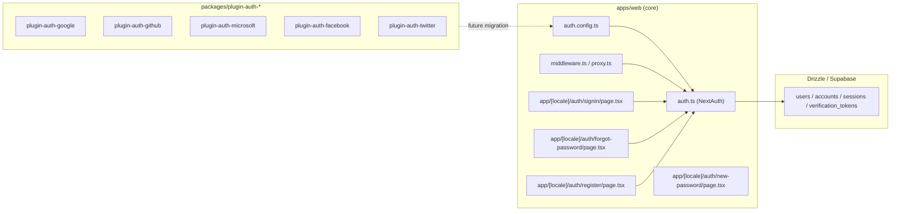

# Implementation Plan — `003-auth-providers`

> **Spec:** [`spec.md`](./spec.md)
>
> **Status.** Retroactive. The behaviour described here is **already
> shipped**; this plan documents the existing topology and the migration
> path to the plugin architecture from
> [`002`](../002-plugin-architecture/spec.md).

## 1. High-Level Approach

Authentication uses **Auth.js v5 (NextAuth)** with the **Drizzle adapter**
plus an optional **Supabase Auth adapter**. The set of OAuth providers is
selected by environment variables at boot. A small wrapper module
(`apps/web/auth.config.ts`) is the **single configuration entry point**;
everything else (middleware, server actions, route handlers) consumes the
`auth()` helper exported from `apps/web/auth.ts`.

The future direction is a **plugin/adapter** model: each provider becomes
its own package (`packages/plugin-auth-google/`,
`plugin-auth-github/`, …) implementing an `AuthProvider` interface from
`@ever-works/plugin-sdk`. The runtime registry assembles the active set,
honours per-environment toggles, and renders only the buttons the admin has
enabled. Until SDK 002 stabilises, we keep the env-flag form so the
template stays usable.

## 2. Architecture Diagram



## 3. Affected Packages & Files

| Package / Path                                            | Change           | Notes                                               |
| --------------------------------------------------------- | ---------------- | --------------------------------------------------- |
| `apps/web/auth.config.ts`                                 | maintain         | Single source of truth for the provider list.       |
| `apps/web/auth.ts`                                        | maintain         | Exports `auth`, `signIn`, `signOut`, handlers.      |
| `apps/web/middleware.ts` / `proxy.ts`                     | maintain         | Route protection.                                   |
| `apps/web/lib/auth/middleware.ts`                         | maintain         | `ActionState` helper for server actions.            |
| `apps/web/app/[locale]/auth/**`                           | maintain         | Sign-in, register, forgot/new password screens.     |
| `apps/web/lib/db/schema/auth.ts`                          | maintain         | Drizzle tables.                                     |
| `apps/web-e2e/tests/auth/{signin,signout,register}.spec.ts` | maintain       | Existing coverage.                                  |
| `apps/web-e2e/tests/auth/forgot-password.spec.ts`         | **new**          | Reset request UI + success state.                   |
| `apps/web-e2e/tests/auth/new-password.spec.ts`            | **new**          | Token-bearing reset screen renders the form.        |
| `packages/plugin-auth-google/`                            | future           | Migration target (002).                             |
| `packages/plugin-auth-github/`                            | future           | Migration target (002).                             |
| `packages/plugin-auth-microsoft/`                         | future           | Migration target (002).                             |
| `packages/plugin-auth-facebook/`                          | future           | Migration target (002).                             |
| `packages/plugin-auth-twitter/`                           | future           | Migration target (002).                             |
| `docs/authentication/**`                                  | maintain         | Provider-specific guides.                           |
| `docs/spec/003-auth-providers/{plan,tasks}.md`            | **this PR**      | Catch up Spec Kit artefacts.                        |

## 4. Public API / Plugin Manifest

After migration to plugin SDK 002, each provider exports:

```ts
// packages/plugin-auth-google/src/index.ts
import { defineDirectoryPlugin } from '@ever-works/plugin-sdk';
import { z } from 'zod';

const ConfigSchema = z.object({
  enabled: z.boolean().default(false),
  clientId: z.string().min(1),
  clientSecret: z.string().min(1),
  allowedDomains: z.array(z.string()).optional(),
});

export default defineDirectoryPlugin({
  manifest: {
    name: 'auth-google',
    version: '0.1.0',
    templateRange: '>=0.1 <1.0',
    capabilities: ['auth'],
    config: ConfigSchema,
    defaultEnabled: false,
    adminToggleable: true,
  },
  providers: { auth: { /* AuthProvider impl */ } },
});
```

## 5. Data Model

The Auth.js Drizzle adapter contract:

- `users(id, email, emailVerified, image, name, role, …)`
- `accounts(userId, provider, providerAccountId, …)`
- `sessions(sessionToken, userId, expires)`
- `verification_tokens(identifier, token, expires)`

No schema changes are required for this catch-up plan. The plugin
migration will move provider-specific config out of env vars and into
`plugin_settings.config` (introduced by spec 002).

## 6. UX & A11y Plan

- Sign-in page lists OAuth buttons only when `AUTH_<PROVIDER>_ENABLED=true`.
- Each button has an accessible name (`Sign in with Google`, …).
- Forgot-password screen has a `Back to login` link with a clear focus
  ring; success state is announced via the alert role.
- All copy is sourced from `apps/web/messages/<locale>.json` under the
  `common.*` and `admin.FORGOT_PASSWORD_PAGE.*` namespaces.

## 7. Performance Plan

- Provider list is computed once at module load — no per-request work.
- Sign-in route is a server component; the form is the only client island.
- No bundle impact beyond what NextAuth ships.

## 8. Security Plan

- `AUTH_SECRET` validated by `apps/web/scripts/check-env.js` before boot;
  missing values fail loudly.
- `COOKIE_SECRET`, `COOKIE_DOMAIN`, `COOKIE_SECURE` enforced in production.
- CSRF protected by Auth.js defaults.
- Rate limiting on `/api/auth/**` is delegated to upstream
  (Vercel / proxy); a future spec should add per-IP throttling.

## 9. Test Plan

- Existing: `apps/web-e2e/tests/auth/{signin,signout,register}.spec.ts`.
- **New (this plan):** `apps/web-e2e/tests/auth/forgot-password.spec.ts`,
  `apps/web-e2e/tests/auth/new-password.spec.ts`.
- Manual: enable Google in `.env.local` and confirm the button renders;
  sign in; confirm a session cookie is set.

## 10. Rollout & Migration Plan

- This plan is retroactive. The migration to plugin SDK 002 lands per
  provider, behind a feature flag, with the env-flag form kept as a
  fallback for one minor version.

## 11. Constitution Check

- [x] **I — Plugin-First** — migration path to packages documented.
- [x] **II — TypeScript Everywhere** — pure TS.
- [x] **III — Spec Before Code** — retroactive spec exists.
- [x] **IV — Documentation First-Class** — `docs/authentication/` and this
  plan.
- [x] **V — Performance Budget** — server-only provider resolution.
- [x] **VI — Latest Stable Frameworks** — Auth.js v5.
- [x] **VII — Reuse Before Build** — Auth.js, not bespoke.
- [x] **VIII — No Removal Without Migration** — env-flag form retained.
- [x] **IX — Test Coverage Bar** — adds forgot/new password specs.
- [x] **X — Modular Packages** — future plugin packages outlined.

## 12. Complexity Tracking

None. The retroactive plan tracks an existing implementation; the
migration to packages is sequenced per provider in 002.

## 13. Open Questions

Mirrored to [`docs/questions.md`](../../questions.md):

- `Q-003a` Add Passkey / WebAuthn? — **default: defer** until Auth.js
  Passkey support is GA-stable.

## 14. References

- Spec: `./spec.md`
- Plugin architecture: [`002`](../002-plugin-architecture/spec.md)
- Auth.js: <https://authjs.dev>
- Constitution Articles: I, IV, V, VI, IX.
