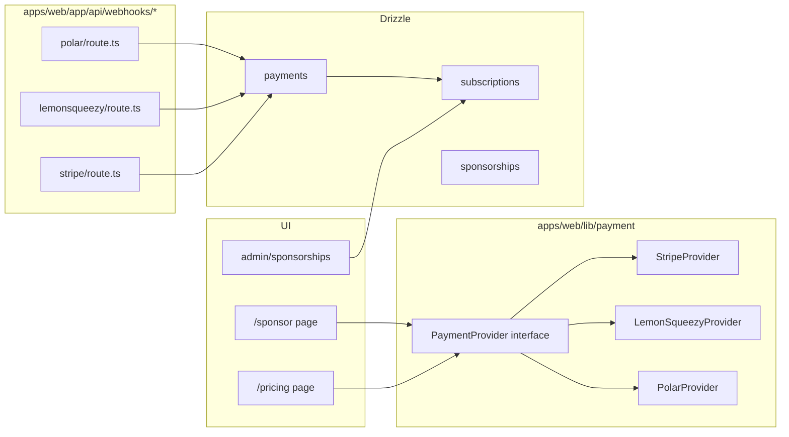

# Implementation Plan — `004-payment-providers`

> **Spec:** [`spec.md`](./spec.md)
>
> **Status.** Retroactive. The behaviour is shipped today; this plan
> documents the topology and the migration path to the plugin
> architecture from [`002`](../002-plugin-architecture/spec.md).

## 1. High-Level Approach

A single `PaymentProvider` interface lives under
[`apps/web/lib/payment/`](../../apps/web/lib/payment) and three concrete
implementations sit alongside it: **Stripe**, **LemonSqueezy**, and
**Polar**. The admin selects the active provider; checkout sessions are
created via a thin server action that picks the correct implementation by
its `id`. Webhooks are isolated under
`apps/web/app/api/webhooks/{stripe,lemon,polar}/`, each verifying the
provider-specific signature before dispatching domain events.

The forward path is `packages/plugin-payment-{stripe,lemon,polar}/`,
each exporting a `defineDirectoryPlugin` factory that registers a
`PaymentProvider` with the runtime registry from spec 002. Until that
ships, the env-flag form continues to work.

## 2. Architecture Diagram



## 3. Affected Packages & Files

| Package / Path                                            | Change       | Notes                                          |
| --------------------------------------------------------- | ------------ | ---------------------------------------------- |
| `apps/web/lib/payment/index.ts`                           | maintain     | Public surface.                                |
| `apps/web/lib/payment/{stripe,lemonsqueezy,polar}/**`     | maintain     | Provider implementations.                      |
| `apps/web/app/api/webhooks/{stripe,lemon,polar}/route.ts` | maintain     | Signature-verified webhooks.                   |
| `apps/web/lib/db/schema/{subscriptions,payments,sponsorships}.ts` | maintain | Domain tables.                            |
| `apps/web/app/[locale]/pricing/**`                        | maintain     | Public pricing page.                           |
| `apps/web/app/[locale]/sponsor/**`                        | maintain     | Sponsor checkout entry.                        |
| `apps/web/app/[locale]/admin/sponsorships/**`             | maintain     | Admin sponsorships management.                 |
| `apps/web-e2e/tests/public/pricing.spec.ts`               | maintain     | Pricing page renders.                          |
| `apps/web-e2e/tests/admin/sponsorships.spec.ts`           | maintain     | Admin view.                                    |
| `apps/web-e2e/tests/public/sponsor.spec.ts`               | **new**      | Sponsor page renders + CTA presence.           |
| `packages/plugin-payment-stripe/`                         | future       | Migration target.                              |
| `packages/plugin-payment-lemonsqueezy/`                   | future       | Migration target.                              |
| `packages/plugin-payment-polar/`                          | future       | Migration target.                              |
| `docs/payment/**`                                         | maintain     | Provider-specific guides.                      |
| `docs/spec/004-payment-providers/{plan,tasks}.md`         | **this PR**  | Catch up Spec Kit artefacts.                   |

## 4. Public API / Plugin Manifest

Future plugin shape (post-002):

```ts
// packages/plugin-payment-stripe/src/index.ts
import { defineDirectoryPlugin } from '@ever-works/plugin-sdk';
import { z } from 'zod';

const ConfigSchema = z.object({
  enabled: z.boolean().default(false),
  publishableKey: z.string().min(1),
  secretKey: z.string().min(1),
  webhookSecret: z.string().min(1),
  defaultCurrency: z.string().length(3).default('USD'),
});

export default defineDirectoryPlugin({
  manifest: {
    name: 'payment-stripe',
    version: '0.1.0',
    templateRange: '>=0.1 <1.0',
    capabilities: ['payment'],
    config: ConfigSchema,
    defaultEnabled: false,
    adminToggleable: true,
  },
  providers: { payment: { /* PaymentProvider impl */ } },
});
```

The shared interface (in core today, in `@ever-works/plugin-sdk` later):

```ts
export interface PaymentProvider {
  id: 'stripe' | 'lemonsqueezy' | 'polar';
  createCheckoutSession(input: CheckoutInput): Promise<CheckoutResult>;
  verifyWebhook(req: Request): Promise<WebhookEvent>;
  mapStatus(raw: unknown): SubscriptionStatus;
}
```

## 5. Data Model

- `subscriptions(id, userId, providerId, providerSubscriptionId, status, …)`
- `payments(id, userId, providerId, providerPaymentId, amount, currency, …)`
- `sponsorships(id, itemId, userId, providerPaymentId, status, …)`

No schema changes required for this catch-up plan.

## 6. UX & A11y Plan

- Pricing buttons use `<button>`/`<a>` with descriptive labels.
- Currency formatting via `Intl.NumberFormat` keyed off the user's locale.
- Receipts are delivered by the provider; the admin sees an event log.
- Empty pricing tier list shows an actionable message.

## 7. Performance Plan

- Pricing tiers are fetched server-side and memoised per request.
- Provider clients are instantiated lazily on the server.
- No client-side payment SDK on the public pricing page (Stripe.js loads
  only on `/sponsor` checkout).

## 8. Security Plan

- Webhook signatures verified using each provider's documented HMAC.
- Secret keys consumed only on the server (`payment/*/server.ts`).
- Idempotency keys recorded in `payments.providerPaymentId` to avoid
  duplicate processing on webhook retries.
- Rate-limit `/api/webhooks/*` is delegated to the platform.

## 9. Test Plan

- E2E (UI smoke):
  - `apps/web-e2e/tests/public/pricing.spec.ts` (existing).
  - `apps/web-e2e/tests/admin/sponsorships.spec.ts` (existing).
  - **New:** `apps/web-e2e/tests/public/sponsor.spec.ts` — sponsor page
    renders with CTA buttons.
- Manual: complete a checkout in each provider's sandbox; verify the
  webhook updates `subscriptions.status`.
- **Out of E2E:** real card transactions; sandbox flows are exercised in
  manual QA only.

## 10. Rollout & Migration Plan

- This plan is retroactive.
- Migration to plugins lands one provider at a time, behind
  `NEXT_PUBLIC_PLUGINS_ENABLED=true` once spec 002 ships.

## 11. Constitution Check

- [x] **I — Plugin-First** — migration path documented.
- [x] **II — TypeScript Everywhere** — pure TS.
- [x] **III — Spec Before Code** — spec exists.
- [x] **IV — Documentation First-Class** — `docs/payment/` and this plan.
- [x] **V — Performance Budget** — server-side pricing, lazy SDKs.
- [x] **VI — Latest Stable Frameworks** — current Stripe / LemonSqueezy /
  Polar SDKs.
- [x] **VII — Reuse Before Build** — provider SDKs, not bespoke.
- [x] **VIII — No Removal Without Migration** — additive.
- [x] **IX — Test Coverage Bar** — existing + new sponsor smoke.
- [x] **X — Modular Packages** — future plugin packages outlined.

## 12. Complexity Tracking

None. The provider-per-package migration is sequenced behind 002.

## 13. Open Questions

Mirrored to [`docs/questions.md`](../../questions.md):

- `Q-004a` Multiple active providers per checkout? — **default: single
  active provider per session**.

## 14. References

- Spec: `./spec.md`
- Plugin architecture: [`002`](../002-plugin-architecture/spec.md)
- Constitution Articles: I, IV, V, VI, VII, IX.
