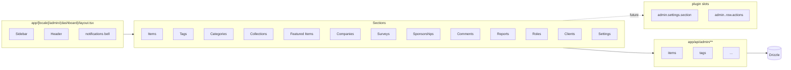

# Implementation Plan — `009-admin-dashboard`

> **Spec:** [`spec.md`](./spec.md)
>
> **Status.** Retroactive. The 17-section admin area is shipped today.

## 1. High-Level Approach

The admin area lives under
`apps/web/app/[locale]/admin/(dashboard)/**` with a sectioned layout
(`layout.tsx`) that hosts every CRUD surface for the directory's
operational data: items, categories, tags, collections, featured items,
companies, surveys, sponsorships, comments, reports, roles, clients,
notifications, and settings (analytics, monetisation, theming, header,
homepage, general).

REST endpoints live under `apps/web/app/api/admin/**` and are guarded
by an `admin` middleware. Tables virtualise for large data sets.
Forms use `react-hook-form` + Zod for validation.

The future direction (per spec 002) is a **slot system** so plugins can
add admin sections (`admin.settings.section`,
`admin.<entity>.toolbar`, `admin.<entity>.row.actions`) without
forking the layout.

## 2. Architecture Diagram



## 3. Affected Packages & Files

| Path                                                | Change      | Notes                                          |
| --------------------------------------------------- | ----------- | ---------------------------------------------- |
| `apps/web/app/[locale]/admin/(dashboard)/**`        | maintain    | All admin pages.                               |
| `apps/web/app/api/admin/**`                         | maintain    | REST endpoints.                                |
| `apps/web/components/admin/**`                      | maintain    | Tables, forms, modals, sidebars.               |
| `apps/web/lib/auth/middleware.ts`                   | maintain    | Admin route guard.                             |
| `apps/web/lib/db/schema/**`                         | maintain    | Drizzle tables.                                |
| `apps/web-e2e/tests/admin/**`                       | maintain    | 21 admin spec files.                           |
| `apps/web-e2e/page-objects/admin/**`                | maintain    | POMs per section.                              |
| `apps/web-e2e/tests/admin/notifications.spec.ts`    | maintain    | Bell visibility & dropdown.                    |
| `docs/spec/009-admin-dashboard/{plan,tasks}.md`     | **this PR** | Catch up Spec Kit artefacts.                   |
| Future slots in plugin SDK                          | future      | `admin.<entity>.row.actions`, etc.             |

## 4. Public API / Plugin Manifest

Future-direction plugin manifest:

```ts
// packages/plugin-admin-<x>/src/index.ts
export default defineDirectoryPlugin({
  manifest: {
    name: 'admin-<x>',
    capabilities: ['ui-slot'],
    config: z.object({ enabled: z.boolean().default(true) }),
  },
  slots: {
    'admin.settings.section': SectionComponent,
    'admin.items.row.actions': RowActionsComponent,
  },
});
```

## 5. Data Model

Each section maps to one or more existing Drizzle tables. No new
schema in this catch-up plan; future plugin-driven sections add their
own tables when needed.

## 6. UX & A11y Plan

- Sidebar navigation labelled with `aria-current="page"` for the active
  section.
- Tables expose row actions through accessible menu buttons, not raw
  three-dot icons.
- Modals trap focus and close on Escape.
- Empty states have a primary CTA (e.g. "Add your first tag").

## 7. Performance Plan

- Tables with ≥ 200 rows virtualise via `react-virtual` / TanStack Table.
- Server pagination as the default; client-side filtering where the
  full set is small.
- API routes use Drizzle prepared statements; N+1 is a blocker.

## 8. Security Plan

- All `app/api/admin/**` handlers call the admin middleware first.
- Mutations are rate-limited by the platform (Vercel WAF / proxy).
- Role checks happen on both client and server; the client check is
  cosmetic only.

## 9. Test Plan

- E2E: 21 admin spec files cover every section
  (`apps/web-e2e/tests/admin/**`).
- Manual: walk through each section's create / edit / delete flow.

## 10. Rollout & Migration Plan

- Retroactive plan; admin is the operational surface and ships in every
  version.

## 11. Constitution Check

- [x] **I — Plugin-First** — slot system is the future direction.
- [x] **II — TypeScript Everywhere** — TS throughout.
- [x] **III — Spec Before Code** — spec exists.
- [x] **IV — Documentation First-Class** — `docs/admin/` (per
  `docs/index.md`).
- [x] **V — Performance Budget** — virtualised tables.
- [x] **VI — Latest Stable Frameworks** — HeroUI, TanStack Table on
  latest.
- [x] **VII — Reuse Before Build** — TanStack, react-hook-form, Zod.
- [x] **VIII — No Removal Without Migration** — additive.
- [x] **IX — Test Coverage Bar** — 21 admin specs.
- [x] **X — Modular Packages** — admin sub-modules per section.

## 12. Complexity Tracking

None.

## 13. Open Questions

None blocking. Granular RBAC is captured under spec 009 Out-of-Scope
and could become its own spec.

## 14. References

- Spec: `./spec.md`
- E2E coverage map: [`apps/web-e2e/E2E-TESTS.md`](../../../apps/web-e2e/E2E-TESTS.md).
- Constitution Articles: II, IV, V, VI, IX.
