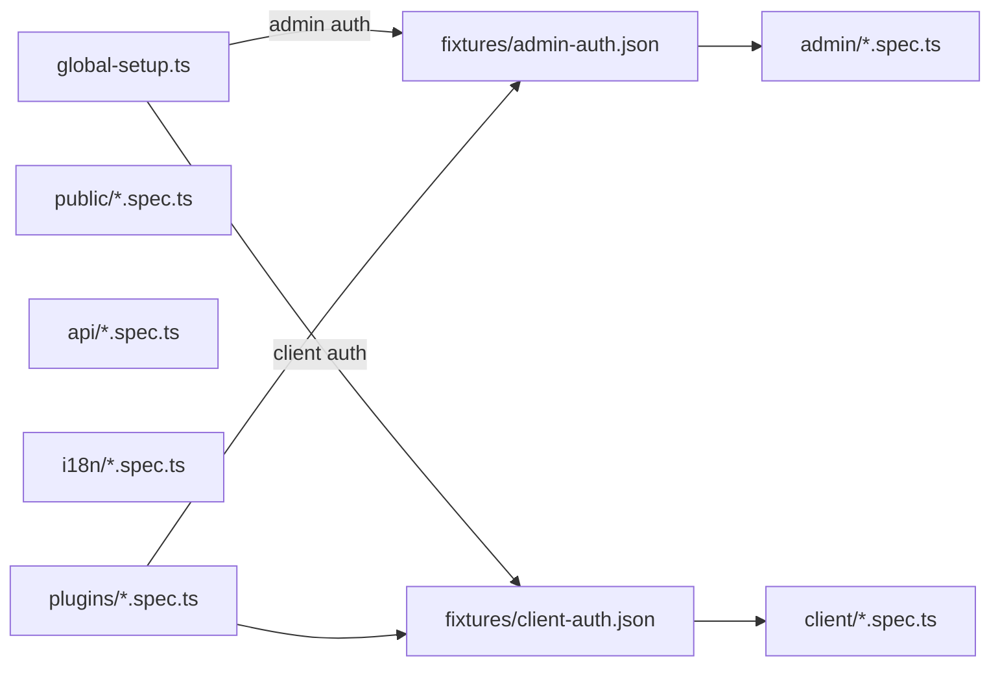

# Implementation Plan — `010-e2e-test-coverage`

> **Spec:** [`spec.md`](./spec.md)

## 1. High-Level Approach

The template already ships ~165 Playwright specs across smoke, auth,
public, client, admin, API, and i18n areas (see
[`apps/web-e2e/E2E-TESTS.md`](../../../apps/web-e2e/E2E-TESTS.md)).
This plan defines the **incremental backlog** to close the gaps the
spec lists as `AC-4..AC-9` (plugins, analytics emission, payments
smoke, maps render, newsletter, notifications) and adds two engineering
backlogs:

- **Resilience pass** — convert any spec still asserting on raw copy
  into a spec asserting on roles / labels / `data-testid`.
- **Speed pass** — group specs that share auth state into describe
  blocks so Playwright reuses contexts efficiently.

## 2. Architecture & Conventions



- One file per feature area.
- Helpers in [`apps/web-e2e/helpers/`](../../../apps/web-e2e/helpers/).
- Page Objects in [`apps/web-e2e/page-objects/`](../../../apps/web-e2e/page-objects/).
- Fixtures merged into [`apps/web-e2e/fixtures/index.ts`](../../../apps/web-e2e/fixtures/index.ts).

## 3. Affected Files

| Path                                                                                                | Change | Notes                                          |
| --------------------------------------------------------------------------------------------------- | ------ | ---------------------------------------------- |
| `apps/web-e2e/tests/plugins/registry.spec.ts`                                                       | new    | Plugin registry boot, enable/disable visible  |
| `apps/web-e2e/tests/plugins/slots.spec.ts`                                                          | new    | Known slots render in expected DOM positions  |
| `apps/web-e2e/tests/plugins/admin-toggle.spec.ts`                                                   | new    | Admin toggles plugin from UI                   |
| `apps/web-e2e/tests/public/maps.spec.ts`                                                            | new    | Map renders for items with coordinates         |
| `apps/web-e2e/tests/public/payments-smoke.spec.ts`                                                  | new    | Pricing page renders, checkout button visible  |
| `apps/web-e2e/tests/public/analytics-emission.spec.ts`                                              | new    | Verifies events for enabled providers          |
| `apps/web-e2e/tests/client/notifications.spec.ts`                                                   | new    | Client bell badge updates on notification      |
| `apps/web-e2e/tests/public/newsletter-validation.spec.ts`                                           | new    | Subscribe + invalid email path                  |
| `apps/web-e2e/page-objects/public/AnalyticsPage.ts`                                                 | new    | Wraps analytics request capture helpers        |
| `apps/web-e2e/page-objects/admin/PluginsPage.ts`                                                    | new    | Wraps the admin Plugins table interactions     |
| `apps/web-e2e/E2E-TESTS.md`                                                                         | edit   | Add backlog rows + link to this plan           |
| `docs/log.md`                                                                                       | edit   | Append a `2026-04-30 spec-010: …` entry        |

## 4. Test Strategy by AC

### AC-4 — Plugin registry / slot rendering

Three specs (`registry`, `slots`, `admin-toggle`) under
`apps/web-e2e/tests/plugins/`. Use the demo plugin shipped in
`packages/plugin-demo/` (per Spec 002 / T-003) so the test does not
depend on any real provider. Toggle the plugin via the admin REST
endpoints and verify the visible slot output appears / disappears.

### AC-5 — Analytics emission

A new helper `recordAnalyticsRequests(page, providerHosts)` listens
for outgoing network requests to the configured provider hosts. The
spec navigates through canonical routes (home → category → item
detail → item submit) and asserts at least one event per route per
enabled provider.

### AC-6 — Payments smoke

The spec verifies the pricing page renders, each enabled provider
shows a CTA, and clicking the CTA redirects to the provider sandbox
domain (we **stop short** of submitting card data — that is out of
scope for an e2e suite).

### AC-7 — Maps

Pre-seed an item with coordinates via the test setup helper, navigate
to the item detail page, and assert that the map container element
exists and the marker count for the seeded item is ≥ 1. Skip
gracefully if `GOOGLE_MAPS_API_KEY` is not set in CI (return
`test.skip("no map API key")`).

### AC-8 — Newsletter validation

Submit a valid email → success toast. Submit an invalid email →
inline `aria-describedby` error message. Submit again with the same
valid email → idempotent success.

### AC-9 — Client notifications

Trigger an admin action that produces a client-visible notification
(approve a submission). On the client session, assert the bell badge
increments and the dropdown contains a notification entry.

## 5. Resilience pass (engineering backlog)

A small audit pass:

```bash
# from monorepo root
grep -RIn "getByText('" apps/web-e2e/tests | wc -l
```

For every match where the asserted text is content-driven (not chrome
copy), replace with a role/label/test-id selector. This is incremental
and need not block other tasks; capture as a TODO list inside this
plan when discovered.

## 6. Speed pass

- Group specs that share storage state into describe blocks with
  `test.use({ storageState })`.
- Audit `beforeEach` hooks that re-navigate to the same page; lift
  to a `beforeAll` where the page state is read-only.
- Confirm `fullyParallel: true` is honoured (true today; see
  [`apps/web-e2e/playwright.config.ts`](../../../apps/web-e2e/playwright.config.ts)).

## 7. Performance Plan

- Don’t add waits longer than 5s; Playwright auto-waits.
- Keep CI workers at `2` until measured wall time > 20 minutes
  ([Q-010a default](../../questions.md#q-010a-worker-count-in-ci)).

## 8. Security Plan

- Never use real provider secrets in tests. Use `*_TEST_*` env vars
  in CI; document required variables in `apps/web-e2e/README.md`
  (gap, future task).

## 9. Test Plan

Each task ends with a `pnpm --filter @ever-works/web-e2e exec
playwright test <file>` verification step. The CI workflow already
runs the full suite on push to `develop` / `main`.

## 10. Rollout & Migration Plan

- Land the plugin specs in lockstep with Spec 002 implementation.
- Other backlog specs can land independently.
- Each PR appends a row to
  [`apps/web-e2e/E2E-TESTS.md`](../../../apps/web-e2e/E2E-TESTS.md).

## 11. Constitution Check

- [x] **I — Plugin-First** — tests live alongside their plugins.
- [x] **II — TypeScript Everywhere** — Playwright in TS.
- [x] **III — Spec Before Code** — this plan exists.
- [x] **IV — Documentation First-Class** — `E2E-TESTS.md` updated.
- [x] **V — Performance Budget** — speed pass included.
- [x] **VI — Latest Stable Frameworks** — Playwright pinned latest.
- [x] **VII — Reuse Before Build** — Page Objects + helpers reused.
- [x] **VIII — No Removal Without Migration** — additive only.
- [x] **IX — Test Coverage Bar** — that *is* this spec.
- [x] **X — Modular Packages** — Page Objects/helpers stay focused.

## 12. Complexity Tracking

None.

## 13. Open Questions

- [Q-010a Worker count in CI](../../questions.md#q-010a-worker-count-in-ci)
  — default kept at 2.

## 14. References

- Spec: `./spec.md`
- Coverage map: [`apps/web-e2e/E2E-TESTS.md`](../../../apps/web-e2e/E2E-TESTS.md)
- Constitution: [`../../../.specify/memory/constitution.md`](../../../.specify/memory/constitution.md)
