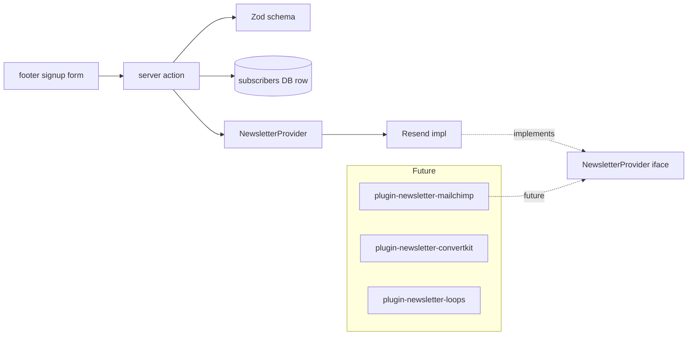

# Implementation Plan — `012-newsletter-providers`

> **Spec:** [`spec.md`](./spec.md)
>
> **Status.** Retroactive. Resend signup is shipped. Plugin migration
> is the forward direction.

## 1. High-Level Approach

A `NewsletterProvider` adapter contract lives under
`apps/web/lib/newsletter/`, with the **Resend** implementation as the
default. The public footer signup form posts to a server action that:

1. Validates input via Zod.
2. Optionally mirrors the subscriber to a `subscribers` table for audit.
3. Calls `provider.subscribe(email, source)` and surfaces success / error
   via toasts.

Future plugins (`packages/plugin-newsletter-{resend,mailchimp,convertkit,loops}/`)
will register through the SDK and be selectable from the admin UI.

## 2. Architecture Diagram



## 3. Affected Packages & Files

| Path                                                  | Change       | Notes                                       |
| ----------------------------------------------------- | ------------ | ------------------------------------------- |
| `apps/web/lib/newsletter/{types,index,resend}.ts`     | maintain     | Provider abstraction + impl.                |
| `apps/web/app/api/newsletter/subscribe/route.ts`      | maintain     | Subscribe endpoint.                         |
| `apps/web/components/footer/Newsletter.tsx`           | maintain     | Public form.                                |
| `apps/web/lib/db/schema/subscribers.ts`               | maintain     | Optional DB mirror.                         |
| `apps/web/messages/<locale>.json`                     | maintain     | Localised labels.                           |
| `apps/web-e2e/tests/public/newsletter.spec.ts`        | maintain     | Existing.                                   |
| `apps/web-e2e/tests/public/newsletter-validation.spec.ts` | **new**  | Per spec 010 AC-8.                          |
| `packages/plugin-newsletter-resend/`                  | future       | Migration target.                           |
| `packages/plugin-newsletter-{mailchimp,convertkit,loops}/` | future  | Optional adapters.                          |
| `docs/spec/012-newsletter-providers/{plan,tasks}.md`  | **this PR**  | Catch up Spec Kit artefacts.                |

## 4. Public API / Plugin Manifest

```ts
export interface NewsletterProvider {
  id: string;
  subscribe(email: string, source?: string): Promise<SubscribeResult>;
  unsubscribe(email: string): Promise<UnsubscribeResult>;
}
```

## 5. Data Model

- `subscribers(email, source, providerId, createdAt)` — optional mirror.

## 6. UX & A11y Plan

- `aria-live` region for success / error.
- Inline email validation with `aria-describedby`.
- Localised copy.

## 7. Performance Plan

- Form is a client island; server action does all work.
- No SDKs ship to the public bundle.

## 8. Security Plan

- Rate limit per IP (delegated to platform).
- Honeypot field for trivial spam mitigation.
- Provider secret stays server-only.

## 9. Test Plan

- E2E (existing): `tests/public/newsletter.spec.ts`.
- E2E (new): `tests/public/newsletter-validation.spec.ts` covers
  invalid + valid + duplicate paths.
- Manual: subscribe with Resend test mode; verify event in dashboard.

## 10. Rollout & Migration Plan

- Retroactive plan; provider plugins sequenced behind 002.

## 11. Constitution Check

- [x] **I — Plugin-First** — migration documented.
- [x] **II — TypeScript Everywhere** — TS throughout.
- [x] **III — Spec Before Code** — spec exists.
- [x] **IV — Documentation First-Class** — feature page exists.
- [x] **V — Performance Budget** — server-action only.
- [x] **VI — Latest Stable Frameworks** — Resend SDK on latest.
- [x] **VII — Reuse Before Build** — Resend reused.
- [x] **VIII — No Removal Without Migration** — additive.
- [x] **IX — Test Coverage Bar** — existing + new validation spec.
- [x] **X — Modular Packages** — future plugin packages outlined.

## 12. Complexity Tracking

None.

## 13. Open Questions

Mirrored to [`docs/questions.md`](../../questions.md):

- `Q-012a` Persist subscribers in our DB? — **default: mirror in DB
  for audit**.

## 14. References

- Spec: `./spec.md`
- Resend: <https://resend.com>
- Constitution Articles: I, IV, V, VII, IX.
