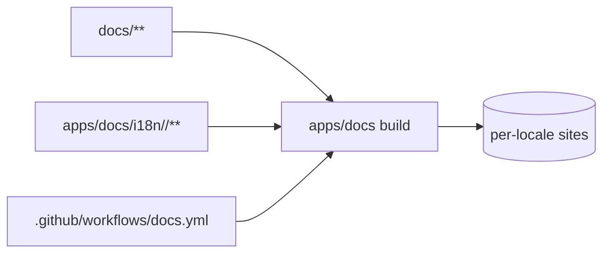

# Implementation Plan — `014-docs-translation`

> **Spec:** [`spec.md`](./spec.md)
>
> **Status.** Retroactive + ongoing. Per-locale Markdown is being filled
> in incrementally (PRs #672, #677, #680, #681).

## 1. High-Level Approach

The Docusaurus site at `apps/docs/` declares the supported locales in
`docusaurus.config.ts`. Translated content lives under
`apps/docs/i18n/<locale>/` for sidebar and navbar JSON, and the same
relative tree under `docs/<feature>/<locale>/` (or per-locale variants
where the docs feature folder layout requires) for Markdown bodies. CI
builds the English locale on every push; per-locale builds run on
release branches to keep CI fast.

## 2. Architecture Diagram

## 3. Affected Packages & Files

| Path                                              | Change      | Notes                                       |
| ------------------------------------------------- | ----------- | ------------------------------------------- |
| `apps/docs/docusaurus.config.ts`                  | maintain    | Locale list.                                |
| `apps/docs/i18n/<locale>/code.json`               | maintain    | UI strings.                                 |
| `apps/docs/i18n/<locale>/docusaurus-plugin-content-docs/current/**` | maintain | Translated docs. |
| `docs/internationalization/coverage.md`           | **new**     | Per-feature translation coverage table.     |
| `apps/web/scripts/i18n-coverage.ts`               | **new**     | Generates coverage data.                    |
| `.github/workflows/docs.yml`                      | maintain    | Per-locale builds gated to release.         |
| `docs/spec/014-docs-translation/{plan,tasks}.md`  | **this PR** | Catch up Spec Kit artefacts.                |

## 4. Public API / Plugin Manifest

N/A — translation is content-only.

## 5. Data Model

N/A.

## 6. UX & A11y Plan

- Locale switcher visible on the docs theme.
- Sidebar labels translated; URLs stay English.
- RTL applied for Arabic.

## 7. Performance Plan

- Per-locale builds gated to release branches.
- Translated builds cached by Docusaurus's incremental build mode.

## 8. Security Plan

- Translations are static Markdown; no executable content beyond
  approved Docusaurus components.

## 9. Test Plan

- CI: English build is the gate; per-locale builds smoke-checked on
  release branches.
- Manual: switch locales on the docs site and read sample pages.

## 10. Rollout & Migration Plan

- Translations land per-feature folder.
- Coverage table tracks progress.

## 11. Constitution Check

- [x] **I — Plugin-First** — N/A; Docs core.
- [x] **II — TypeScript Everywhere** — config in TS.
- [x] **III — Spec Before Code** — spec exists.
- [x] **IV — Documentation First-Class** — this *is* docs.
- [x] **V — Performance Budget** — incremental builds.
- [x] **VI — Latest Stable Frameworks** — Docusaurus on latest.
- [x] **VII — Reuse Before Build** — Docusaurus i18n.
- [x] **VIII — No Removal Without Migration** — additive.
- [x] **IX — Test Coverage Bar** — N/A; smoke is build success.
- [x] **X — Modular Packages** — content per feature folder.

## 12. Complexity Tracking

None.

## 13. Open Questions

Mirrored to [`docs/questions.md`](../../questions.md):

- `Q-014a` Translation hosting — **default: keep in repo**.

## 14. References

- Spec: `./spec.md`
- Docusaurus i18n: <https://docusaurus.io/docs/i18n/introduction>
- PRs: #672, #677, #680, #681.
- Constitution Articles: IV, VI.
