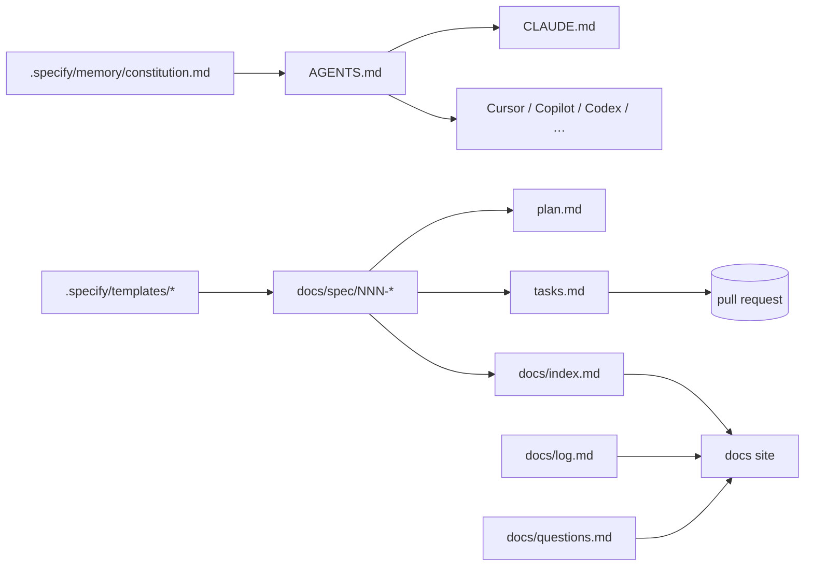

# Implementation Plan — `015-docs-spec-kit`

> **Spec:** [`spec.md`](./spec.md)
>
> **Status.** Mostly shipped (Spec Kit assets land 2026-04-30). Remaining
> work is automation and steady state.

## 1. High-Level Approach

The repo follows the [GitHub Spec Kit](https://github.com/github/spec-kit)
convention with two anchors:

- `.specify/` at the repo root holds the methodology — `README.md`,
  `memory/constitution.md`, `templates/{spec,plan,tasks}-template.md`.
- `docs/spec/` holds per-feature spec/plan/tasks trios so they ship with
  the docs site.

`AGENTS.md` and `CLAUDE.md` cross-cut the rules so any AI agent or
human contributor lands on the same instructions. `docs/log.md` and
`docs/questions.md` provide the running change log and open-questions
register described in the constitution.

The forward direction is automation:

1. A `lint-specs.ts` script that fails CI if a feature folder lacks
   `spec.md`, `plan.md`, or `tasks.md`.
2. A "spec coverage report" linking packages to their owning specs.
3. A PR template that requires linking the relevant spec.

## 2. Architecture Diagram

## 3. Affected Packages & Files

| Path                                      | Change      | Notes                                       |
| ----------------------------------------- | ----------- | ------------------------------------------- |
| `.specify/README.md`                      | maintain    | Onboarding doc.                             |
| `.specify/memory/constitution.md`         | maintain    | Ten-article constitution.                   |
| `.specify/templates/{spec,plan,tasks}-template.md` | maintain | Templates.                          |
| `docs/spec/README.md`                     | maintain    | Spec index.                                 |
| `docs/spec/NNN-*/spec.md`                 | maintain    | Existing specs.                             |
| `docs/spec/NNN-*/plan.md`                 | **growing** | Plans being added retroactively.            |
| `docs/spec/NNN-*/tasks.md`                | **growing** | Task lists being added retroactively.       |
| `AGENTS.md`                               | maintain    | Cross-cutting agent rules.                  |
| `CLAUDE.md`                               | maintain    | Claude-specific guidance.                   |
| `docs/index.md`                           | maintain    | Links to Spec Kit assets.                   |
| `docs/log.md`                             | maintain    | Running log.                                |
| `docs/questions.md`                       | maintain    | Open questions.                             |
| `apps/web/scripts/lint-specs.ts`          | **future**  | Spec validation script.                     |
| `.github/PULL_REQUEST_TEMPLATE.md`        | **future**  | Require spec link.                          |

## 4. Public API / Plugin Manifest

N/A.

## 5. Data Model

N/A.

## 6. UX & A11y Plan

N/A.

## 7. Performance Plan

- Spec lint should run quickly (< 5s); avoid heavy file walks.

## 8. Security Plan

- N/A — documentation-only.

## 9. Test Plan

- Manual review of `.specify/` and `docs/spec/` structure.
- Future: `pnpm tsx apps/web/scripts/lint-specs.ts` exits non-zero when
  a feature folder lacks any of the three artefacts.

## 10. Rollout & Migration Plan

- Adopted incrementally. Continual-improvement runs add plans / tasks
  to specs that lacked them.

## 11. Constitution Check

- [x] **I — Plugin-First** — N/A.
- [x] **II — TypeScript Everywhere** — TS lint script.
- [x] **III — Spec Before Code** — this is the methodology itself.
- [x] **IV — Documentation First-Class** — yes.
- [x] **V — Performance Budget** — N/A.
- [x] **VI — Latest Stable Frameworks** — N/A.
- [x] **VII — Reuse Before Build** — Spec Kit reused.
- [x] **VIII — No Removal Without Migration** — additive.
- [x] **IX — Test Coverage Bar** — manual review + future lint.
- [x] **X — Modular Packages** — N/A.

## 12. Complexity Tracking

None.

## 13. Open Questions

Mirrored to [`docs/questions.md`](../../questions.md):

- `Q-015a` Automate spec coverage report — **default: manual for now**,
  automate later.

## 14. References

- Spec: `./spec.md`
- Spec Kit: <https://github.com/github/spec-kit>
- Constitution Articles: III, IV, VIII.
