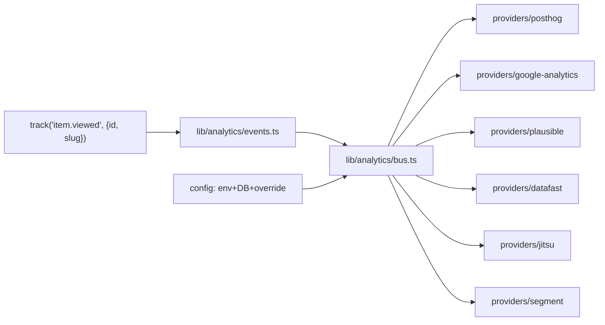

# Implementation Plan — `016-typed-analytics-events`

> **Spec:** [`spec.md`](./spec.md)
>
> **Status.** Retroactive. The typed event API and provider fan-out are
> shipped in PR #692. Outstanding: the analytics-emission e2e spec (per
> Spec 010 / T-006) and migration to the plugin architecture (Spec 002).

## 1. High-Level Approach

Centralise tracking on a single **typed event API** under
`apps/web/lib/analytics/`. Each event is described by a Zod schema and a
TypeScript type derived from it. The `track()` (or `events.<name>()`)
function is the **only** sanctioned way to emit. A small `bus.ts`
queues events and fans them out to every enabled provider; providers
implement `forward(name, payload, context)`.

This makes adding a new provider zero-touch for callers, and makes
adding a new event a single point-of-change in `events.ts`.

## 2. Architecture Diagram



## 3. Affected Packages & Files

| Path                                                  | Change       | Notes                                       |
| ----------------------------------------------------- | ------------ | ------------------------------------------- |
| `apps/web/lib/analytics/events.ts`                    | maintain     | Zod schemas + emitters.                     |
| `apps/web/lib/analytics/bus.ts`                       | maintain     | Fan-out to providers.                       |
| `apps/web/lib/analytics/providers/<name>.ts`          | maintain     | Provider adapters.                          |
| `docs/architecture/analytics-layer.md`                | maintain     | Architecture doc.                           |
| `apps/web-e2e/tests/public/analytics-emission.spec.ts`| **future**   | Per spec 010 AC-5.                          |
| `docs/spec/016-typed-analytics-events/{plan,tasks}.md`| **this PR**  | Catch up Spec Kit artefacts.                |

## 4. Public API

```ts
// apps/web/lib/analytics/events.ts
export const Events = {
  'page.viewed': z.object({ path: z.string() }),
  'item.viewed': z.object({ id: z.string(), slug: z.string() }),
  'item.favourited': z.object({ id: z.string() }),
  'item.unfavourited': z.object({ id: z.string() }),
  'item.upvoted': z.object({ id: z.string() }),
  'item.downvoted': z.object({ id: z.string() }),
  'comment.created': z.object({ itemId: z.string(), commentId: z.string() }),
  'submission.created': z.object({ submissionId: z.string() }),
  'submission.approved': z.object({ submissionId: z.string() }),
  'submission.rejected': z.object({ submissionId: z.string() }),
  'auth.signed-up': z.object({ method: z.string() }),
  'auth.signed-in': z.object({ method: z.string() }),
  'auth.signed-out': z.object({}),
  'newsletter.subscribed': z.object({ source: z.string().optional() }),
} satisfies Record<string, z.ZodTypeAny>;

export function track<E extends keyof typeof Events>(
  event: E,
  payload: z.infer<(typeof Events)[E]>,
): void;
```

## 5. Data Model

No DB changes. Configuration leans on Spec 008's `analytics_settings`
row.

## 6. UX & A11y Plan

N/A — developer-facing API.

## 7. Performance Plan

- Validation is dev-only; production strips Zod parsing on hot paths
  (or falls back to a cheap assertion).
- The bus is non-blocking; providers are fired and forgotten with a
  shared `requestIdleCallback` shim.
- Bundle impact: the typed events module + bus is a few KB gzip.

## 8. Security Plan

- Events never carry secret data.
- Server-only fields are stripped at the bus boundary.
- High-cardinality events (e.g. scroll position) are explicitly
  prohibited per the open question default.

## 9. Test Plan

- Unit (manual / dev console): emit each canonical event and verify
  validation.
- E2E (planned, per spec 010 T-006): assert the network requests for
  enabled providers on canonical routes.

## 10. Rollout & Migration Plan

- Retroactive plan; the API is in place.
- Plugin migration tracked under Spec 002 / T-011.

## 11. Constitution Check

- [x] **I — Plugin-First** — provider migration is the next step.
- [x] **II — TypeScript Everywhere** — typed events.
- [x] **III — Spec Before Code** — spec exists.
- [x] **IV — Documentation First-Class** — `analytics-layer.md`.
- [x] **V — Performance Budget** — dev-only validation.
- [x] **VI — Latest Stable Frameworks** — Zod on latest.
- [x] **VII — Reuse Before Build** — Zod, no bespoke validator.
- [x] **VIII — No Removal Without Migration** — additive.
- [x] **IX — Test Coverage Bar** — e2e gap to be closed.
- [x] **X — Modular Packages** — events module focused.

## 12. Complexity Tracking

None.

## 13. Open Questions

- Sample-rate analytics events for high-cardinality emitters — default:
  **don't emit scroll events at all** in v1.

## 14. References

- Spec: `./spec.md`
- Sibling plan: [`008/plan.md`](../008-analytics-providers/plan.md)
- PRs: #685, #686, #692.
- Constitution Articles: II, III, IV, V, VII.
