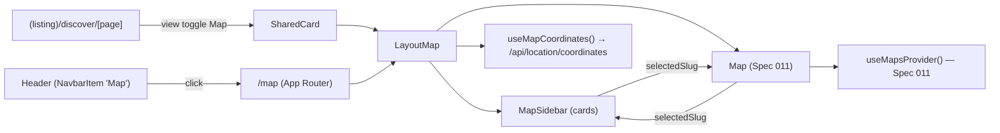

# Implementation Plan — `017-map-view`

> **Spec:** [`spec.md`](./spec.md)

## 1. High-Level Approach

The map UI building blocks already exist (Spec 011). What this plan
adds is the *experience* layer on top of them: a dedicated page, a
header navigation entry, and a synchronised sidebar.

We extend the existing `LayoutMap` component into a side-by-side
"map + sidebar" composition that lives behind a single new prop
(`showSidebar`). The same composition is used in two places:

1. inside `SharedCard` when the user clicks the **Map** button in the
   view toggle (existing flow), and
2. inside the new `app/[locale]/map/page.tsx` route, which renders the
   composition full-bleed with no hero.

This keeps the data flow simple — items still come from the cached
content loader, coordinates still come from
`GET /api/location/coordinates` via `useMapCoordinates()`, and a
`selectedSlug` piece of state lives at the composition root and drives
both the sidebar highlight and the map's pan-to-marker.

The new header link is gated on a single config key
(`settings.header.map_enabled`) plumbed through the existing
`HeaderSettings` plumbing (server-rendered via
`apps/web/app/[locale]/layout.tsx`, exposed to the client through
`SettingsProvider`).

We deliberately do **not** introduce a new map provider (Leaflet,
MapLibre). Spec 011's provider abstraction already supports Mapbox and
Google; adding a third is a future plugin spec and out of scope.

## 2. Architecture Diagram



## 3. Affected Packages & Files

| Path                                                            | Change         | Notes                                                                 |
| --------------------------------------------------------------- | -------------- | --------------------------------------------------------------------- |
| `apps/web/components/layouts/LayoutMap.tsx`                     | modify         | Add sidebar + selectedSlug + auto-fit bounds.                         |
| `apps/web/components/layouts/MapSidebar.tsx`                    | **new**        | Sidebar list of listing cards with selection sync.                    |
| `apps/web/app/[locale]/map/page.tsx`                            | **new**        | Dedicated `/map` route, full-bleed map view.                          |
| `apps/web/components/header/index.tsx`                          | modify         | Inject the `Map` nav item when feature is enabled.                    |
| `apps/web/lib/content.ts`                                       | modify         | Add `mapEnabled` to `HeaderSettings` and `map_enabled?` to `HeaderConfigSettings`. |
| `apps/web/lib/utils/settings.ts`                                | modify         | New `getHeaderMapEnabled()` server util.                              |
| `apps/web/components/providers/settings-provider.tsx`           | modify         | Default `mapEnabled: false`.                                          |
| `apps/web/app/[locale]/layout.tsx`                              | modify         | Wire `getHeaderMapEnabled()` into `headerSettings`.                   |
| `apps/web/messages/en.json`                                     | modify         | Add `HEADER_MAP`, `MAP_PAGE_TITLE`, `MAP_PAGE_DESCRIPTION` strings.   |
| `apps/web-e2e/tests/public/map.spec.ts`                         | **new**        | Playwright spec covering the new flows.                               |
| `apps/web-e2e/page-objects/public/map.page.ts`                  | **new**        | Page object wrapping the `/map` route selectors.                      |
| `apps/web-e2e/page-objects/public/view-toggle.page.ts`          | already covers `mapButton` | No changes required.                                       |
| `docs/features/map-view.md`                                     | **new**        | Operator-facing documentation.                                        |
| `docs/index.md`                                                 | modify         | Link the new feature page.                                            |
| `docs/log.md`                                                   | append         | One line for the change.                                              |
| `docs/spec/README.md`                                           | modify         | Index row for spec 017.                                               |

## 4. Public API / Plugin Manifest

This feature does not introduce a new plugin. It extends the existing
public surface in two ways:

```ts
// apps/web/lib/content.ts
export interface HeaderSettings {
  // ...existing fields...
  mapEnabled: boolean; // NEW
}

export interface HeaderConfigSettings {
  // ...existing fields...
  map_enabled?: boolean; // NEW
}
```

```ts
// apps/web/lib/utils/settings.ts
export function getHeaderMapEnabled(): boolean {
  const enabled = configManager.getNestedValue('settings.header.map_enabled');
  return enabled ?? false;
}
```

## 5. Data Model Changes

None. The map view consumes the existing `item_location_index` table
through `GET /api/location/coordinates` (Spec 011). Items declare their
location in YAML using the existing `location:` block:

```yaml
# .content/items/<slug>.yml
name: Some Café
slug: some-cafe
location:
  address: "123 Market Street, San Francisco, CA"
  # latitude / longitude are optional — geocoded automatically
```

The geocoding pipeline (Spec 011 + `LocationIndexService.indexItem`)
already resolves an `address` to coordinates and writes them to the
index, so no schema change is needed.

## 6. UX & A11y Plan

- New components:
  - `MapSidebar` — a scrollable `<aside>` containing one card per
    indexed item. Each card is an anchor (`<a href="/items/...">`)
    and is focusable; the active one carries `aria-current="true"`.
  - `LayoutMap` (extended) — wraps `MapSidebar` and the existing
    `Map` in a 70/30 grid on `lg+`, stacked on smaller breakpoints,
    with a "Show map / Show list" toggle for the stacked view.
- Keyboard map: `Tab` cycles header → view toggle → sidebar cards →
  marker layer. Arrow-down inside the sidebar moves focus through
  cards.
- Localisation:
  - `messages/*.json` gains:
    - `common.HEADER_MAP` — "Map"
    - `listing.MAP_PAGE_TITLE` — "{name} on the map"
    - `listing.MAP_PAGE_DESCRIPTION` — "Browse listings on an interactive map"
  - All other strings already exist (`MAP_NO_LOCATION_DATA`,
    `MAP_ITEMS_WITH_LOCATION`, `VIEW_SWITCH_TO_MAP`, etc.).
- Theming: re-uses the existing `theme-primary` palette via
  `tailwind.config` tokens — no new CSS variables.

## 7. Performance Plan

- The map provider scripts (`@googlemaps/js-api-loader` /
  `mapbox-gl`) are already lazy-loaded by the existing `Map`
  component. We keep that contract.
- `MapSidebar` renders the same `ItemData[]` array the listing
  already has in memory. We re-use the existing item card to avoid a
  new bundle.
- `useMapCoordinates` is gated by an `enabled` argument; the new
  `/map` page passes `enabled: true` once mounted (client-only) and
  the discover view passes `enabled: isMapView` so coordinates are
  not fetched unless the map is actually shown.
- For large directories (> 200 items in the sidebar), we apply CSS
  `content-visibility: auto` per card to defer off-screen render.
  Full virtualisation is deferred until we have measurements (see
  Risks).

## 8. Security Plan

- No new auth boundaries. The page is public, just like
  `/discover`.
- No new env vars. Provider keys (`NEXT_PUBLIC_MAPBOX_ACCESS_TOKEN` /
  `NEXT_PUBLIC_GOOGLE_MAPS_API_KEY`) are reused.
- The `/map` route does not accept any user-supplied query params
  that touch the database, so there is no injection surface beyond
  the existing `/api/location/coordinates` endpoint (which already
  validates).

## 9. Test Plan

- **Playwright e2e** (`apps/web-e2e/tests/public/map.spec.ts`):
  - `displays Map view toggle when feature is enabled`
  - `clicking Map view toggle switches layout to map`
  - `/map route renders successfully`
  - `header Map link visible when settings.header.map_enabled = true`
  - `header Map link hidden when settings.header.map_enabled = false`
  - graceful skip when neither Mapbox nor Google API keys are set
    locally (so the suite stays green in dev environments without map
    keys, mirroring Spec 011 §9).
- **Manual verification recipe:**
  1. set `settings.location.enabled: true`,
     `settings.header.map_enabled: true`, and either
     `NEXT_PUBLIC_MAPBOX_ACCESS_TOKEN` or
     `NEXT_PUBLIC_GOOGLE_MAPS_API_KEY` in `.env.local`,
  2. add an item with a `location.address` in `.content/items/`,
  3. run `pnpm dev`, navigate to `/`, confirm the **Map** entry is
     in the header,
  4. click **Map**, confirm the sidebar lists the item and the
     marker is centred on the address,
  5. click the marker → card highlights; click another card → map
     pans.

## 10. Rollout & Migration Plan

- Feature flag: `settings.header.map_enabled` in `config.yml`.
  Default `false` so existing forks see no UI change after
  upgrading.
- Operators opt in by setting:

  ```yaml
  settings:
    location:
      enabled: true
      provider: mapbox    # or google
    header:
      map_enabled: true
  ```

- The view-toggle Map button stays gated on
  `settings.location.enabled` (existing behaviour) so toggling
  *only* `header.map_enabled` without enabling location does
  nothing.
- Backward compatibility: no schema changes, no new env vars, no
  removed features — Article VIII compliant.

## 11. Constitution Check

- [x] **I — Plugin-First** — the work re-uses the Spec 011 provider
  abstraction; no core lock-in. A future migration to a `directory-views`
  plugin can extract this composition without rewrites.
- [x] **II — TypeScript Everywhere** — every new file is `.ts` /
  `.tsx`.
- [x] **III — Spec Before Code** — this spec/plan/tasks trio precedes
  the code changes.
- [x] **IV — Documentation First-Class** — `docs/features/map-view.md`
  is part of this PR; index and log get a line each.
- [x] **V — Performance Budget** — provider scripts stay lazy;
  `useMapCoordinates` stays gated; sidebar uses `content-visibility:
  auto` until we measure virtualisation needs.
- [x] **VI — Latest Stable Frameworks** — no new dependencies.
- [x] **VII — Reuse Before Build** — every building block
  (provider, geocoder, item card, view toggle, settings provider)
  already exists.
- [x] **VIII — No Removal Without Migration** — additive only.
- [x] **IX — Test Coverage Bar** — new Playwright spec covers the
  three user-visible behaviours.
- [x] **X — Modular Packages** — `MapSidebar` lives next to
  `LayoutMap`; once Spec 002 ships we can extract both into a
  `directory-views` package without rewrites.

## 12. Complexity Tracking

None. Every principle above is satisfied without exception.

## 13. Open Questions

- **Q-017-1:** should `/map` share the `(listing)` route group's
  hero + filters, or render full-bleed?
  **Default chosen:** full-bleed, no hero — fastest path to "I see
  the map", which is the user's intent when clicking the link.
  Recorded in [`docs/questions.md`](../../questions.md).

## 14. References

- Spec: [`./spec.md`](./spec.md)
- Spec 011 — [`Maps Providers`](../011-maps-providers/spec.md)
- Spec 010 — [`E2E Test Coverage`](../010-e2e-test-coverage/spec.md)
- Constitution Articles: I, II, III, IV, V, VII, IX.
