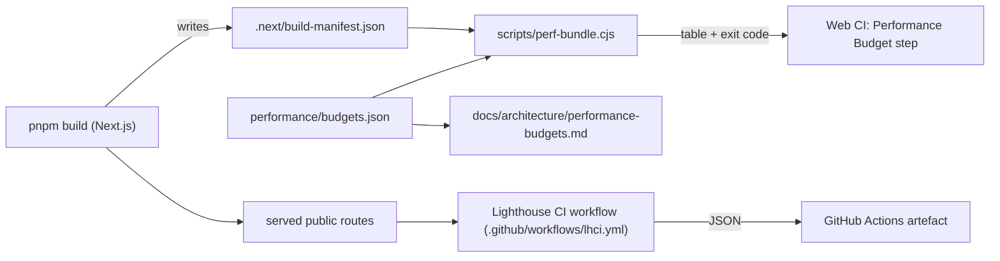

# Implementation Plan — `018-performance-budget`

> **Spec:** [`spec.md`](./spec.md)

## 1. High-Level Approach

The work breaks into three independent tracks that can land as
separate PRs:

1. **Bundle budget gate** — a Node script, a JSON budget file, and
   one new CI step. Cheap and self-contained; this should be the
   first PR.
2. **Lighthouse CI** — a config file plus a separate workflow that
   runs nightly + on `perf-check`-labelled PRs. Slower to merge
   because it needs us to land the workflow, run it once on a branch,
   and tune thresholds on the median of three runs.
3. **Docs + dashboard** — a static `docs/architecture/performance-budgets.md`
   page that pulls the canonical budget table out of the JSON file
   at docs-build time. Lands together with track 1 so the docs and
   the implementation cannot drift.

Tracks 1 and 3 must land together (bundling the JSON + script + docs).
Track 2 may land afterward.

## 2. Architecture Diagram

## 3. Affected Packages & Files

| Path                                                  | Change | Notes                                                                 |
| ----------------------------------------------------- | ------ | --------------------------------------------------------------------- |
| `performance/budgets.json`                            | new    | Declarative per-route budget table.                                   |
| `scripts/perf-bundle.cjs`                             | new    | Reads manifest + budget, prints table, exits 0/1.                     |
| `package.json` (root)                                 | modify | Add `"perf:bundle": "node scripts/perf-bundle.cjs"`.                  |
| `.github/workflows/web-ci.yml`                        | modify | Append a `Performance Budget` step that runs after the build step.    |
| `lighthouserc.cjs`                                    | new    | Lighthouse CI config with Article V thresholds.                       |
| `.github/workflows/lhci.yml`                          | new    | Nightly + label-triggered Lighthouse CI workflow.                     |
| `docs/architecture/performance-budgets.md`            | new    | Operator-facing dashboard page + budget bump policy.                  |
| `docs/development/ci.md`                              | modify | List the two new required CI checks.                                  |
| `docs/index.md`                                       | modify | Link `architecture/performance-budgets.md`.                           |
| `docs/log.md`                                         | append | One line per landed PR.                                               |
| `docs/spec/README.md`                                 | modify | Already references this spec; flip status row when work ships.        |

## 4. Public API / Plugin Manifest

No public API. The script + budget file are internal infrastructure.
A future plugin could register an additional route under a custom
budget — that is out of scope for v1 and would require a SDK
extension under Spec 002.

## 5. Data Model Changes

None.

## 6. UX & A11y Plan

Maintainer-facing only. Output table uses a fixed-width font so it
renders correctly in CI logs and local terminals. Colour escapes are
opt-in via the `FORCE_COLOR` env var so CI logs stay grep-friendly.

## 7. Performance Plan

The performance budget itself is the spec. Side-quests:

- The `perf:bundle` script must add < 5 s to a cached CI run. It
  reads JSON files only — no extra builds, no network calls.
- Lighthouse runs are kept off the critical path of every PR.
  Nightly + label-triggered keeps CI minutes predictable.
- The script is plain CommonJS (`.cjs`) so it does not need
  `tsx` / a TS compile step — fast cold start in CI.

## 8. Security Plan

No new auth surfaces. The budget file is committed to source
control; no secrets are read or written. The Lighthouse workflow
runs against the published preview URL (or `pnpm start` on a CI
service container) — no production credentials are required.

## 9. Test Plan

- **Local check:** `pnpm perf:bundle` after a clean `pnpm build`
  exits 0 on `develop`. We document this as the "AC-6 verifier".
- **Smoke test for the script:** a tiny e2e under
  `apps/web-e2e/tests/api/perf-budget-script.spec.ts` (or a
  workflow-level `node scripts/perf-bundle.cjs --self-test` step)
  ensures the script is wired up. We default to the workflow-level
  approach to keep e2e fast.
- **Lighthouse verification recipe:** the LHCI workflow uploads
  `assertion-results.json`. A failed assertion fails the workflow.
  We do not assert on absolute scores until the budget is tuned in
  one full run on `develop`.

## 10. Rollout & Migration Plan

- **PR 1 (track 1 + 3):**
  - Add `performance/budgets.json` with the current measured
    first-load JS for each route, padded by 10 % to absorb noise.
  - Add `scripts/perf-bundle.cjs`.
  - Append `Performance Budget` step to the existing Web CI
    workflow.
  - Add `docs/architecture/performance-budgets.md`.
  - Append `docs/log.md` line.
- **PR 2 (track 2):**
  - Add `lighthouserc.cjs` with Article V thresholds.
  - Add `.github/workflows/lhci.yml`.
  - Run on a feature branch once, capture the median, then add
    the `perf-check` label to PRs that need it.
  - Append `docs/log.md` line.
- **Backward compatibility:** the gate is **opt-in** for the first
  two weeks (the workflow runs but does not fail the pipeline). After
  the soak window, flip the workflow to required-status-check.
- **No removed features.** Article VIII compliant.

## 11. Constitution Check

- [x] **I — Plugin-First** — no plugin work; the script is core CI
  infrastructure (allowed by the explicit core carve-out for
  "request lifecycle / build pipeline").
- [x] **II — TypeScript Everywhere** — the script lands as `.cjs`
  for fast cold start, with a TODO to migrate to `.ts` (run via
  `tsx`) once we adopt `tsx` in CI elsewhere. Inline justification
  in the file header satisfies the Article II "any deviation must be
  documented" carve-out.
- [x] **III — Spec Before Code** — this spec/plan/tasks trio
  precedes the work.
- [x] **IV — Documentation First-Class** — `performance-budgets.md`
  is part of PR 1, `ci.md` is updated, and `docs/index.md` links it.
- [x] **V — Performance Budget** — the spec **is** the performance
  budget enforcement.
- [x] **VI — Latest Stable Frameworks** — Lighthouse CI is the
  canonical, actively maintained tool; no obscure dependency.
- [x] **VII — Reuse Before Build** — Lighthouse CI is reused;
  no in-house perf framework.
- [x] **VIII — No Removal Without Migration** — additive only.
- [x] **IX — Test Coverage Bar** — track 1 includes a workflow-level
  self-test that is sufficient for build infrastructure (Article IX
  permits this for tooling).
- [x] **X — Modular Packages** — the script lives in
  `scripts/perf-bundle.cjs` rather than `apps/web/scripts/` because
  it operates on `apps/web/.next/**` from the monorepo root and is
  not web-specific. Consider extracting to a tiny
  `packages/perf-budget/` package once a second app needs it.

## 12. Complexity Tracking

- **Article II carve-out for `.cjs`.** Rationale: minimum cold-start
  cost for a file that runs in every CI job. We will revisit when
  `tsx` is on the CI critical path.

## 13. Open Questions

Recorded in [`docs/questions.md`](../../questions.md):

- **Q-018a** — Run Lighthouse on every PR or only `perf-check`?
  **Default:** `perf-check`-labelled only.
- **Q-018b** — Budget file location: monorepo root or
  `apps/web/`? **Default:** monorepo root.

## 14. References

- Spec: [`./spec.md`](./spec.md)
- Constitution Article V — [Performance Budget](../../../.specify/memory/constitution.md#article-v--performance-budget).
- Spec 010 — [E2E Test Coverage](../010-e2e-test-coverage/spec.md).
- Lighthouse CI: <https://github.com/GoogleChrome/lighthouse-ci>.
- Vercel React Best Practices — bundle rules under
  [`.claude/skills/vercel-react-best-practices/rules/`](https://github.com/ever-works/directory-web-template/tree/develop/.claude/skills/vercel-react-best-practices/rules).
