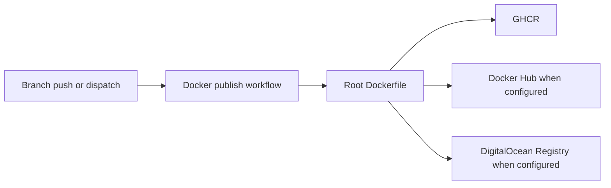

# Implementation Plan — `036-docker-build-publish-workflow`

> **Spec:** [`spec.md`](./spec.md)

## 1. High-Level Approach

Use the existing root `Dockerfile` as the only image definition and add
branch-specific registry-publish workflows separate from deployment. The workflow follows the
registry set used in the sibling `../ever-works` repo: GHCR is mandatory,
Docker Hub and DigitalOcean Container Registry are optional when secrets are
configured.

The template has one web image, not separate API and web images, so the branch
split is represented in the image name: `directory-web-template-dev`,
`directory-web-template-stage`, and `directory-web-template` for production.

## 2. Architecture Diagram

## 3. Affected Packages & Files

| Package / Path | Change | Notes |
| --- | --- | --- |
| `.github/workflows/docker-build-publish-dev.yml` | new | Build and push the develop image |
| `.github/workflows/docker-build-publish-stage.yml` | new | Build and push the stage image |
| `.github/workflows/docker-build-publish-prod.yml` | new | Build and push the main image |
| `docs/deployment/docker.md` | modify | Document workflow triggers, tags, and secrets |
| `docs/spec/036-docker-build-publish-workflow/` | new | Spec Kit record |
| `docs/spec/README.md` | modify | Add spec index row |
| `docs/log.md` | modify | Add dated entry |

## 4. Public API / Plugin Manifest

No public API or plugin manifest changes.

## 5. Data Model Changes

No data model changes.

## 6. UX & A11y Plan

No UI changes.

## 7. Performance Plan

Runtime performance is unchanged. CI build time should improve after the first
run through GitHub Actions cache-backed Buildx layers.

## 8. Security Plan

The workflow uses `GITHUB_TOKEN` for GHCR and reads optional registry secrets
only from GitHub Actions secrets. `GH_TOKEN` is passed as a BuildKit secret, not
as a Docker build argument, matching the existing Kubernetes deploy workflow.

## 9. Test Plan

- Static review of the workflow file and generated docs.
- `git diff --check` for whitespace and patch sanity.
- Live registry publishing is verified by GitHub Actions
  `workflow_dispatch` after secrets are present.

## 10. Rollout & Migration Plan

The change is additive. Existing Vercel and Kubernetes workflows remain
unchanged.

## 11. Constitution Check

- [x] **I — Plugin-First** — not applicable; repository infrastructure only.
- [x] **II — TypeScript Everywhere** — no production source or scripts added.
- [x] **III — Spec Before Code** — spec, plan, and tasks exist.
- [x] **IV — Documentation First-Class** — Docker docs, spec index, and log updated.
- [x] **V — Performance Budget** — no application runtime impact.
- [x] **VI — Latest Stable Frameworks** — no framework changes.
- [x] **VII — Reuse Before Build** — reuses existing Dockerfile and standard Docker actions.
- [x] **VIII — No Removal Without Migration** — additive workflow only.
- [x] **IX — Test Coverage Bar** — not user-visible app behaviour; no Playwright test.
- [x] **X — Modular Packages** — no package changes.

## 12. Complexity Tracking

No constitutional violations.

## 13. Open Questions

None.

## 14. References

- Spec: `./spec.md`
- Existing workflow: `.github/workflows/deploy_k8s.yaml`
- Prior art: `../ever-works/.github/workflows/docker-build-publish-dev.yml`
