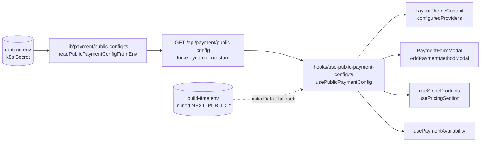

# Implementation Plan — `044-public-payment-config`

> **Spec:** [`spec.md`](./spec.md)

## 1. High-Level Approach

One new, anonymous, uncached JSON route exposes the server's runtime view of
the **public** payment configuration; one React Query hook consumes it with
the build-time `process.env` values as `initialData` and as the permanent
fallback. Every client reader of `NEXT_PUBLIC_STRIPE_PUBLISHABLE_KEY`,
`NEXT_PUBLIC_STRIPE_DYNAMIC_PRICING` and (in the payment-availability path)
`NEXT_PUBLIC_DEMO` switches to the hook. The env-reading logic lives in a single
pure module shared by the route and the hook so the two can never drift.

Alternatives considered: (a) per-Work k8s builds so `NEXT_PUBLIC_*` inlines —
rejected, the platform deliberately builds one image; (b) passing the config
as a prop from `[locale]/layout.tsx` — viable and zero-request, but the modals
and hooks outside that tree still need a source, and a route matches the
existing `useStripeProducts` → `/api/stripe/products` pattern. Logged as an
open question in the spec.

## 2. Architecture Diagram



## 3. Affected Packages & Files

| Package / Path                                                 | Change | Notes                                                                           |
| -------------------------------------------------------------- | ------ | ------------------------------------------------------------------------------- |
| `apps/web/lib/payment/public-config.ts`                        | new    | Pure reader + `mergePublicPaymentConfig`; no server-only imports                |
| `apps/web/app/api/payment/public-config/route.ts`              | new    | `GET`, swagger JSDoc, `force-dynamic`, `Cache-Control: no-store`                |
| `apps/web/hooks/use-public-payment-config.ts`                  | new    | React Query hook + `useStripePublishableKey` / `useStripeDynamicPricingEnabled` |
| `apps/web/components/context/LayoutThemeContext.tsx`           | modify | `configuredProviders` from hook; `CheckoutProvider` aliases shared type         |
| `apps/web/components/payment/stripe-payment-modal.tsx`         | modify | Key from hook; error effect gated on `isOpen && !isFetching`                    |
| `apps/web/components/dashboard/add-payment-method-modal.tsx`   | modify | `loadStripe(key)` memoised per instance                                         |
| `apps/web/hooks/use-stripe-products.ts`                        | modify | Hook-based dynamic-pricing flag; plain fn kept for non-React callers            |
| `apps/web/hooks/use-pricing-section.ts`                        | modify | Uses `useStripeDynamicPricingEnabled()`                                         |
| `apps/web/hooks/use-payment-availability.ts`                   | modify | `demo` from hook; SSR default until first fetch settles                         |
| `apps/web/.env.example`                                        | modify | Comment only                                                                    |
| `apps/web-e2e/tests/api/payment-public-config.spec.ts`         | new    | Contract: 200 JSON, 4 keys, no secrets, `no-store`                              |
| `docs/payment/stripe.md`, `docs/spec/README.md`, `docs/log.md` | modify | DoD                                                                             |

## 4. Public API

```http
GET /api/payment/public-config
200 application/json
Cache-Control: no-store, no-cache, must-revalidate, private, max-age=0

{
  "stripePublishableKey": "pk_test_…" | null,
  "dynamicPricing": boolean,
  "demo": boolean,
  "configuredProviders": ("stripe" | "lemonsqueezy" | "polar" | "solidgate")[]
}
```

```ts
// apps/web/hooks/use-public-payment-config.ts
usePublicPaymentConfig(): { config: PublicPaymentConfig; isResolved: boolean; isFetching: boolean; isError: boolean }
useStripePublishableKey(): string | null
useStripeDynamicPricingEnabled(): boolean
```

## 5. Data Model Changes

None.

## 6. Constitution Check

- **Plugin-first / reuse before build** — reuses React Query, the existing
  `/api/*` route conventions and `lib/query-client`; no new dependency.
- **Performance budget** — one ~120-byte JSON request per page load, shared
  cache, 5-min stale; no bundle growth beyond the hook.
- **No removal without migration** — every consumer keeps its `process.env`
  fallback; `isStripeDynamicPricingEnabled()` and `isDemoMode()` remain
  exported.
- **Security** — route reads only publishable / public identifiers; e2e
  asserts no `sk_` / `whsec_` substrings.
- **Test coverage bar** — new API e2e spec; `public/pricing.spec.ts` unchanged.

## 7. Sequencing & Verification

1. Shared reader → route → hook (pure, independently lint/tsc-checkable).
2. Swap consumers one file at a time; each keeps env fallback.
3. `eslint` + `tsc --noEmit` on touched files; e2e contract spec.
4. Docs (spec, README row, log line, stripe.md tip, `.env.example` note).
