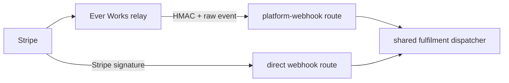

# Implementation Plan — `045-shared-stripe-webhook-relay`

> **Spec:** [`spec.md`](./spec.md)

## 1. High-Level Approach

Lift the existing direct-route handlers into a shared server module without
changing their business branches. Add a platform-authenticated route that reads
the raw body byte-for-byte, verifies the existing HMAC contract, maps the Stripe
event, and calls that dispatcher. Track only successful event ids in a bounded
per-pod coordinator so transient failures stay retryable.

## 2. Architecture Diagram

## 3. Affected Packages & Files

| Path                                                       | Change | Notes                               |
| ---------------------------------------------------------- | ------ | ----------------------------------- |
| `apps/web/app/api/stripe/platform-webhook/route.ts`        | new    | HMAC boundary and retry response    |
| `apps/web/app/api/stripe/webhook/route.ts`                 | modify | delegates after Stripe verification |
| `apps/web/lib/payment/webhook-dispatch.ts`                 | new    | one fulfilment definition           |
| `apps/web/lib/payment/relay-event-coordinator.ts`          | new    | bounded success-only deduplication  |
| `apps/web/lib/payment/webhook-email-data.ts`               | new    | typed email boundary                |
| `apps/web-e2e/tests/api/cron-and-webhook-security.spec.ts` | modify | fail-closed API checks              |

## 4. Public API

The relay route is server-to-server only. It returns 200 after successful
dispatch, 401 for invalid HMAC, 409 for a mismatched Work id, 503 when not
provisioned, and 502 for transient fulfilment failure. The distinct 5xx statuses
preserve diagnostics; the platform relay treats both as retryable.

## 5. Data Model Changes

None.

## 6. Security Plan

The site never accepts the platform's assertion without verifying the HMAC over
timestamp, raw-body SHA-256 digest, and Work id. Secrets remain runtime-only.

## 7. Test Plan

- Node tests for success-only deduplication, retry, and formatted amount data.
- Existing nine work-metadata cases retained under the repository's Node harness.
- Playwright probes for missing and fabricated HMAC requests.
- TypeScript, Prettier, OpenAPI generation, and production build checks.

## 8. Rollout & Migration Plan

Merge and cascade the template first. Deploy every directory with the relay route
while keeping legacy endpoints enabled. The platform then migrates one site at a
time and disables—not deletes—its legacy endpoint only after relay proof.

## 9. Constitution Check

- [x] TypeScript only; no dependency added.
- [x] Spec, plan, tasks, index, and log are present.
- [x] No UI or bundle-path performance regression.
- [x] Existing direct route is retained for rollback.
- [x] Unit and API security tests cover the new boundary.
- [x] Focused modules keep authentication, coordination, mapping, and fulfilment separate.

## 10. Complexity Tracking

No new package or plugin is warranted: this is an internal transport for the
existing Stripe adapter, not a user-selectable payment provider.

## 11. Open Questions

None blocking. Durable event-ledger work is explicitly outside this change.
