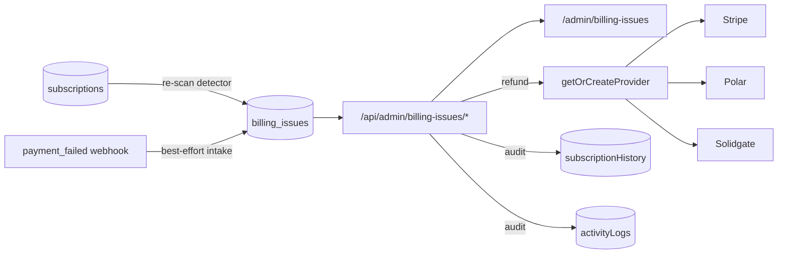

# Implementation Plan — `046-admin-billing-issues`

> **Spec:** [`spec.md`](./spec.md)

## 1. High-Level Approach

Add a thin triage record on top of the payment data the template already stores,
and wire the refund seam that already exists but had no callers.

The load-bearing decision is that `billing_issues` is **not** a second source of
truth for money. Amount, plan and provider live on the referenced `subscriptions`
row; the issue row carries only what an admin workflow needs — what kind of
problem it is, whether it is still open, what the provider returned for a refund,
and who closed it. Every list read joins back to `subscriptions` and `users`, and
the refund resolves its provider from `subscriptions.payment_provider` through the
existing `getOrCreateProvider(name)` factory.

## 2. Architecture Diagram

## 3. Affected Packages & Files

| Area | File |
| --- | --- |
| Schema | `apps/web/lib/db/schema.ts` (`billingIssues`, `BillingIssueType`, `BillingIssueStatus`, three `ActivityType` values) |
| Migration | `apps/web/lib/db/migrations/0040_admin_billing_issues.sql` + journal entry |
| Queries | `apps/web/lib/db/queries/billing-issue.queries.ts` |
| Service | `apps/web/lib/services/billing-issue.service.ts` |
| API | `apps/web/app/api/admin/billing-issues/{route,stats/route,[id]/route,[id]/refund/route}.ts` |
| Hook | `apps/web/hooks/use-admin-billing-issues.ts` |
| UI | `apps/web/app/[locale]/admin/billing-issues/page.tsx`, `apps/web/components/admin/billing-issues/billing-issue-action-dialog.tsx` |
| Nav | `apps/web/components/admin/admin-features-grid.tsx`, `apps/web/components/profile-button/menu-items.tsx` |
| Webhook intake | `apps/web/lib/payment/webhook-dispatch.ts` |
| i18n | `apps/web/messages/*.json` (21 locales) |
| Tests | `apps/web-e2e/tests/admin/billing-issues.spec.ts`, `apps/web-e2e/tests/api/admin-billing-issues-query.spec.ts`, both coverage matrices |

## 4. Detection

`syncBillingIssuesFromSubscriptions()` reads only columns that already exist:

- `failed_payment_count > 0` → a `payment_failed` issue.
- `status = 'pending'`, or `status = 'expired'` while `auto_renewal` is on → a
  `subscription_state` issue.

Rows are keyed by `source_key = "<type>:<subscriptionId>"` and inserted with
`ON CONFLICT DO NOTHING` against the unique `(tenant_id, source_key)` index. A
re-run therefore never duplicates an issue and — importantly — never re-opens one
an admin already closed. The same helper backs the webhook intake, so both paths
converge on one row.

## 5. Refund Path

1. Load the issue; reject if already refunded, if neither the request nor the row
   carries a `provider_payment_id`, or if the amount is not a positive integer no
   larger than the charge.
2. Reject LemonSqueezy up front with a 409 and an instruction, because its adapter
   throws rather than refunding.
3. `getOrCreateProvider(provider).refundPayment(providerPaymentId, amount / 100)`.
4. Only then write `status='refunded'`, the reference that worked, the refund id
   and amount (converted back to cents), the acting admin and the note.
5. Append to `subscriptionHistory` and the activity log, both wrapped so a failed
   audit write can never undo a refund the provider already took.

The provider call is injected as a parameter defaulting to the real factory, so
the branch can be exercised without a live provider.

**Two boundary details worth spelling out, because both are silent failure modes:**

- *Units.* The whole feature — column, API body, UI — speaks in the smallest
  currency unit, like `subscriptions.amount`. Every provider adapter's
  `refundPayment` takes major units and does its own `* 100`, and returns
  `amount / 100`. `toProviderAmount` / `fromProviderAmount` in the service are the
  single conversion point; without them a "$12.34" partial refund would leave as
  $1,234.
- *Reference.* `provider_payment_id` is filled by detection from
  `subscriptions.invoice_id`, but Stripe refunds a payment intent, not an invoice.
  The refund request may therefore carry an overriding `providerPaymentId`, the
  dialog exposes it as an editable field pre-filled from the row, and the value
  that succeeded is written back. The webhook intake prefers the invoice's
  `payment_intent` when Stripe expanded one, and accepts both the pre-2025
  `invoice.subscription` and the current `invoice.parent.subscription_details`
  shapes when resolving the subscription.

## 6. Constitution Check

- **Article III (spec-driven).** Spec, plan, tasks, index row and log line ship in
  the same PR as the code.
- **Article V (performance).** Every list query is paginated and every filter
  column is indexed; the list is one query plus one count, with no N+1.
- **Article VII (reuse before build).** No new dependency, no new payment
  abstraction — the existing provider factory, admin shell components,
  `useAdminFilters`, `UniversalPagination` and admin guard are reused as-is.
- **Article VIII (no removal).** Purely additive: no existing route, table,
  column, test or translation is changed or removed.
- **Article IX (test coverage).** One Playwright page spec and one API spec, plus
  entries in both coverage matrices.

## 7. Rollout

The migration is additive and idempotent (`CREATE TABLE IF NOT EXISTS`, guarded
constraint adds, `CREATE INDEX IF NOT EXISTS`), so it is safe on a database that
already ran it. With no rows the page renders its empty state and the re-scan
button is the entry point.
