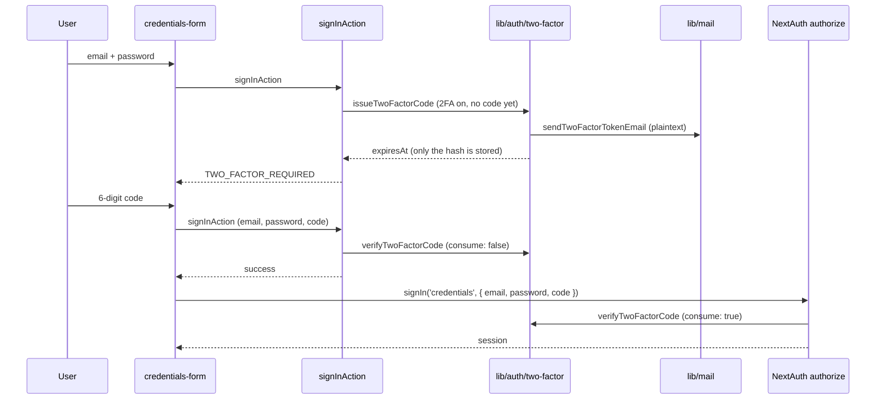

# Implementation Plan — `046-email-two-factor-auth`

> **Spec:** [`spec.md`](./spec.md)

## 1. High-Level Approach

Split the feature in two halves so the security-critical arithmetic is testable
without a database:

- `apps/web/lib/auth/two-factor-code.ts` — **pure**: code generation, hashing,
  constant-time digest comparison, expiry and lockout arithmetic. No `db`, no
  mail, no `next/headers` imports, so it can be imported directly by a test file
  and from either runtime.
- `apps/web/lib/auth/two-factor.ts` — **stateful**: reads and writes
  `twoFactorCodes` and the `client_profiles` 2FA columns, and dispatches the
  email.

The sign-in flow then gets a second leg. Two call sites verify, deliberately:

1. `signInAction` (server action) pre-checks so the user gets a *specific*,
   translatable message. NextAuth collapses everything `authorize` throws into a
   generic `CredentialsSignin`, which is why the existing password check is also
   duplicated there. This leg verifies with `consume: false`.
2. `authorize` in `lib/auth/credentials.ts` is the **authoritative** gate — it is
   the only place a session is minted, so a scripted
   `signIn('credentials', …)` that skips the server action still has to satisfy
   it. This leg consumes the code.

## 2. Architecture Diagram



## 3. Affected Packages & Files

| Area | File | Change |
| --- | --- | --- |
| DB | `apps/web/lib/db/schema.ts` | new `twoFactorCodes` table; `two_factor_failed_attempts` / `two_factor_locked_until` on `clientProfiles`; five `ActivityType` members |
| DB | `apps/web/lib/db/migrations/0040_email_two_factor_auth.sql` (+ `meta/`) | additive, idempotent migration |
| DB | `apps/web/lib/db/queries/client.queries.ts` | three `ClientProfileWithAuth` projections extended with the two new columns |
| Lib | `apps/web/lib/auth/two-factor-code.ts` | new — pure primitives |
| Lib | `apps/web/lib/auth/two-factor.ts` | new — stateful helpers |
| Lib | `apps/web/lib/auth/auth-error-codes.ts` | five `TWO_FACTOR_*` codes |
| Lib | `apps/web/lib/auth/credentials.ts` | `code` credential + authoritative gate |
| Mail | `apps/web/lib/mail/templates/two-factor-code.ts` | new branded template |
| Mail | `apps/web/lib/mail/index.ts` | `sendTwoFactorTokenEmail` uses it; optional third argument |
| API | `apps/web/app/api/auth/security/2fa/{enable,disable}/route.ts` | new |
| API | `apps/web/app/api/auth/2fa/resend/route.ts` | new |
| API | `apps/web/app/api/auth/security/settings/route.ts` | returns `canEnableTwoFactor`, `authMethod`, real `loginAttemptsCount` / `accountLocked` / `accountLockedUntil` |
| UI | `apps/web/components/settings/security/two-factor-card.tsx` | new |
| UI | `apps/web/components/settings/security/security-overview.tsx` | lock copy reflects a temporary, self-clearing lock |
| UI | `apps/web/app/[locale]/auth/components/credentials-form.tsx` | code step, resend, countdown, back |
| UI | `apps/web/app/[locale]/auth/actions.ts` | 2FA leg in `signInAction` |
| Hooks | `apps/web/hooks/use-security-settings.ts` | `useEnableTwoFactor` / `useDisableTwoFactor` |
| i18n | `apps/web/messages/*.json` (21) | `auth.TWO_FACTOR.*`, `settings.SECURITY_PAGE.TWO_FACTOR.*` |
| Config | `apps/web/.env.example` | three documented, optional env vars |
| Tests | `apps/web-e2e/tests/unit/two-factor-code.spec.ts` | pure-function unit coverage |
| Tests | `apps/web-e2e/tests/auth/two-factor-login.spec.ts` | enable → challenge → disable, expiry, lockout |
| Tests | `apps/web-e2e/tests/api/auth-2fa-routes.spec.ts` | auth / OAuth / resend contract |
| Tests | `apps/web-e2e/helpers/two-factor-db.ts` | test-only DB access |

## 4. Data Model

```
twoFactorCodes
  id          text pk
  userId      text -> users.id  on delete cascade   (indexed)
  email       text
  code_hash   text      -- hex SHA-256; NEVER the code
  expires     timestamp                              (indexed)
  attempts    integer default 0
  consumed_at timestamp
  created_at  timestamp default now()
  tenant_id   text -> tenant.id on delete cascade    (indexed)

client_profiles
  two_factor_enabled          boolean  (pre-existing, now written)
  two_factor_failed_attempts  integer default 0
  two_factor_locked_until     timestamp
```

Rotate-on-issue: minting a code deletes every earlier code for that user, so at
most one is live and the newest email is always the valid one — the same shape
`verificationTokens` and `passwordResetTokens` already use. Issuing also sweeps
rows that expired more than a day ago so the table cannot grow without bound.

## 5. Security Decisions

- **Hash-only storage.** `code_hash` is a hex SHA-256 digest. A plain digest (not
  bcrypt) is the right choice for a *high-entropy-per-second, short-lived*
  secret that is checked on a hot path: the code lives ten minutes, only five
  guesses are allowed against it, and an offline attacker who dumps the table has
  at most that window before the row is gone. Comparison is
  `crypto.timingSafeEqual` over the two digests, never `===`.
- **Where the budget lives.** The enforcement counter is on `client_profiles`,
  not on the code row, precisely so that requesting a resend cannot clear it.
- **No oracle while locked.** An active lockout short-circuits before the code
  table is touched, so a locked account leaks nothing about whether a code
  exists.
- **Malformed input is free.** A value that is not six digits cannot match a
  digest, so it does not spend an attempt — otherwise a clumsy user could lock
  themselves out with typos.
- **Enumeration.** `POST /api/auth/2fa/resend` answers `200` for every
  well-formed request regardless of whether the address exists, the password is
  right, or 2FA is on. The only distinguishable answer is `429`.
- **The resend route re-checks the password** because there is no session at that
  point in the flow; without it, anyone who knows an address could use the
  endpoint to bomb that inbox.
- **Issuance is capped inside `issueTwoFactorCode`** (6 per 10 minutes per
  account), not only at the routes. `authorize` is reachable by posting straight
  to `/api/auth/callback/credentials`, which bypasses the server action's own
  per-email limiter; putting the cap at the single choke point every issuance
  path shares closes that hole. Exceeding it answers `AuthErrorCode.RATE_LIMITED`
  and mints nothing.

## 6. Alternatives Considered

- **Redis for attempt tracking** (as the ticket suggests). Rejected: the template
  has no Redis dependency and adding one for this would be a deployment
  requirement for every generated directory. The database is already shared
  across pods, which is the property that actually matters.
- **A separate `/auth/verify` page** for the code step. Rejected: it would need
  to carry the password across a navigation. Keeping the step inside the existing
  form keeps the credentials in component state and out of any URL or cookie.
- **Storing a "2FA pending" marker in the JWT.** Rejected: it would mean issuing
  a token before the second factor passed. Nothing is minted until `authorize`
  returns.
- **bcrypt for the code hash.** Rejected: see above — it buys little for a
  ten-minute, five-guess secret and costs a bcrypt round on a login hot path.

## 7. Constitution Check

| Article | Verdict |
| --- | --- |
| I — Plugin-first | Not applicable: this extends the core auth flow, which the constitution keeps outside packages. No plugin boundary is crossed. |
| II — TypeScript only | Pass. All new files are `.ts` / `.tsx`. |
| III — Public-surface stability | Pass. `sendTwoFactorTokenEmail`'s third argument is optional, so the previous two-argument call keeps working. `canEnableTwoFactor` / `authMethod` / `accountLockedUntil` are additive fields on the settings response, and the client types them optional. |
| IV — Latest stable frameworks | Pass. No dependency added or moved. |
| V — Performance budget | Pass. The card is a client component on an already-client settings page; the sign-in step adds no bundle beyond one input. The settings route adds two indexed queries. |
| VI — Reuse before build | Pass. Reuses `lib/mail`, `ratelimit()`, `logActivity`, the `hasPassword` detection from the connected-accounts route, and the `expires`-column pattern from `passwordResetTokens`. |
| VII — Test coverage | Pass. Unit coverage for the pure half, Playwright coverage for the flow and the routes. |
| VIII — No removal without migration | Pass. Purely additive; the pre-existing read-only 2FA badge keeps working and now reflects a value users can change. |
| IX — Documentation | Pass. This trio, [`docs/authentication/two-factor-auth.md`](../../authentication/two-factor-auth.md), a `docs/log.md` line and Q-046a. |
| X — Modular packages | Pass. Two focused modules, ~200 and ~170 lines. |

## 8. Rollout & Rollback

The migration is additive and idempotent (`CREATE TABLE IF NOT EXISTS`,
`ADD COLUMN IF NOT EXISTS`), so it can be applied ahead of the code and re-run
safely. No existing row changes meaning: `two_factor_enabled` stays `false`
everywhere until a user opts in, and every sign-in path for a user who has not
opted in is byte-identical to before.

Rollback is to revert the application code; the added table and columns are inert
without it. Operators who need to unlock an account by hand can clear
`two_factor_failed_attempts` / `two_factor_locked_until`, or set
`two_factor_enabled = false`.
