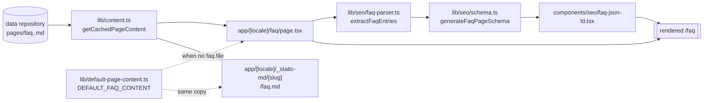

# Implementation Plan — `046-faq-page`

> **Spec:** [`spec.md`](./spec.md)

## 1. High-level approach

Reuse everything the existing static info pages already do, and add exactly one
new capability: turning a Markdown FAQ into `FAQPage` structured data.

The route is a copy of the `/cookies` shape — `revalidate = 3600`, a
`generateMetadata` with canonical + hreflang + `text/markdown` alternates, a
`getCachedPageContent(slug, locale)` read with a module-level default as the
fallback, the content rendered through the shared `MDX` component, a
`BreadcrumbJsonLd`, and a related-links card grid. Nothing about content
loading, caching, locale fallback or path-traversal validation is re-invented;
`lib/content.ts` already handles all of it for an arbitrary slug.

The one new piece is a **pure, I/O-free parser** that maps a page's frontmatter
and Markdown body onto `{ question, answer }` pairs, plus a schema generator and
a server component that serialises them. Keeping the parser pure means the
server component stays trivial and the extraction rules can be reasoned about
(and exercised) without a running app.

Alternatives considered:

- **Reuse the generic `/pages/[slug]` catch-all** instead of a dedicated route.
  Rejected: the catch-all cannot carry FAQ-specific structured data, a
  `/faq` canonical URL, or nav entries, and `/pages/faq` is a worse URL for the
  page an operator most wants indexed. The catch-all still works and is
  untouched.
- **Hard-code the FAQ as i18n strings**, like the `/help` FAQ tab. Rejected by
  the ticket comment: content must live as MD/MDX in the data directory.
- **Ship `faq.en.md` in the template** rather than a code constant. Rejected:
  `apps/web/.content/` is cloned from `DATA_REPOSITORY` at build time and is not
  a template-authored directory, so a committed file there would be overwritten.
  A constant in `lib/` survives, and is shared with the `.md` mirror so the two
  surfaces cannot drift.

## 2. Architecture

## 3. Files

### New

| File                                    | Purpose                                                                    |
| --------------------------------------- | -------------------------------------------------------------------------- |
| `apps/web/app/[locale]/faq/page.tsx`     | The route. Mirrors `cookies/page.tsx`.                                      |
| `apps/web/lib/seo/faq-parser.ts`         | Pure frontmatter + Markdown → `FaqEntry[]` extraction.                      |
| `apps/web/components/seo/faq-json-ld.tsx`| Server component emitting the `FAQPage` script block.                       |
| `apps/web/lib/default-page-content.ts`   | `DEFAULT_FAQ_CONTENT`, shared by the page and the `.md` mirror.             |
| `apps/web-e2e/tests/public/faq.spec.ts`  | Dedicated Playwright coverage.                                              |
| `apps/web/lib/seo/__tests__/faq-parser.spec.ts` | `node:test` unit coverage for the parser (fidelity + no tag reassembly). |

### Changed (all additive)

| File                                         | Change                                                            |
| -------------------------------------------- | ----------------------------------------------------------------- |
| `apps/web/lib/seo/schema.ts`                  | Add `generateFaqPageSchema` + `FaqEntry` / `FaqPageSchemaInput`.   |
| `apps/web/lib/seo/markdown-mirror.ts`         | `renderStaticPageMarkdown` treats an empty body as absent, so every `.md` mirror falls back the way its HTML page does. |
| `apps/web/app/[locale]/_static-md/[slug]/route.ts` | `faq` added to `ALLOWED_STATIC_SLUGS`, `TITLES`, `DEFAULT_BODIES`. |
| `apps/web/next.config.ts`                     | `faq` added to both `staticSlug` rewrite groups.                   |
| `apps/web/app/sitemap.ts`                     | `/faq` added to `STATIC_ROUTES` (also feeds the per-locale block). |
| `apps/web/app/robots.ts`                      | `/faq` added to `sharedAllow`.                                     |
| `apps/web/app/llms.txt/route.ts`              | `/faq.md` added to the mirror list.                                |
| `apps/web/components/footer/social-links.tsx` | FAQ entry in `productLinks`.                                       |
| `apps/web/components/header/more-menu.tsx`    | FAQ entry in `MENU_ITEMS_CONFIG`.                                  |
| `apps/web/messages/*.json` (21)               | `common.FAQ`, `footer.FAQ`, `pages.FAQ_BADGE`, `pages.FAQ_META_DESCRIPTION`, `pages.FAQ_INTRO`, `pages.HELP_DESCRIPTION`. |
| `docs/features/seo.md`                        | Document the now-real `FAQPage` generator.                         |
| 4 existing e2e matrices + `helpers/test-data.ts` | `/faq` and `/faq.md` added to the route lists.                  |

Nothing is removed or narrowed. The `/help` FAQ tab, the `/pages/[slug]`
catch-all, and every existing route list keep their prior entries.

## 4. Parser design decisions

- **Frontmatter beats headings.** A `faqs:` array is authoritative whenever it
  is *present* — including when it is empty or every row failed validation.
  Falling back to headings there would publish questions the author explicitly
  did not select, which is the opposite of "explicit control", and it makes
  `faqs: []` a usable opt-out. Heading extraction is the zero-effort default
  for pages with no `faqs` key at all.
- **Skip H1.** It is the document title. Emitting it as a question produces a
  `Question` whose answer is the whole page.
- **Skip headings with no body.** This is what makes grouping headings
  (`## Submissions` above a run of `###` questions) work without configuration.
- **Answers stop at the next heading of any level**, so a nested `###` question
  is never swallowed into its parent section's answer.
- **Plain text, not HTML.** `acceptedAnswer.text` accepts a limited HTML subset,
  but the content is author-controlled text from a Git repository that ends up
  inside a `<script>` block. Stripping to plain text removes the need to
  sanitise an HTML subset; the serialiser additionally rewrites every `<` to
  its JSON unicode escape `\u003c`, the same guard
  `breadcrumb-json-ld.tsx` uses.
- **Caps.** 50 entries, 1200 characters per answer, 300 per question. Google's
  own limit is far higher; these keep an inline JSON-LD payload that is parsed
  on every page view inside the performance budget (AGENTS.md §5).
- **Return `null` / empty rather than an empty `FAQPage`.** An `FAQPage` with an
  empty `mainEntity` is invalid structured data and worse than none.
- **The reduction to plain text must not change what the page says.** Google
  treats a marked-up answer that disagrees with the visible one as a
  structured-data violation, so `stripMarkdown` removes `*` / `_` / `~` only
  where they actually delimit a span. A blanket removal of every marker
  character published `snakecase` and `53` for pages that render `snake_case`
  and `5*3`. Three rules follow from "say what the page says":
  - **Code first.** Code spans and fenced blocks are lifted into placeholders
    before anything else runs and put back at the very end. Inside code,
    Markdown punctuation is literal: a page rendering `` `_setup_` `` must be
    marked up as `_setup_`. Restoring after the table-pipe rule also keeps a
    `|` inside code intact.
  - **`*` and `_` are not symmetric.** CommonMark lets `*` open and close
    inside a word and does not let `_`, so `2*3*4` renders as 2<em>3</em>4 and
    is marked up as `234`, while `snake_case` stays literal. Both still need a
    non-space character inside the delimiters, which is what leaves an
    unpaired `5*3` and a spaced `a * b * c` alone.
  - **Emphasis runs to a fixpoint.** A single pass cannot unwrap
    `**bold *nested* text**` — the inner `*` blocks the outer match — and left
    the outer delimiters in the schema. Each changing pass removes at least
    two characters, so it terminates.
- **HTML removal is a scanner run to a fixpoint, not one `String.replace`.** A
  single global `<[^>]*>` pass is an incomplete sanitiser: deleting the inner
  tag of `<scr<script>ipt>` splices the remainder into a fresh `<script>`
  (CodeQL `js/incomplete-multi-character-sanitization`). Repeating until a pass
  changes nothing leaves nothing that can be reassembled, and each changing
  pass strictly shortens the string, so it terminates. A `<` that opens neither
  a comment nor a tag is prose ("orders under < 10 items") and is kept; one
  that opens something tag-shaped but never closes is dropped, because keeping
  it is exactly what would let two fragments recombine.
- **The `.md` mirror falls back the same way the HTML page does.** A
  `faq.<locale>.md` carrying frontmatter but no body loads as `content: ''`,
  which means "the data repository ships no body", not "an intentionally empty
  body". `renderStaticPageMarkdown` therefore uses `||`, not `??`, so `/faq`
  and the `/faq.md` it advertises to crawlers never disagree. The same applies
  to `/about`, `/cookies`, `/privacy-policy` and `/terms-of-service`, whose
  HTML pages already fell back on falsy content while their mirrors did not.

## 5. Constitution check

| Principle                          | Assessment                                                                                                                     |
| ---------------------------------- | ------------------------------------------------------------------------------------------------------------------------------ |
| Spec-driven development            | Spec, plan and tasks land with the code.                                                                                        |
| Plugin-first                       | No new plugin: this is a core route in the same family as `/about`, `/cookies`, `/terms-of-service`, which all live in core.     |
| TypeScript only                    | All new files are `.ts` / `.tsx`; no `any`.                                                                                     |
| Performance budget                 | Server component, `revalidate = 3600`, no client JS added. JSON-LD size is capped (§4).                                          |
| Reuse before build                 | Content loading, caching, MDX rendering, hreflang, breadcrumbs and the `.md` mirror are all existing modules.                    |
| No removal without migration       | Every change is additive; the `/help` FAQ tab and all existing route lists are preserved.                                       |
| Test coverage bar                  | New Playwright spec plus `/faq` added to the existing public-route, static-content, locale-prefix and md-mirror matrices.        |
| Documentation first-class          | This trio, the `docs/spec/README.md` row, the `docs/log.md` line, a `docs/questions.md` entry, and the `seo.md` correction.      |
| i18n                               | No hard-coded English in the route; keys added to all 21 locale files with real translations.                                    |

## 6. Verification

- `npx tsc --noEmit` in `apps/web` — clean.
- `pnpm run --filter @ever-works/web lint` — no new errors or warnings.
- `pnpm run build:web` — the route compiles and prerenders.
- `npx tsx --test apps/web/lib/seo/__tests__/faq-parser.spec.ts` — 18 unit
  assertions over the parser, following the `node:test` convention already used
  by `apps/web/lib/payment/__tests__`.
- Playwright: `tests/public/faq.spec.ts` plus the four amended matrices. Note
  the e2e workflow runs on `stage` / `main` only (see `.github/workflows/e2e.yml`),
  so these are release-gate coverage rather than PR-gate coverage.
