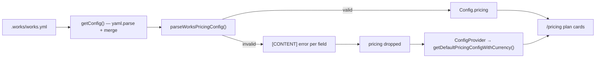

# Implementation Plan — `046-works-yml-pricing-config`

> **Spec:** [`spec.md`](./spec.md)

## 1. High-Level Approach

Add one Zod module that describes the `pricing:` block, call it from
`getConfig()` where the YAML is already parsed, and publish the complete
example the schema is tested against. No consumer of `config.pricing` changes:
the parsed value is a `PricingPlanConfig` exactly as before, and the failure
mode (`config.pricing` undefined → `ConfigProvider` falls back to
`getDefaultPricingConfigWithCurrency()`) is the path the template already
takes when no block is present.

Three compatibility rules drive the schema:

1. **Only `id`, `name` and `price` are required per plan.** The TypeScript
   interface also marks `description` and `annualDiscount` required, but the
   example we published before this spec omitted them on `FREE`. Those blocks
   must keep working, so the schema defaults them (`''` and `0`) instead of
   erroring — the parsed value still satisfies `PricingConfig`.
2. **Every object is `z.looseObject`.** Keys a running template does not know
   round-trip untouched, so a `works.yml` authored for a newer template loads
   on an older one.
3. **Nothing throws.** `parseWorksPricingConfig()` returns
   `{ pricing?, errors[], warnings[] }`; the caller logs and degrades.

## 2. Data Flow

## 3. Affected Packages & Files

| Path                                                            | Change | Notes                                                       |
| --------------------------------------------------------------- | ------ | ----------------------------------------------------------- |
| `apps/web/lib/config/schemas/works-pricing.schema.ts`           | new    | schema, `manual` / `PRO` normalization, `parseWorksPricingConfig` |
| `apps/web/lib/config/schemas/__tests__/works-pricing.schema.spec.ts` | new | 20 `node:test` cases, parses the published example          |
| `apps/web/lib/content.ts`                                       | modify | `applyPricingValidation()` in `getConfig()`                 |
| `apps/web/package.json`                                         | modify | `test:unit` script                                          |
| `package.json`, `turbo.json`                                    | modify | root `test:unit` passthrough                                |
| `.github/workflows/ci.yml`                                      | modify | run the unit specs                                          |
| `docs/configuration/works-yml-pricing.md`                       | new    | full field reference                                        |
| `docs/configuration/examples/works-pricing.example.yml`         | new    | canonical complete example                                  |
| `docs/configuration/payment-config.md`, `docs/payment/payment.md` | modify | point at the reference, document `manual` / `PRO`           |
| `apps/docs/sidebarsTemplate.ts`                                 | modify | list the new page under Configuration                       |

## 4. Public API

No HTTP surface. The module exports `parseWorksPricingConfig`,
`worksPricingConfigSchema`, `worksPricingPlanSchema`,
`MANUAL_PRICING_PROVIDER`, `STANDARD_PLAN_ALIAS` and
`WORKS_PRICING_PROVIDERS`.

## 5. Data Model Changes

None. No entity, no migration, no environment variable.

## 6. Key Decisions

**`manual` is normalized away, not added to the enum.** `PaymentProvider` names
gateways the factory instantiates and the `payment_provider` column stores;
adding a member would leak a non-gateway into `determinePaymentProvider()`,
`useProviderPayment()` and every provider switch. `manual` is instead accepted
in YAML and resolved to "no provider", which is byte-identical to a block that
names none — so the site renders through the existing no-provider / DEMO path
(spec 044) with zero new branches. A warning names the choice in the logs.

**`PRO` is an alias, not a rename.** The shipped vocabulary is
`PaymentPlan.STANDARD` (EW-160) across the DB, API and UI. EW-131's `PRO`
wording predates it. Accepting `PRO` and mapping it to `STANDARD` satisfies the
ticket without a rename that would break every consumer; `STANDARD` wins if
both are present.

**Warn-and-fall-back, never throw.** `getConfig()` runs on every page render.
A hard failure on bad pricing metadata would take a whole directory offline for
a typo in an optional block — strictly worse than the previous behaviour of
rendering an odd card. Errors are loud in the logs; the page stays up.

**Compile-time contract coverage.** `worksPricingSchemaCoversContract` is a
typed constant whose type resolves to `true` only when the schema shape covers
every key of `PricingConfig` and `PricingPlanConfig`. Adding an interface field
without a schema field stops the type-check with the missing key names — the
guard AC-1 needs, and something a runtime test cannot do.

## 7. Test Plan

`apps/web/lib/config/schemas/__tests__/works-pricing.schema.spec.ts`, run by
`pnpm --filter @ever-works/web test:unit`:

- the published example parses, and each plan lists exactly the
  `PricingConfig` fields (AC-1, AC-2, AC-4);
- every provider value, including `manual` and mixed case, and rejection of an
  unknown one (AC-3);
- the `PRO` alias, the both-present precedence, missing plans reported
  together (AC-4);
- a quoted price and an unknown interval named by path (AC-5);
- no `pricing` key, the pre-EW-131 example, defaults, unknown-key
  preservation, non-mapping input (AC-6).

Wiring `test:unit` into CI also gives the twelve pre-existing `node:test`
assertions (spec 045's relay dispatch and work-metadata specs) their first
enforcement — until now nothing ran them.

No Playwright spec: nothing user-visible changes, and the existing
`apps/web-e2e/tests/public/pricing.spec.ts` continues to cover the rendered
page.

## 8. Constitution Check

- **Spec-driven** — spec / plan / tasks written alongside the code.
- **No removal without migration** — purely additive; the previous
  documentation example is kept working by design and is still valid.
- **TypeScript only** — one `.ts` module and one `.ts` spec.
- **Reuse before build** — Zod, already the repo's validation library and
  already used for config schemas in `lib/config/schemas/` and for YAML
  frontmatter in `content.ts`.
- **Performance** — validation runs inside the already-cached `getConfig()`
  (`unstable_cache`, 60 s), over an object of a few dozen keys.
- **Docs first-class** — a new reference page in the sidebar, a canonical
  example, and two existing payment pages updated to point at them.

## 9. Rollback

Revert the PR. The schema is additive; nothing persists and no configuration
has to be migrated back.
