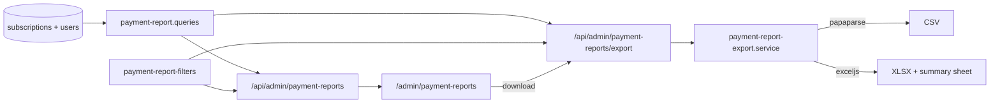

# Implementation Plan — `047-admin-payment-reports`

> **Spec:** [`spec.md`](./spec.md)

## 1. High-Level Approach

Report over the `subscriptions` table the site already writes on every payment,
rather than fetching from a provider API. Three consequences make that the right
call for a template: it works offline and in CI, it covers every configured
provider at once, and it needs no new credentials.

The one structural decision worth naming: **the JSON view and the export share a
single filter validator.** `parsePaymentReportFilters` lives in
`lib/services/payment-report-filters.ts`, not in either route, because a Next.js
`route.ts` may only export route handlers — and because two independent parsers
would eventually disagree about `?from=` or `?planId=` and hand a stakeholder a
CSV that does not match the table it was exported from.

## 2. Architecture Diagram

## 3. Affected Packages & Files

| Area | File |
| --- | --- |
| Queries | `apps/web/lib/db/queries/payment-report.queries.ts` |
| Filters | `apps/web/lib/services/payment-report-filters.ts` |
| Export | `apps/web/lib/services/payment-report-export.service.ts` |
| API | `apps/web/app/api/admin/payment-reports/{route,export/route}.ts` |
| Hook | `apps/web/hooks/use-admin-payment-reports.ts` |
| UI | `apps/web/app/[locale]/admin/payment-reports/page.tsx` |
| Nav | `apps/web/components/admin/admin-features-grid.tsx`, `apps/web/components/profile-button/menu-items.tsx` |
| i18n | `apps/web/messages/*.json` (21 locales) |
| Tests | `apps/web-e2e/tests/admin/payment-reports.spec.ts`, `apps/web-e2e/tests/api/admin-payment-reports-query.spec.ts`, both coverage matrices |

## 4. Query Design

`listPaymentRecords` and `summarizePayments` build their `WHERE` from the same
private helper, so a row that appears in the table is always counted in the
summary. The collected amount is
`coalesce(nullif(amount_paid, 0), amount, 0)` — `amount_paid` when the provider
reported one, otherwise the subscription amount.

Date bounds are parsed by `parseReportDate`, which **throws** on a malformed value
rather than dropping the filter: a dropped bound widens a report instead of
narrowing it, which is the failure mode most likely to be believed. A bare
`YYYY-MM-DD` upper bound is pushed to `23:59:59.999Z` so the last day is included.

`listAllPaymentRecords` pages through the same query for the export and is capped
at 10,000 rows.

## 5. Export Design

One `COLUMNS` array drives both formats, so a CSV and an XLSX of the same report
have identical columns in identical order. Amounts are converted to major units
in the file so a spreadsheet `SUM()` reads as money. The XLSX carries a second
`Summary` sheet with the same roll-ups the page shows.

`SUPPORTED_EXPORT_FORMATS = ['csv', 'xlsx']` is the single extension point. PDF is
absent because no PDF library is in `apps/web/package.json` and Article VII says
reuse before build — see Q-047-1.

## 6. Constitution Check

- **Article III (spec-driven).** Spec, plan, tasks, index row and log line ship
  with the code.
- **Article V (performance).** The table is paginated (default 20, max 200) and
  the export is capped; both filter on indexed columns
  (`subscription_created_at_idx`, `subscription_plan_idx`, `subscription_status_idx`,
  `subscriptions_tenant_id_idx`). Four grouped aggregates run in parallel.
- **Article VII (reuse before build).** No new dependency: `papaparse` and
  `exceljs` are already used by the item export.
- **Article VIII (no removal).** Purely additive. `/admin/reports` (content
  moderation) is untouched — the new page is `/admin/payment-reports` precisely so
  the existing route keeps its meaning.
- **Article IX (test coverage).** One page spec, one API spec, both matrices.

## 7. Rollout

No migration and no new configuration. On a site with no payments the page renders
its empty state and an export returns a header-only CSV.
