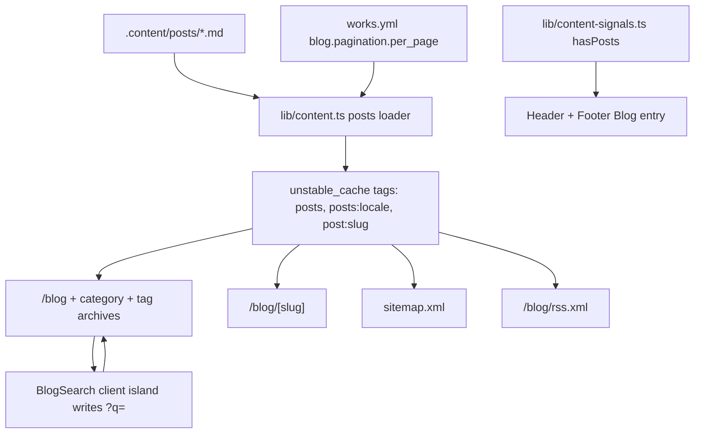

# Implementation Plan — `050-blog-pages`

> **Spec:** [`spec.md`](./spec.md)

## 1. High-Level Approach

Treat posts as one more content type in the existing Git-CMS pipeline rather
than as a new subsystem. `lib/content.ts` already knows how to make the content
repository available, read a file safely, sanitise a slug, bound filesystem
concurrency and cache a result with a revalidation tag — the blog loader is
built out of exactly those primitives and adds no new dependency.

On top of the loader, one shared server component (`BlogListing`) renders the
list, and the three listing surfaces (`/blog`, category archive, tag archive)
differ only in which filter the route pins and which base path the links use.
The post page mirrors the existing `/pages/[slug]` route.

The single client island is the search input: it debounces into a URL change so
results stay server-rendered, shareable and crawlable, and the highlighting on
the cards is produced on the server from the same query the loader filtered on.

## 2. Architecture Diagram

## 3. Affected Packages and Files

| Path                                                  | Change | Notes                                                        |
| ----------------------------------------------------- | ------ | ------------------------------------------------------------ |
| `apps/web/types/post.ts`                              | new    | post types, kept out of the `'use server'` content module    |
| `apps/web/lib/blog/constants.ts`                      | new    | default and maximum posts-per-page                           |
| `apps/web/lib/blog/urls.ts`                           | new    | URL builders, search-param parsing, date formatting          |
| `apps/web/lib/content.ts`                             | modify | posts loader, taxonomies, adjacency, cached wrappers         |
| `apps/web/lib/cache-config.ts`                        | modify | `POSTS`, `POST(slug)`, `POSTS_LOCALE(locale)` tags           |
| `apps/web/lib/content-signals.ts`                     | modify | `hasPosts` signal                                            |
| `apps/web/lib/seo/feeds.ts`                           | modify | `buildPostFeedEntries()`                                     |
| `apps/web/components/providers/settings-provider.tsx` | modify | thread `hasPosts` to the client                              |
| `apps/web/hooks/use-blog-exists.ts`                   | new    | mirrors `use-comparisons-exists`                             |
| `apps/web/components/header/index.tsx`                | modify | Blog nav entry, gated on `hasPosts`                          |
| `apps/web/components/header/more-menu.tsx`            | modify | drop the external blog shortcut when the site has its own    |
| `apps/web/components/footer/*`                        | modify | Blog footer link, gated on `hasPosts`                        |
| `apps/web/components/blog/*`                          | new    | listing, card, filters, pagination, search, highlight, image |
| `apps/web/app/[locale]/blog/**`                       | new    | listing, loading skeleton, detail, category and tag archives |
| `apps/web/app/blog/rss.xml/route.ts`                  | new    | blog RSS feed beside the existing site feed                  |
| `apps/web/app/sitemap.ts`                             | modify | `/blog`, post and taxonomy entries                           |
| `apps/web/messages/*.json`                            | modify | `common.BLOG` plus the `blog` namespace in all 21 locales    |
| `apps/web-e2e/tests/public/blog*.spec.ts`             | new    | listing and detail coverage                                  |
| `.github/workflows/e2e.yml`                           | modify | seed posts in the CI content fixture                         |
| `README.md`                                           | modify | document the `.content/posts/` frontmatter contract          |

## 4. Key Decisions

**Types live in `apps/web/types/post.ts`, not in `lib/content.ts`.** That module
carries a `'use server'` directive, which restricts its runtime exports to async
functions; a plain `export const` there is a build error. The same reason puts
`DEFAULT_POSTS_PER_PAGE` / `MAX_POSTS_PER_PAGE` in `lib/blog/constants.ts`, which
`lib/content.ts` imports so there is still one source of truth.

**Filter before paginate.** `fetchPosts()` applies category, tag and query
filters and only then slices the page, so `total` describes the filtered set —
which is what both the result count and the pagination controls need.

**Pagination is links, not state.** Every control is a real anchor, so filtered
and paginated views are crawlable, shareable and work without JavaScript.

**Highlighting splits in React.** `HighlightText` builds an escaped `RegExp` and
renders `<mark>` elements; post content and the query never reach
`dangerouslySetInnerHTML`.

**Missing content is not an error.** No posts directory means an empty list, a
hidden nav entry and a graceful empty state — never a 500, and never a failed
build. `generateStaticParams()` swallows loader failures and leans on
`dynamicParams`.

## 5. Sequencing

1. Types, constants and URL helpers (no behaviour yet).
2. Loader, cache tags and content signal.
3. Navigation entries and i18n keys.
4. Listing, card, pagination, loading and empty states.
5. Post detail page, adjacency, JSON-LD.
6. Taxonomy chips and archives.
7. Search box, highlighting, result count and no-results state.
8. Sitemap, RSS, e2e specs and documentation.

## 6. Risks and Mitigations

| Risk                                                 | Mitigation                                                            |
| ---------------------------------------------------- | --------------------------------------------------------------------- |
| A hostile or malformed slug escapes the posts folder | `sanitizeFilename()` plus `safeReadFile()` base-directory containment |
| A remote featured image host is not allow-listed     | `PostImage` falls back to `unoptimized`                               |
| A bad `per_page` renders the whole archive           | clamped to `MAX_POSTS_PER_PAGE`                                       |
| Malformed frontmatter breaks a build                 | parse failures are caught per file; the post is skipped, not fatal    |
| Two "Blog" links with different destinations         | the external More-menu shortcut is dropped when the site has posts    |

## 7. Rollback

Remove the `/blog` routes and the nav entries. The loader is additive, reads a
folder nothing else touches, and introduces no schema or data migration, so
nothing else in the template depends on it.
