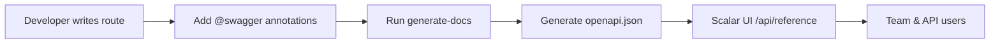

# API Documentation Training

Master the automated API documentation system using Swagger annotations and Scalar UI.

## 🎯 Objectives

By the end of this module, you will:

- ✅ Understand the API documentation workflow
- ✅ Write proper Swagger annotations
- ✅ Follow standardized tag conventions
- ✅ Generate and validate documentation
- ✅ Troubleshoot common issues
- ✅ Maintain high-quality API documentation

**Estimated time**: 2-3 days

---

## Why This System?

### Problems We Solved

- **Inconsistent documentation**: Previously had 8 different Stripe tags scattered across endpoints
- **Manual synchronization**: Documentation often outdated compared to actual code
- **Poor developer experience**: Basic Swagger UI with limited functionality
- **No standards**: Each developer documented differently
- **Maintenance burden**: Separate documentation files to maintain

### Benefits We Gained

- **Automatic synchronization**: Documentation generated directly from code annotations
- **Modern interface**: Scalar UI with interactive testing and better UX
- **Consistent standards**: Unified tag system and documentation patterns
- **Zero maintenance**: No separate documentation files to maintain
- **Better DX**: Developers document while coding, not as an afterthought

---

## System Architecture

### Core Components

1. **Swagger Annotations in Code**
   - JSDoc comments with `@swagger` tags
   - OpenAPI 3.0 specification format
   - Embedded directly in route files
   - Version controlled with the code

2. **generate-docs Script**
   - Scans all `app/api/**/route.ts` files
   - Extracts and validates Swagger annotations
   - Generates unified `public/openapi.json`
   - Creates automatic backups
   - Merges with existing manual documentation

3. **Scalar UI Interface**
   - Modern, responsive documentation interface
   - Interactive API testing capabilities
   - Advanced search and filtering
   - Better UX than traditional Swagger UI
   - Accessible at `/api/reference`

4. **Automated Workflow Integration**
   - CI/CD validation of documentation
   - Pre-commit hooks for consistency
   - Watch mode for development
   - Automatic deployment with app

### Complete Workflow



---

## Getting Started

### 1. Access Documentation

**Local Development**:

```bash
# Start the development server
yarn dev

# Open documentation
open http://localhost:3000/api/reference
```

**Production**:

```bash
# Live documentation
https://demo.ever.works/api/reference
```

### 2. Essential Commands

```bash
# Generate documentation manually
yarn generate-docs

# Development mode with file watching
yarn docs:watch

# Validate all annotations
yarn docs:validate

# Check if documentation is up to date
git status public/openapi.json
```

### 3. Development Workflow

1. **Create/modify route** in `app/api/*/route.ts`
2. **Add Swagger annotations** using our standards
3. **Run `yarn generate-docs`** to update documentation
4. **Verify on `/api/reference`** that documentation looks correct
5. **Commit changes** including updated `public/openapi.json`

---

## Writing Swagger Annotations

### Understanding the Structure

Every Swagger annotation follows the OpenAPI 3.0 specification and must be placed in a JSDoc comment block starting with `@swagger`.

### Basic Template

```typescript
/**
 * @swagger
 * /api/your-endpoint:           # The actual API path
 *   post:                       # HTTP method (get, post, put, delete, patch)
 *     tags: ["Category"]        # For grouping in UI
 *     summary: "Brief action"   # Short description (appears in list)
 *     description: "Detailed"   # Full explanation with context


---

## Standardized Tag System

### Why Consistent Tags Matter

Tags organize endpoints in the Scalar UI sidebar. Consistent tagging means:

- **Better navigation**: Users find related endpoints easily
- **Logical grouping**: Similar functionality grouped together
- **Professional appearance**: Clean, organized documentation
- **Scalability**: Easy to add new endpoints to existing categories

### Our Tag Conventions

**Format**: `"Provider/Category - Subcategory"` or `"Category"` for core features

#### Admin Operations

```yaml
"Admin - Users"        # User management (CRUD, roles, permissions)
"Admin - Categories"   # Category management (create, edit, delete, reorder)
"Admin - Items"        # Content management (approve, reject, feature)
"Admin - Comments"     # Comment moderation (delete, approve)
"Admin - Roles"        # Role and permission management
```

#### Core Application Features

```yaml
"Authentication"       # Login, logout, password reset, session management
"Favorites"           # User favorites (add, remove, list)
"Items & Content"     # Public content browsing, search, filtering
"Featured Items"      # Featured content management
```

#### Payment Systems

```yaml
"Stripe - Core"              # Checkout, Payment Intent, Setup Intent
"Stripe - Payment Methods"   # Payment method CRUD operations
"Stripe - Subscriptions"     # Subscription lifecycle management
"Stripe - Webhooks"          # Webhook event processing
"LemonSqueezy - Core"        # All LemonSqueezy operations
"Payment Accounts"           # Cross-provider account management
```

#### User and System

```yaml
"User"                # User profile, preferences, payment history
"System"              # Version info, health checks, repository sync
"Security - ReCAPTCHA" # Security verification endpoints
```

### Choosing the Right Tag

**Decision Tree**:

1. **Is it admin-only?** → Use `"Admin - [Category]"`
2. **Is it payment-related?** → Use `"[Provider] - [Function]"`
3. **Is it core app functionality?** → Use single word like `"Authentication"`
4. **Is it user-specific data?** → Use `"User"`
5. **Is it system/infrastructure?** → Use `"System"`

**Examples**:

```typescript
// ✅ Good tag choices
tags: ["Admin - Users"]           // Admin creating/editing users
tags: ["Stripe - Subscriptions"] // Subscription management
tags: ["Authentication"]          // Login endpoint
tags: ["User"]                   // User profile data

// ❌ Bad tag choices
tags: ["Users"]                  // Too vague - admin or user operation?
tags: ["Stripe"]                 // Too broad - what Stripe function?
tags: ["API"]                    // Meaningless - everything is API
tags: ["Payments - Stripe"]      // Inconsistent with our format
```

---

## Best Practices

### Writing Effective Descriptions

**Summary Guidelines**:

- Use action verbs: "Create", "Update", "Delete", "Retrieve"
- Be specific: "Get user profile" not "Get user"
- Keep under 50 characters for UI readability

**Description Guidelines**:

- Explain the business purpose, not just the technical action
- Include authentication/authorization requirements
- Mention any side effects or important behavior
- Use 1-3 sentences maximum

**Examples**:

```yaml
# ❌ Bad
summary: "Get user"
description: "Gets a user"

# ✅ Good
summary: "Get user profile"
description: "Retrieves complete user profile including preferences, subscription status, and activity metrics. Requires authentication and returns filtered data based on user permissions."

# ❌ Bad
summary: "POST /api/users"
description: "Creates user"

# ✅ Good
summary: "Create user account"
description: "Creates a new user account with email verification. Automatically assigns default role and sends welcome email. Requires admin privileges."
```

### Realistic Examples

Examples are crucial for API usability. They appear in the Scalar UI and help developers understand expected data formats.

**Guidelines**:

- Use realistic, meaningful data
- Match your application's domain
- Be consistent across related endpoints
- Include edge cases when relevant

```yaml
# ❌ Bad examples
example: "string"
example: 123
example: true

# ✅ Good examples
example: "john.doe@company.com"
example: "user_123abc456def"
example: "2024-01-15T10:30:00.000Z"
example: ["productivity", "design", "development"]
```

### Documenting Request Bodies

**Always include**:

- All required fields
- Field types and formats
- Validation rules (min/max length, patterns)
- Realistic examples
- Clear descriptions

**Example**:

```yaml
requestBody:
  required: true
  content:
    application/json:
      schema:
        type: object
        properties:
          email:
            type: string
            format: email
            description: "User's email address"
            example: "user@example.com"
          password:
            type: string
            minLength: 8
            maxLength: 100
            description: "Password (8-100 characters)"
            example: "SecurePass123!"
          name:
            type: string
            minLength: 2
            maxLength: 50
            description: "User's full name"
            example: "John Doe"
        required: ["email", "password", "name"]
```

### Documenting Responses

**Document all possible responses**:

- Success responses (200, 201, 204)
- Client errors (400, 401, 403, 404, 409, 422)
- Server errors (500)

**Example**:

```yaml
responses:
  201:
    description: "User created successfully"
    content:
      application/json:
        schema:
          type: object
          properties:
            success:
              type: boolean
              example: true
            data:
              type: object
              properties:
                id:
                  type: string
                  example: "user_123abc"
                email:
                  type: string
                  example: "user@example.com"
  400:
    description: "Validation failed"
    content:
      application/json:
        schema:
          type: object
          properties:
            success:
              type: boolean
              example: false
            error:
              type: string
              example: "Invalid email format"
  409:
    description: "User already exists"
    content:
      application/json:
        schema:
          type: object
          properties:
            success:
              type: boolean
              example: false
            error:
              type: string
              example: "Email already registered"
```

---

## Developer Checklist

### Before Creating New Route

- [ ] Copy template from [Quick Reference](/template/getting-started/quick-reference)
- [ ] Choose appropriate tag according to conventions
- [ ] Document all parameters and responses
- [ ] Add realistic examples
- [ ] Include all possible error codes

### Before Commit

- [ ] Execute `yarn generate-docs`
- [ ] Verify documentation on `/api/reference`
- [ ] Test examples in Scalar UI
- [ ] Validate that `public/openapi.json` is updated
- [ ] No YAML syntax errors

---

## Troubleshooting

### 1. Documentation Generation Fails

**Symptoms**:

- `yarn generate-docs` exits with error
- YAML syntax errors in console
- Missing or malformed annotations

**Solutions**:

```bash
# Step 1: Check syntax validation
yarn docs:validate

# Step 2: Look for specific error messages
yarn generate-docs 2>&1 | grep -i error

# Step 3: Restore from backup if needed
cp public/openapi.backup.json public/openapi.json

# Step 4: Fix the problematic file and retry
yarn generate-docs
```

**Common YAML syntax errors**:

```typescript
// ❌ Wrong indentation
/**
 * @swagger
 * /api/test:
 *   get:
 *   tags: ["Test"]  // Should be indented more
 */

// ✅ Correct indentation
/**
 * @swagger
 * /api/test:
 *   get:
 *     tags: ["Test"]  // Properly indented
 */

// ❌ Missing quotes in array
tags: [Test, Other]  // Should be quoted

// ✅ Proper quotes
tags: ["Test", "Other"]

// ❌ Inconsistent spacing
type:string  // Missing space after colon

// ✅ Consistent spacing
type: string
```

### 2. Annotations Not Detected

**Symptoms**:

- Route exists but doesn't appear in documentation
- `yarn docs:watch` doesn't pick up changes
- No errors but endpoint missing

**Diagnostic steps**:

```bash
# Check if file is in correct location
find app/api -name "route.ts" | grep your-route

# Verify @swagger annotation exists
grep -n "@swagger" app/api/your-route/route.ts

# Check file permissions
ls -la app/api/your-route/route.ts

# Restart watcher
yarn docs:watch
```

**Common causes**:

- **Wrong file location**: Must be in `app/api/**/route.ts`
- **Missing @swagger**: Annotation must start with `@swagger`
- **File not saved**: Ensure file is saved before generation
- **Cached process**: Restart the watcher process

### 3. Scalar UI Issues

**Symptoms**:

- `/api/reference` returns 404
- Documentation loads but appears broken
- Interactive testing doesn't work

**Solutions**:

```bash
# Check if openapi.json exists and is valid
ls -la public/openapi.json
cat public/openapi.json | jq . > /dev/null  # Validates JSON

# Restart development server
yarn dev

# Clear browser cache
# Open DevTools → Application → Storage → Clear site data
```

### 4. Inconsistent Documentation

**Symptoms**:

- Some endpoints documented, others not
- Mixed tag formats
- Inconsistent response structures

**Solutions**:

1. **Audit existing documentation**:
   - Review all tags for consistency
   - Check response structures match standards
   - Verify all endpoints have examples

2. **Use the Quick Reference**:
   - Follow [Quick Reference](/template/getting-started/quick-reference) templates
   - Copy from well-documented endpoints
   - Ask for code review

3. **Run validation**:

   ```bash
   yarn docs:validate
   ```

---

## Quality Standards

### Documentation Completeness

Every API endpoint should have:

- ✅ Clear, descriptive summary
- ✅ Detailed description with business context
- ✅ Appropriate tag from standardized list
- ✅ All request parameters documented
- ✅ All response codes documented (success + errors)
- ✅ Realistic examples for all fields
- ✅ Security requirements specified

### Success Criteria

**Individual Endpoint**:

- [ ] Appears in Scalar UI under correct tag
- [ ] All fields have descriptions
- [ ] Examples are realistic and helpful
- [ ] All error codes documented
- [ ] Interactive testing works

**Team-wide**:

- [ ] 100% of new routes documented before merge
- [ ] 0 documentation generation errors in CI/CD
- [ ] Consistent tag usage across all endpoints
- [ ] Response time < 2s for documentation loading

---

## Additional Resources

### Internal Documentation

- [Quick Reference](/template/getting-started/quick-reference) - Templates and commands
- [API Documentation Guide](/template/development/api-documentation) - Technical details
- [Development Testing](/template/development/testing) - Testing strategies

### External Resources

- [OpenAPI 3.0 Specification](https://swagger.io/specification/) - Official spec
- [Scalar Documentation](https://github.com/scalar/scalar) - Scalar UI docs
- [Swagger Best Practices](https://swagger.io/docs/specification/2-0/basic-structure/) - General guidelines

---

## Next Steps

After mastering API documentation:

1. [Best Practices](/template/team-training/best-practices) - Learn coding standards
2. [Exercises](/template/team-training/exercises) - Practice with real tasks
3. Start documenting real endpoints in your project

:::tip Practice Makes Perfect
The best way to learn is by doing. Start with simple GET endpoints and gradually work up to complex POST/PUT endpoints with validation.
:::

Need help? Check the [Quick Reference](/template/getting-started/quick-reference) or ask your team lead! 🚀
